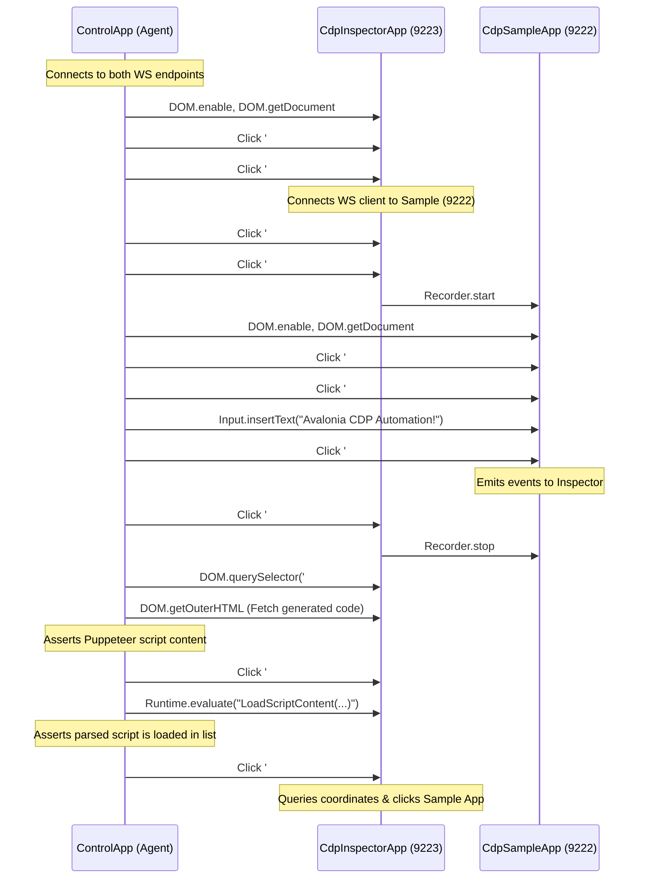

# Agent-Driven CDP Self-Inspection & Multi-App Testing Guide

This guide describes how to use the **Chrome DevTools Protocol (CDP)** support inside **both** the inspector client (`CdpInspectorApp`) and the target application (`CdpSampleApp`) to build programmatic test verification scripts and allow AI coding agents to control, inspect, and verify features end-to-end.

---

## The Challenge of Testing Developer Tools

Testing developer tools (like a custom DevTools inspector client) is notoriously difficult:
1. **Interactive GUI Complexity**: They involve deep trees, dynamic data tabs, charts, console execution, and real-time network tables.
2. **Multi-App Interactions**: The inspector acts as a client connected to a separate running target application. Verifying features (like recording user actions) requires orchestrating events across both processes.
3. **Headless Execution**: Standard UI automation frameworks (such as WinAppDriver, Appium, or FlaUI) are platform-dependent, slow, hard to configure in headless CI/CD (like GitHub Actions), and brittle.

## The Solution: Dual-CDP Orchestration

By embedding the `CdpServer` in **both** the target application (`CdpSampleApp` on port `9222`) and the client application (`CdpInspectorApp` on port `9223`), we expose full control of both GUIs to a single automation script or AI agent.

```
       ┌────────────────────────┐
       │   Control App (Agent)  │
       └────┬──────────────┬────┘
            │              │
   CDP: 9223│              │CDP: 9222
            ▼              ▼
 ┌──────────────┐     ┌──────────────┐
 │ CdpInspector │     │  CdpSample   │
 │    Client    │     │  Target App  │
 └──────┬───────┘     └──────────────┘
        │                    ▲
        └────────────────────┘
          CDP WebSocket Connection
```

### Architecture Components
1. **CdpSampleApp (Target)**: Starts `CdpServer` on port `9222`. Exposes its visual tree, inputs, network calls, and recording hooks.
2. **CdpInspectorApp (Client & Target)**: Starts `CdpServer` on port `9223`. This enables **self-inspection**. We can inspect the inspector itself, query its elements, click its buttons, and invoke its methods.
3. **ControlApp (Agent)**: A simple console application that connects to both WebSockets simultaneously, coordinating their actions and reading back outcomes.

---

## Step-by-Step E2E Recording Verification Flow

The E2E verification sequence is located inside `scratch/ControlApp`. The flow shown below is the baseline verification sequence used to validate the core recording, loading, and replaying pipeline. **AI coding agents must customize or extend the actual verification script in `ControlApp` to target the specific deliverables of the current task (such as verifying logical tree lookups, toggle behaviors, or specific UI components).**

The default verification flow operates as follows:



---

## Coding Agent Recipes (CDP JSON-RPC Examples)

Here are the key JSON-RPC commands used by an agent to automate the inspector app:

### 1. Connecting Inspector to Target
First, we scan for targets, then click the connect button:
```json
// Command sent to Inspector (9223)
{
  "id": 10,
  "method": "Input.dispatchMouseEvent",
  "params": {
    "type": "mousePressed",
    "x": 120.5,
    "y": 25.0,
    "button": "left",
    "clickCount": 1
  }
}
```

### 2. Loading Script Content Programmatically
To verify that script importing and parsing work, the agent calls `LoadScriptContent` on the inspector window instance via the `Runtime` domain:
```json
{
  "id": 11,
  "method": "Runtime.evaluate",
  "params": {
    "expression": "LoadScriptContent(\"{\\n  \\\"title\\\": \\\"Test Recording\\\",\\n  \\\"steps\\\": [\\n    {\\n      \\\"type\\\": \\\"click\\\",\\n      \\\"selectors\\\": [[\\\"#btnClickMe\\\"]],\\n      \\\"offsetX\\\": 0,\\n      \\\"offsetY\\\": 0\\n    }\\n  ]\\n}\")"
  }
}
```

### 3. Replaying the Loaded Script
To trigger replaying, the agent finds coordinates of the `#btnReplay` button using `DOM.getBoxModel` and clicks it. The inspector's replayer will:
1. Fetch `DOM.getDocument` of the connected target (`CdpSampleApp`).
2. Perform `DOM.querySelector` to find elements.
3. Retrieve element center coordinates via `DOM.getBoxModel`.
4. Command the target app using `Input.dispatchMouseEvent` to simulate clicks at the exact center coordinates.

---

## Benefits for Development & CI/CD

- **100% Portable & Headless**: Runs out-of-the-box on Linux container builds (Xvfb/Virtual framebuffer), macOS, and Windows.
- **Fast Execution**: The complete sequence—spawning two GUI processes, connecting them, recording inputs, exporting code, loading code, and replaying inputs—executes in **under 10 seconds**.
- **No Brittle Bounding Boxes**: The selector engine resolves dynamic visual layouts, avoiding the coordinate offsets that break image-based or static coordinate testing.
- **AI Agent Native**: Standardizes target interactions under a unified JSON-RPC protocol, allowing large language models and coding agents to test software natively.

---

## Architectural Guidelines for Coding Agents

When refactoring, modifying, or extending the codebase, coding agents must adhere to the following strict architectural guidelines:

### 1. Inspector Client (`CdpInspectorApp`) Architecture (MVVM & SOLID)
- **Decoupled Code-Behind**: `MainWindow.axaml.cs` and other view files must remain thin. They should only contain view initialization code and delegation for platform-specific API calls (like file pickers).
- **Central Infrastructure Service**: Direct CDP network calls, loops, and connection lifecycles must be delegated to a reusable service class (implementing `ICdpService`).
- **Domain-Specific ViewModels**: Specific tab panels (Elements, Console, Network, Recorder, etc.) must have their own independent ViewModels inheriting from `ViewModelBase` to isolate concerns.
- **Data-Binding & Commands**: All UI values, lists, states, and action triggers must be bound using standard XAML data-bindings (`{Binding ...}`) and `ICommand` interfaces rather than manually manipulating UI control properties in code-behind.
- **No Control Renaming**: Keep XAML control names (`Name` attributes) unchanged to prevent breaking selectors in E2E automation/testing verifier scripts.

### 2. Core Library (`Avalonia.Diagnostics.Cdp`) and Test Code Guidelines
- **SOLID Compliance**: All core library classes and unit/integration tests must strictly follow **SOLID** design principles (Single Responsibility, Open/Closed, Liskov Substitution, Interface Segregation, and Dependency Inversion). Avoid monolithic classes and tight coupling.
- **YAGNI (You Aren't Gonna Need It)**: Do not write speculative, forward-looking code or add unused extension hooks. Build only the concrete features requested to keep the codebase simple and maintainable.
- **Modern & High-Performance .NET APIs**: Leverage modern .NET capabilities for performance-critical logic. Use `Span<T>`, `ReadOnlySpan<T>`, `Memory<T>`, `ValueTask`, `ArrayPool<T>`, and non-allocating string/JSON parsing APIs where appropriate. Focus on minimizing heap allocations.
- **Focus on Quality & Performance**: Always prioritize write-time code cleanliness, readability, and run-time efficiency. Ensure hot paths (such as WebSocket dispatching, diagnostics observers, and visual tree traversal) are optimized, thread-safe, and free from memory leaks.
