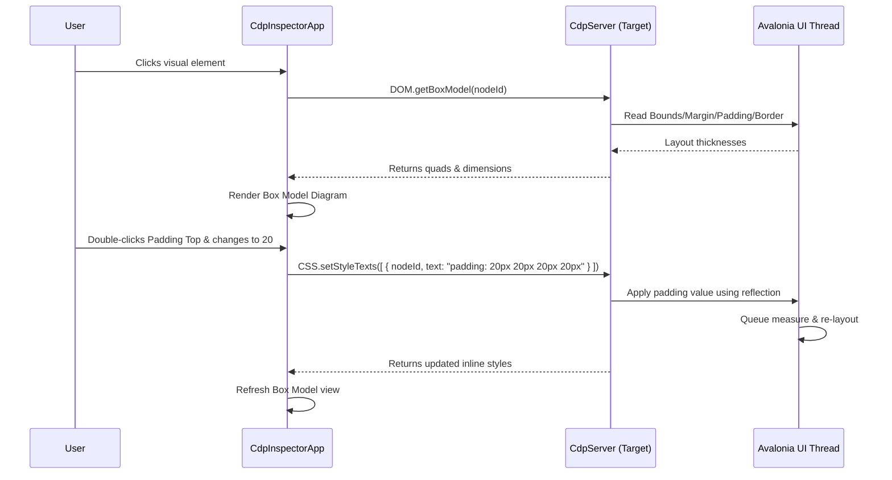

# CDP Inspector Gap Analysis & Implementation Plan

This report evaluates the features of our custom Chrome DevTools Protocol (CDP) client inspector (`CdpInspectorApp`) compared to the official Google Chrome Browser Developer Tools, identifying functional gaps and outlining a detailed implementation plan for high-impact extensions.

---

## Executive Summary

While `CdpInspectorApp` provides core diagnostic features (visual tree representation, styles inspection, interactive screencasts, memory control counts, and custom Test Studio recorder/replay engines), Google Chrome DevTools has matured over a decade with deep runtime and rendering support. 

By building upon the standard CDP domains and custom extensions in `Avalonia.Diagnostics.Cdp`, we can close critical gaps and provide native-like debugging, styling, and memory leak analysis specialized for **Avalonia UI** applications.

---

## Feature-by-Feature Gap Analysis

The table below lists each developer tools tab, comparing Google Chrome DevTools' features against `CdpInspectorApp`, evaluating the gap severity, and assessing the feasibility of implementation in Avalonia.

| DevTools Tab | Google Chrome Feature Set | Current CdpInspectorApp | Gap Severity | Feasibility in Avalonia UI |
| :--- | :--- | :--- | :--- | :--- |
| **Elements** | Live DOM editing, drag-and-drop hierarchy, CSS Styles hierarchy, interactive Box Model Editor, Class toggler (`.cls`), Event Listeners pane, DOM Breakpoints, Accessibility tree and attributes. | Visual tree as HTML, node search, delete element, flat key-value list of Inline/Computed styles, basic pseudo-state forcing (`:hover`), AX tree mapping. | **High** | **High** (for styles hierarchy & Box Model) |
| **Console** | JS REPL with autocomplete, CLI API ($0-$4, `$_`), filter levels, grouping, live watch expressions, stack trace source-code linking. | C# evaluation REPL, console history, completions lookup, log level filter, simple regex search, UI REPL mode. | **Medium** | **High** (add watch expressions & trace links) |
| **Sources** | File navigator, text editor, debugger (breakpoints, call stack, scope variables inspector, watch pane, code hot-swapping). | Workspace file navigator, read-only text file viewer. | **Critical** | **Medium** (requires integrating C# debug/diagnostics APIs) |
| **Network** | Detailed request log grid, waterfall timeline, response previews, request payload parser, WebSocket message frames list, throttling. | Requests list, request/response headers and body text, basic blocked URL lists, mock rules, network throttling. | **Medium** | **High** (visual waterfall, payload parse, WebSocket inspector) |
| **Performance** | Performance recorder, flame chart of execution stacks, paint flashing, layout shifts, frame rate tracking, aggregate CPU charts. | Live CPU/FPS metrics checklist, Working Set MB live chart, live control allocations list, target kill button. | **High** | **Medium** (implementing tracing, call stack aggregates, flame charts) |
| **Memory** | Heap snapshotting, allocation timelines, allocation sampling, object retainers path-to-root graph. | Control allocations snapshot, snapshot comparison, Detached Controls list (memory leak finder), GC button. | **High** | **High** (reference retainer tree graph) |
| **Application** | Local/Session Storage, IndexedDB, SQLite, Cookies, Cache Storage, Service Workers, Background Services. | Resource dictionary editor, Local/Session Storage key-value editor, empty Cookies & Background Services. | **Medium** | **High** (fully support Cookies, add SQLite/DB viewer) |
| **Audits** | Lighthouse audits (a11y, SEO, performance, PWA), detailed metrics scoring, recommendations list. | Custom `runDiagnostics` auditing, basic scores, click-to-inspect issue list. | **Low** | **High** (extend metrics and categories) |

---

## High-Impact Feature Recommendations

Based on our analysis, we recommend prioritizing four key features that will elevate `CdpInspectorApp` to a professional-grade .NET diagnostic tool:

### 1. Elements Tab: Interactive XAML Box Model Editor
Developers need to quickly inspect and edit control spacing. An interactive box model editor displays concentric rectangular boxes representing **Margin**, **Border**, **Padding**, and **Content** dimensions of the selected control. Users can double-click numerical fields inside the editor to dynamically alter the layout of the running Avalonia application.

### 2. Memory Tab: Detached Control Retainer Tree
Avalonia applications commonly suffer from memory leaks caused by events, VM bindings, or static fields retaining detached controls. When a control is detected in the "Detached Controls" list, the inspector should display an object-graph reference tree tracing the chain of references back to a Garbage Collection (GC) root.

### 3. Sources Tab: Lightweight C# Execution Debugger
While full C# debugging is complex, we can provide a lightweight debugger experience by adding support for line breakpoints inside XAML and C# code viewed in the Sources tab, pausing execution on exception, and inspecting local scope variables.

### 4. Network Tab: Request Payload Parser & Response Previews
Expand network request inspection with collapsible, formatted JSON tree viewers, form data parsing, and image thumbnails for media assets.

---

## UI View Mockups

Below are modern, premium dark-mode interface mockups visualizing how these new features integrate into the `CdpInspectorApp` workspace.

### 1. Upgraded Elements Panel with XAML Box Model Editor

The mockup below shows a cascading style rules list and an interactive, concentric Box Model Editor at the bottom right. Double-clicking any value allows updating the layout properties in real time.


### 2. Upgraded Memory Panel with Detached Control Retainers

The mockup below displays the Detached Controls list. When `submitBtn` (a leaked Button) is selected, the bottom panel traces the exact GC roots keeping it alive (e.g., event handler delegate, static reference, active tasks).


---

## Implementation Plan

### Phase 1: Interactive XAML Box Model Editor



#### Server-side updates (src/Avalonia.Diagnostics.Cdp/Domains/CssDomain.cs)
Expand `ApplyStyleText` to parse and apply Margin, Padding, Width, Height, and BorderThickness values dynamically:

```csharp
// In CssDomain.cs
private static void ApplyStyleText(Control control, string styleText)
{
    var statements = styleText.Split(';', StringSplitOptions.RemoveEmptyEntries);
    foreach (var statement in statements)
    {
        var colonIndex = statement.IndexOf(':');
        if (colonIndex == -1) continue;

        var rawName = statement.Substring(0, colonIndex).Trim().ToLower();
        var rawValue = statement.Substring(colonIndex + 1).Trim();

        if (rawValue.EndsWith("px", StringComparison.OrdinalIgnoreCase))
            rawValue = rawValue.Substring(0, rawValue.Length - 2).Trim();

        switch (rawName)
        {
            case "margin":
                control.Margin = Thickness.Parse(rawValue);
                break;
            case "padding":
                if (control.GetType().GetProperty("Padding") is PropertyInfo pInfo)
                    pInfo.SetValue(control, Thickness.Parse(rawValue));
                break;
            case "border-width":
            case "borderthickness":
                if (control.GetType().GetProperty("BorderThickness") is PropertyInfo bInfo)
                    bInfo.SetValue(control, Thickness.Parse(rawValue));
                break;
            case "width":
                control.Width = double.Parse(rawValue, CultureInfo.InvariantCulture);
                break;
            case "height":
                control.Height = double.Parse(rawValue, CultureInfo.InvariantCulture);
                break;
        }
    }
}
```

#### Client-side updates (src/CDP.Inspector.Shared/Views/ElementsView.axaml)
Add a visual diagram in XAML using nested `Borders` and text fields:

```xml
<!-- Add in ElementsView.axaml inside the Styles subtab -->
<Border Classes="box-model-container" Background="#202124" BorderBrush="#3c4043" BorderThickness="1" Padding="15" Margin="5">
    <Grid RowDefinitions="Auto, *">
        <TextBlock Text="XAML Box Model Editor" FontWeight="Bold" Foreground="#9aa0a6" FontSize="11" Margin="0,0,0,10"/>
        
        <!-- Concentric boxes -->
        <Border Grid.Row="1" Background="#292a2d" BorderBrush="#33b3e0ff" BorderThickness="1" CornerRadius="3" Padding="8">
            <Grid ColumnDefinitions="Auto, *, Auto" RowDefinitions="Auto, *, Auto">
                <!-- Margin Box -->
                <TextBlock Grid.Row="0" Grid.Column="1" Text="{Binding Elements.MarginTop}" HorizontalAlignment="Center"/>
                <TextBlock Grid.Row="1" Grid.Column="0" Text="{Binding Elements.MarginLeft}" VerticalAlignment="Center"/>
                <TextBlock Grid.Row="1" Grid.Column="2" Text="{Binding Elements.MarginRight}" VerticalAlignment="Center"/>
                <TextBlock Grid.Row="2" Grid.Column="1" Text="{Binding Elements.MarginBottom}" HorizontalAlignment="Center"/>
                
                <!-- Border Box -->
                <Border Grid.Row="1" Grid.Column="1" Background="#2d2e30" BorderBrush="#ffca28" BorderThickness="1" CornerRadius="3" Padding="8">
                    <!-- Concentric inner boxes repeated for Padding & Content -->
                </Border>
            </Grid>
        </Border>
    </Grid>
</Border>
```

---

### Phase 2: Detached Control Retainer Tree (Memory Leak Finder)

#### Server-side updates (src/Avalonia.Diagnostics.Cdp/Domains/MemoryDomain.cs)
Introduce a reference crawler that traverses the object graph starting from typical GC roots to locate what holds a reference to the selected detached control:

```csharp
// In MemoryDomain.cs
case "getRetainers":
    {
        int hashCode = @params["hashCode"]?.GetValue<int>() ?? 0;
        var targetControl = ControlTracker.FindControlByHashCode(hashCode);
        if (targetControl == null)
            throw new Exception("Target control not found or collected");

        var retainers = await Task.Run(() => ReferenceCrawler.FindRetainers(targetControl));
        return new JsonObject { ["retainers"] = retainers };
    }
```

Implement the `ReferenceCrawler` to trace delegates (event subscriptions), static fields, and parent trees:

```csharp
public static class ReferenceCrawler
{
    public static JsonArray FindRetainers(object target)
    {
        var retainersArray = new JsonArray();
        var visited = new HashSet<object>();
        
        // Crawl static fields in loaded assemblies, active view models, and UI event subscriptions
        foreach (var assembly in AppDomain.CurrentDomain.GetAssemblies())
        {
            if (assembly.IsDynamic) continue;
            foreach (var type in assembly.GetTypes())
            {
                foreach (var field in type.GetFields(BindingFlags.Static | BindingFlags.NonPublic | BindingFlags.Public))
                {
                    var val = field.GetValue(null);
                    if (val == null || !visited.Add(val)) continue;
                    
                    if (CrawlObject(val, target, visited, out var path))
                    {
                        retainersArray.Add(new JsonObject
                        {
                            ["rootType"] = "Static Field",
                            ["description"] = $"{type.FullName}.{field.Name}",
                            ["path"] = path
                        });
                    }
                }
            }
        }
        return retainersArray;
    }

    private static bool CrawlObject(object current, object target, HashSet<object> visited, out string path)
    {
        path = "";
        if (current == target) return true;
        
        // Inspect event handlers / delegates
        if (current is Delegate del)
        {
            foreach (var r in del.GetInvocationList())
            {
                if (r.Target == target)
                {
                    path = $"Event subscription: {del.Method.Name} -> {r.Method.Name}";
                    return true;
                }
            }
        }

        // Trace instance fields recursively
        var fields = current.GetType().GetFields(BindingFlags.Instance | BindingFlags.NonPublic | BindingFlags.Public);
        foreach (var field in fields)
        {
            var val = field.GetValue(current);
            if (val == null || !visited.Add(val)) continue;
            if (CrawlObject(val, target, visited, out var subPath))
            {
                path = $"{current.GetType().Name}.{field.Name} -> {subPath}";
                return true;
            }
        }
        return false;
    }
}
```

#### Client-side updates (src/CDP.Inspector.Shared/Views/MemoryView.axaml)
Extend the MemoryView to add a hierarchical TreeView detail section beneath the detached control list:

```xml
<Grid Grid.Row="2" RowDefinitions="Auto, *">
    <TextBlock Text="Retainers reference tree graph" Classes="panel-header"/>
    <TreeView Grid.Row="1" ItemsSource="{Binding Memory.SelectedControlRetainers}" x:DataType="models:RetainerNodeModel">
        <TreeView.ItemTemplate>
            <TreeDataTemplate ItemsSource="{Binding Children}">
                <StackPanel Orientation="Horizontal" Spacing="6">
                    <PathIcon Data="{StaticResource AlertIcon}" Width="12" Height="12" Foreground="#ff8f00" IsVisible="{Binding IsWarning}"/>
                    <TextBlock Text="{Binding DisplayName}" Foreground="#e8eaed" FontSize="11"/>
                    <TextBlock Text="{Binding ValueDetail}" Foreground="#9aa0a6" FontSize="11" FontStyle="Italic"/>
                </StackPanel>
            </TreeDataTemplate>
        </TreeView.ItemTemplate>
    </TreeView>
</Grid>
```

---

## User Action Walkthroughs

### 1. Changing Control Margins with the Box Model Editor
1. Connect `CdpInspectorApp` to the target application.
2. Select the **Elements** tab.
3. Click on a control in the **DOM Tree** (e.g., `<Button Name="submitButton">`).
4. Look at the **XAML Box Model Editor** in the bottom right corner.
5. Hovering over the Margin value will highlight the margin area in orange in the live preview.
6. Double-click the **Margin-Top** value (e.g. `10`) in the diagram.
7. Type `30` and press **Enter**.
8. The live application preview immediately shifts downward, and the button's margin properties are updated.

### 2. Tracing a Leaking Control in the Memory Panel
1. Perform actions in the application (e.g., opening and closing a modal containing a form).
2. Open the **Memory** tab inside `CdpInspectorApp`.
3. Click the **Detached Controls** tab.
4. If there is a memory leak, the table will show instances of controls (e.g. `TextBox` or `Button`) that are detached from the visual tree but still alive.
5. Select the leaked control row in the table.
6. The **Retainers reference tree graph** at the bottom will populate:
   - Expand the tree nodes to walk the chain of references.
   - For example, you see: `MainWindow -> Static Event Handler (SaveCommand.CanExecuteChanged) -> EventHandler -> submitButton`.
7. You immediately locate the code error: the submit button's event handler was not unsubscribed during the form's disposal.
