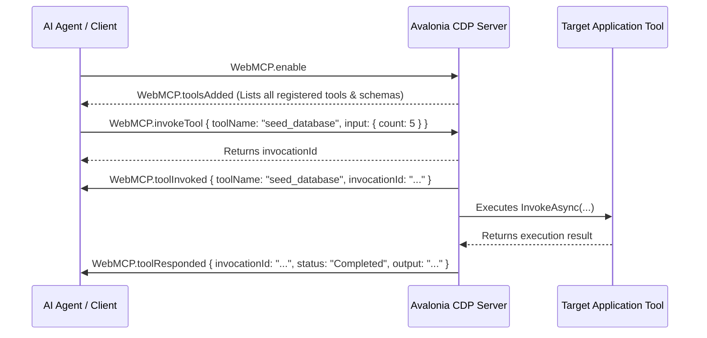

# Slim Mode Token Optimization & WebMCP Custom Tools

As applications grow, their visual tree structure becomes extremely deep and complex. For LLM agents and AI coding assistants inspecting these interfaces, transmitting the full raw visual tree can consume massive context tokens and slow down response speeds. 

To solve this, this library introduces **Slim Mode visual tree pruning** and the **WebMCP custom tool domain**.

---

## 1. Slim Mode Token Optimization

Slim Mode prunes layout-only container elements (like `Border`, `Grid`, `StackPanel`, `Canvas`) from the visual tree JSON representation, while keeping:
1. **Interactive Controls**: Buttons, TextBoxes, CheckBoxes, ComboBoxes, Sliders, MenuItems, etc.
2. **Text Containers**: TextBlocks, Labels, and elements containing visible content.
3. **Lineage Ancestors**: The parent container paths necessary to preserve the layout tree structure.

By pruning layout overhead, Slim Mode reduces DOM document node representation sizes by up to **80%**, saving massive token overhead and improving query performance.

### Activating Slim Mode
Slim Mode is activated by passing a custom `slim` Boolean parameter during `DOM.enable`:

```json
{
  "id": 1,
  "method": "DOM.enable",
  "params": {
    "slim": true
  }
}
```

Once enabled, all subsequent standard tree inspection commands (such as `DOM.getDocument` and `DOM.getFlattenedDocument`) automatically return the optimized, pruned tree structure.

---

## 2. WebMCP Custom Tools Domain

The **WebMCP Domain** (`WebMCP`) is a custom protocol extension that allows developers to register custom C# tools inside their Avalonia applications. AI agents can discover and execute these tools directly through the CDP socket interface.

This is highly useful for exposing application-specific mock triggers, database seeding scripts, test diagnostics, or complex internal actions directly to the AI agent.

### The IMcpTool Interface
To expose a custom tool, implement the `IMcpTool` interface:

```csharp
public class SeedDatabaseTool : IMcpTool
{
    public string Name => "seed_database";
    public string Description => "Seeds the test database with sample accounts";
    
    // Define input parameters schema using JSON Schema
    public JsonObject? InputSchema => new JsonObject
    {
        ["type"] = "object",
        ["properties"] = new JsonObject
        {
            ["count"] = new JsonObject { ["type"] = "integer", ["default"] = 10 }
        }
    };

    public async Task<JsonNode?> InvokeAsync(JsonObject input)
    {
        int count = input["count"]?.GetValue<int>() ?? 10;
        await Database.SeedAsync(count);
        return JsonValue.Create("Database seeded successfully!");
    }
}
```

### Registering Custom Tools
Register your tool using the static `McpToolRegistry`:

```csharp
// Register a single tool instance
McpToolRegistry.RegisterTool(new SeedDatabaseTool());

// Register a provider supplying multiple dynamic tools
McpToolRegistry.RegisterProvider(new CustomToolProvider());
```

---

## 3. WebMCP Protocol Flow

When the agent enables the WebMCP domain, the protocol handles execution lifecycle events asynchronously:



*   **`WebMCP.toolsAdded`**: Fired on domain enable, and dynamically whenever a new tool is registered.
*   **`WebMCP.toolInvoked`**: Broadcasts tool invocation status.
*   **`WebMCP.toolResponded`**: Delivers the final output or error context when execution resolves.
