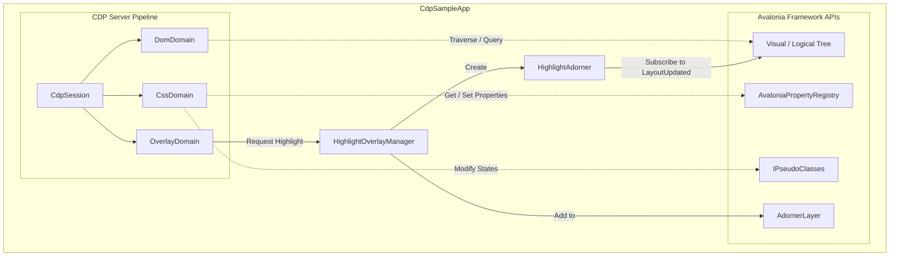

# Technical Implementation Plan: Visual Inspection & Live Style/Property Editor

This technical plan details the architecture, design, and step-by-step roadmap for implementing dynamic visual inspection, style modification, layout updating, and live property editing. It maps the Chrome DevTools Protocol (CDP) DOM, CSS, and Overlay domains to Avalonia UI framework abstractions and MVVM components in the inspector.

---

## 1. Objective & Use Cases

The Visual Inspection & Live Style/Property Editor feature enables developer self-inspection, visual tree debugging, and remote styling controls for Avalonia applications.

### Business Value & Developer Benefits
- **Zero-Compile Style Tuning**: Developers can inspect, edit, and experiment with control styling (colors, fonts, backgrounds) and layout dimensions (margins, padding, alignment) in real-time without recompiling or redeploying the application.
- **Visual Layout Auditing**: Simplifies resolving complex layout alignment and sizing issues (e.g., overlapping margins, improper padding, text truncation).
- **Interactive UX Exploration**: Allows developers and designers to toggle interactive control states (like hover, active, focus, disabled) to verify styling themes under various conditions.

### QA & Testing Scenarios
- **Layout Consistency Verification**: Programmatic E2E test scripts can query elements and assert their computed size, bounds, alignments, and spacing configurations.
- **Dynamic Visual Regression Testing**: E2E scenarios can apply temporary styling changes, take screenshots (via the Page domain), and assert visual fidelity.
- **Pseudo-State Compliance**: Asserts style applications and color contrast ratios under forced interaction states (e.g., verifying that disabled buttons show appropriate contrast).

---

## 2. Protocol Mapping (CDP to Avalonia)

To support visual inspection, tree browsing, live overlays, and styling modification, standard CDP domains map to Avalonia abstractions as described in the table below.

### CDP Domain & Method Mappings

| CDP Domain | CDP Method / Event | Direction | Purpose / Mapped Avalonia Action |
| :--- | :--- | :--- | :--- |
| **DOM** | `DOM.getDocument` | Client ➔ Server | Serializes and returns the root document node representing the window's visual or logical tree. |
| **DOM** | `DOM.getBoxModel` | Client ➔ Server | Computes and returns the quad coordinates for the Content, Padding, Border, and Margin boxes of a visual element. |
| **DOM** | `DOM.getNodeForLocation` | Client ➔ Server | Performs hit-testing at the specified coordinate $(x, y)$ and returns the corresponding `nodeId`. |
| **DOM** | `DOM.setAttributeValue` | Client ➔ Server | Modifies a control's property mapped as an attribute (e.g., `class` list, `id`). |
| **DOM** | `DOM.removeNode` | Client ➔ Server | Removes a control from its parent collection (e.g., `panel.Children.Remove(control)`). |
| **CSS** | `CSS.enable` / `disable` | Client ➔ Server | Activates or deactivates styling tracking. |
| **CSS** | `CSS.getComputedStyleForNode`| Client ➔ Server | Reads and returns a visual's active styling values (width, height, background-color, fonts, margin, padding). |
| **CSS** | `CSS.getMatchedStylesForNode` | Client ➔ Server | Returns active style declarations (inline style properties and applied style classes/rules). |
| **CSS** | `CSS.setStyleTexts` | Client ➔ Server | Parses raw CSS declarations (e.g., `background: red; padding: 10;`) and applies them to the control. |
| **CSS** | `CSS.forcePseudoState` | Client ➔ Server | Forcefully adds or removes pseudo-classes (e.g., `:hover`, `:pressed`, `:disabled`) to/from a control. |
| **Overlay** | `Overlay.enable` / `disable` | Client ➔ Server | Controls the inspection overlay subsystem. |
| **Overlay** | `Overlay.highlightNode` | Client ➔ Server | Renders a semi-transparent colored highlighting overlay with box bounds and type labels over the targeted control. |
| **Overlay** | `Overlay.hideHighlight` | Client ➔ Server | Removes the highlighting layer from the control. |
| **Overlay** | `Overlay.inspectNodeRequested`| Server ➔ Client | **Event**: Fired when the user selects an element in target inspection mode, notifying the inspector client of the `backendNodeId`. |

---

## 3. Current Implementation Status

### A. What is Already Implemented

#### 1. Server-Side Protocol Handling (`Avalonia.Diagnostics.Cdp`)
- **Visual & Logical Tree Serialization**: Implemented in `DomDomain.cs`. Traversal is performed using `visual.GetVisualChildren()` or `logical.GetLogicalChildren()`. It honors the `pierce` parameter to switch between visual and logical trees. Attributes are serialized to include Type, Name, Id, Classes, Text, Bounds, IsEnabled, IsVisible, and Accessibility properties.
- **Computed Style Queries**: Implemented in `CssDomain.cs`. It returns standard properties like `width`, `height`, `display`, `opacity`, `margin`, `background-color`, `padding`, `font-size`, and `font-family`.
- **Forced Pseudo-States via Reflection**: Implemented in `CssDomain.cs` (Line 134). Evaluates the non-public `PseudoClasses` property of a `Control` using reflection and dynamically calls `Add("hover")`, `Remove("hover")`, etc., to manipulate the control's interactive pseudo-states (e.g., hover, pointerover, active, pressed, focus, focus-within, focus-visible, and disabled).
- **Basic Highlight Overlays**: Implemented in `OverlayDomain.cs`, `HighlightOverlayManager.cs`, and `HighlightAdorner.cs`. It hooks into the window's `AdornerLayer`, instantiates `HighlightAdorner`, and draws a semi-transparent blue rectangle matching the control's bounds along with a type/accessibility tooltip. It recalculates the layout coordinates dynamically when the window raises the `LayoutUpdated` event.
- **Box Model Calculations**: Implemented in `DomDomain.cs` (Line 614). Resolves coordinates of Margin, Border, Padding, and Content boxes, outputting them as standard CDP 8-coordinate quads.

#### 2. Client-Side Inspector App (`CdpInspectorApp`)
- **Tree Visualizers & Selection**: Implemented in `ElementsViewModel.cs` and `ElementsView.axaml`. DOM and Accessibility trees are rendered as interactive Hierarchical TreeViews. Selecting a node triggers details loading.
- **Forced Pseudo-Class Toggles**: Interactive check boxes (hover, active, focus, focus-within, focus-visible, disabled) inside a sliding panel bind to VM properties, programmatically calling `CSS.forcePseudoState` via the CDP connection.
- **Layout Display**: Shows Margin, Padding, BorderThickness, Width, Height, and Bounds in a static visual representation in the Layout subtab, binding values parsed from generic element properties.
- **Simple Inline CSS Modifiers**: Provides a single text-input field where raw rules can be typed (e.g. `background: red; width: 100px;`) and applied to the remote control via `CSS.setStyleTexts`.

---

### B. What is Missing or Needs Enhancement

#### 1. Highlight Overlay Subsystem
- **Gaps**: `HighlightAdorner` currently only draws a single translucent blue rectangle (using the control's raw bounds). It **ignores** the customized colors (`contentColor`, `paddingColor`, `borderColor`, `marginColor`) sent in the `DOM.highlightNode` configuration. It also does not render distinct nested overlays for Padding, Border, or Margin boxes.
- **Enhancement**: Refactor `HighlightAdorner` to accept a custom `HighlightConfig` payload. Update its `Render(DrawingContext)` method to compute and draw nested translucent colored boxes for:
  - **Margin Box**: Outset bounding area using the margin color.
  - **Border Box**: Bounding area using the border color.
  - **Padding Box**: Inset bounding area using the padding color.
  - **Content Box**: Center bounding area using the content color.

#### 2. Live CSS Text Parsing & Editing
- **Gaps**:
  - The client side displays applied inline styles in a read-only list. Individual property names/values cannot be clicked or edited inline.
  - The CSS parsing on the server is primitive (splits strings by `;` and `:`). It does not support complex unit conversions (only strips `px`), gradients, fonts, shadows, or multiple border properties.
  - It does not support editing/creating custom styling rules that write back into the target's stylesheet structure.
- **Enhancement**:
  - Implement an interactive inline styling editor. Replace the read-only ListBox with an editable grid where developers can double-click style properties (or values) to change them.
  - Build a robust tokenizer/parser on the server-side `CssDomain` to handle standard CSS rule strings and map styling values gracefully (e.g., translating color names, hex codes, numeric sizes, and shorthand values into appropriate Avalonia types).

#### 3. Custom Style Class Chips Editor
- **Gaps**: Class names are displayed as a raw text string under the Attributes tab. There is no dedicated UI to manage XAML style classes dynamically (such as tags/chips that can be added or deleted individually), although this is a primary styling mechanic in Avalonia.
- **Enhancement**: Implement the "Class Tag Editor" as sketched in the original plan. Add an interactive tag container (items control) in the Styles tab displaying each applied style class as a chip with a remove (`x`) button, along with an "Add class" TextBox and `+` button.

#### 4. Layout Box Model Visualization Extensions
- **Gaps**: The box model diagram in the client layout subtab displays static, read-only text values. Double-clicking values inside the diagram does not trigger editing. Furthermore, the values are resolved from generic CLR properties rather than calling `DOM.getBoxModel` directly.
- **Enhancement**:
  - Update the client VM to retrieve layout dimensions using `DOM.getBoxModel` coordinates.
  - Make the numbers in the Box Model visualizer interactive. When a developer double-clicks a value (e.g., margin-top, padding-left), convert it into an input TextBox. On submit, send a command to apply the updated thickness value back to the target application control.

---

## 4. Avalonia-Side Architectural Design

The server-side implementation is located in the core library `src/Avalonia.Diagnostics.Cdp`. The architectural hooks for visual tree navigation, overlays, and style mutation are designed as follows:



### A. Visual & Logical Tree Navigation
- **Dynamic Browsing**: Traversal is performed using `visual.GetVisualChildren()` or `logical.GetLogicalChildren()` in `DomDomain.cs`.
- **Pierce vs. Logical Tree**: `session.UseLogicalTree` is configured via `DOM.getDocument` params. If `pierce = true`, the server traverses the visual tree; otherwise, it navigates the logical tree.
- **Tree Mutation Subscriptions**: The server registers listeners to tree attachment events (`OnAttachedToVisualTree` / `OnDetachedFromVisualTree` or window-level child events) to track layout mutations. When the tree changes, the server raises `DOM.childNodeCountUpdated`, `DOM.childNodeInserted`, and `DOM.childNodeRemoved` events.

### B. Highlighting Overlay Subsystem
- **Overlay Adorner**: A dedicated custom control `HighlightAdorner.cs` is instantiated. It overrides `Render(DrawingContext)` to draw colored translucent layers overlaying the content box, padding box, border box, and margin box.
- **Dynamic Updates**: Inside `HighlightAdorner`, the `LayoutUpdated` event of the host window is observed. When a layout change occurs, `InvalidateVisual()` is called to recalculate bounding boxes and re-render.
- **Overlay Manager**: The static class `HighlightOverlayManager.cs` retrieves the Window's `AdornerLayer` via `AdornerLayer.GetAdornerLayer(visual)` and appends the `HighlightAdorner` instance.
- **Overlay Customization**: `DOM.highlightNode` maps custom highlight configs (RGBA fill colors, borders, labels) directly to the adorner's drawing properties.

### C. Style and Layout Mutators
- **Layout Queries (`DOM.getBoxModel`)**: The server maps coordinates from the visual control to its containing `TopLevel`. Let $B$ represent the control bounds. We calculate the relative top-left point $P_{start} = (x, y)$ using `visual.TranslatePoint(new Point(0, 0), topLevel)`.
  - **Content Box**: Offset by padding and border width: $Rect(x + P_{left} + B_{left}, y + P_{top} + B_{top}, w - P_{horiz} - B_{horiz}, h - P_{vert} - B_{vert})$
  - **Padding Box**: Offset by border width: $Rect(x + B_{left}, y + B_{top}, w - B_{horiz}, h - B_{vert})$
  - **Border Box**: Corresponds to control bounds: $Rect(x, y, w, h)$
  - **Margin Box**: Outset by margin: $Rect(x - M_{left}, y - M_{top}, w + M_{horiz}, h + M_{vert})$
  - Coordinates are returned as an array of 8 doubles per box representing the quad corners: `[x1, y1, x2, y2, x3, y3, x4, y4]`.
- **Property Mutations**: Done in `CssDomain.cs` (Line 778). Value updates (e.g., `width`, `margin`, `background`) undergo conversion matching the target `AvaloniaProperty` type:
  - Sizes with unit suffix `px` are stripped and parsed as `double`.
  - Margin/Padding shorthand representations (e.g., `10 20`) are parsed into `Thickness`.
  - Color declarations (e.g., `#FF5733`) are parsed into `SolidColorBrush`.
  - Target properties are set on the UI thread using `control.SetValue(avProperty, convertedValue)`.

### D. XAML Style Classes & State Integration
- **Style Class Binding**: When class attributes are modified (`DOM.setAttributeValue` for name `class`), the server splits the space-separated string and adds/removes elements from the control's `Classes` collection:
  ```csharp
  var newClasses = classStr.Split(' ', StringSplitOptions.RemoveEmptyEntries);
  control.Classes.Replace(newClasses);
  ```
  This immediately triggers Avalonia's built-in style evaluation.
- **Pseudo-States Management**: Evaluated in `CssDomain.cs` (Line 134). The non-public `PseudoClasses` property of `Control` (implementing `IPseudoClasses`) is accessed via reflection. Methods `Add(name)` and `Remove(name)` are invoked to apply pseudo-classes (e.g., `hover`, `pressed`, `focus`, `disabled`).

---

## 5. Inspector-Side UI/UX Design

The inspector GUI is located in `src/CDP.Inspector.Shared`. To support live styling and layout editing, we design a dedicated styling panel structure integrated with the element inspector.

### MVVM Classes & Relations
- **`CssPropertyModel`**: Mapped from the protocol, representing a name-value styling pair.
- **`StylingViewModel`**:
  - `SelectedNode`: Bounds to the element selected in `ElementsViewModel`.
  - `InlineStyles`: `ObservableCollection<CssPropertyModel>` representing local modifications.
  - `ComputedStyles`: `ObservableCollection<CssPropertyModel>` showing active computed styles.
  - `StyleClasses`: `ObservableCollection<string>` containing class tags applied to the control.
  - `BoxModelMargin`, `BoxModelPadding`, `BoxModelBorder`, `BoxModelContent`: Bindings representing box model thickness text strings.
  - **Commands**:
    - `ApplyStyleTextCommand`: Submits inline stylesheet declarations.
    - `AddClassCommand` / `RemoveClassCommand`: Applies/deletes XAML style classes.
    - `UpdateBoxThicknessCommand`: Updates layout margins/paddings from box visualizer text entries.

### Styling Tab Panel Wireframe Mockup

```
+---------------------------------------------------------------------------------+
| Styles & Layout Inspector                                                       |
+---------------------------------------------------------------------------------+
| (•) Inline Styles    ( ) Computed Rules    ( ) Layout Properties                |
+---------------------------------------------------------------------------------+
| :hov [X] :hover  [ ] :active  [ ] :focus  [ ] :disabled                         |
+---------------------------------------------------------------------------------+
| Applied Style Classes (XAML Classes):                                           |
| [ button-primary (x) ] [ large-text (x) ]                   [ Add class... (+) ]|
+---------------------------------------------------------------------------------+
| Properties:                                                                     |
| +------------------------------------------------------------+----------------+ |
| | Property Name                                              | Value          | |
| +------------------------------------------------------------+----------------+ |
| | background                                                 | #FF3c4043      | |
| | foreground                                                 | White          | |
| | font-size                                                  | 14px           | |
| | opacity                                                    | 1.0            | |
| +------------------------------------------------------------+----------------+ |
|                                                                                 |
| Add CSS Rule:                                                                   |
| [ background: #1a73e8; padding: 10px;                       ] [ Apply Rule ] |
+---------------------------------------------------------------------------------+
| Box Model Visualizer:                                                           |
| +-----------------------------------------------------------------------------+ |
| | margin                                                                      | |
| |       [  12  ]                                                              | |
| |   +---------------------------------------------------------------------+   | |
| |   | border                                                              |   | |
| |   |       [  2   ]                                                      |   | |
| |   |   +-------------------------------------------------------------+   |   | |
| |   |   | padding                                                     |   |   | |
| |   |   |       [  8   ]                                              |   |   | |
| |   |   |   +-----------------------------------------------------+   |   |   | |
| |   |   |   | content                                             |   |   |   | |
| |   |   |   |              120 px  x  40 px                       |   |   |   | |
| |   |   +-----------------------------------------------------+   |   |   | |
| |   +-------------------------------------------------------------+   |   |   | |
| +-----------------------------------------------------------------------------+ |
+-----------------------------------------------------------------------------+ |
+---------------------------------------------------------------------------------+
```

### Styling Tab Panel Markup Structure (`StylesView.axaml`)
```xml
<UserControl xmlns="https://github.com/avaloniaui"
             xmlns:x="http://schemas.microsoft.com/winfx/2006/xaml"
             x:Class="CdpInspectorApp.Views.StylesView"
             x:CompileBindings="False">
    <Grid RowDefinitions="Auto, Auto, *, Auto">
        <!-- Pseudo States Panel -->
        <Border Background="#2d2e30" Padding="8" Margin="0,0,0,5" CornerRadius="4">
            <StackPanel Orientation="Horizontal" Spacing="10">
                <TextBlock Text="Forced States:" VerticalAlignment="Center" Foreground="#9aa0a6" FontSize="11"/>
                <CheckBox Content=":hover" IsChecked="{Binding Elements.IsForcedHover, Mode=TwoWay}" FontSize="11"/>
                <CheckBox Content=":active" IsChecked="{Binding Elements.IsForcedActive, Mode=TwoWay}" FontSize="11"/>
                <CheckBox Content=":focus" IsChecked="{Binding Elements.IsForcedFocus, Mode=TwoWay}" FontSize="11"/>
                <CheckBox Content=":disabled" IsChecked="{Binding Elements.IsForcedDisabled, Mode=TwoWay}" FontSize="11"/>
            </StackPanel>
        </Border>

        <!-- Classes Tag Panel -->
        <Border Grid.Row="1" Background="#2d2e30" Padding="8" Margin="0,0,0,5" CornerRadius="4">
            <Grid ColumnDefinitions="*, Auto">
                <ItemsControl ItemsSource="{Binding Styling.StyleClasses}">
                    <ItemsControl.ItemsPanel>
                        <ItemsPanelTemplate>
                            <WrapPanel Orientation="Horizontal"/>
                        </ItemsPanelTemplate>
                    </ItemsControl.ItemsPanel>
                    <ItemsControl.ItemTemplate>
                        <DataTemplate>
                            <Border Background="#3c4043" CornerRadius="12" Padding="8,3" Margin="2">
                                <StackPanel Orientation="Horizontal" Spacing="4">
                                    <TextBlock Text="{Binding}" FontSize="11" Foreground="#e8eaed"/>
                                    <Button Command="{Binding DataContext.Styling.RemoveClassCommand, RelativeSource={RelativeSource AncestorType=UserControl}}"
                                            CommandParameter="{Binding}" Content="x" FontSize="9" Padding="2,0" Background="Transparent"/>
                                </StackPanel>
                            </Border>
                        </DataTemplate>
                    </ItemsControl.ItemTemplate>
                </ItemsControl>
                <StackPanel Grid.Column="1" Orientation="Horizontal" Spacing="4">
                    <TextBox Width="120" Watermark="Add class..." Text="{Binding Styling.NewClassNameInput, Mode=TwoWay}" Height="24" FontSize="11"/>
                    <Button Command="{Binding Styling.AddClassCommand}" Content="+" Width="24" Height="24" Padding="0"/>
                </StackPanel>
            </Grid>
        </Border>

        <!-- Styles ListBox -->
        <ListBox Grid.Row="2" ItemsSource="{Binding Styling.InlineStyles}" Margin="0,0,0,5">
            <ListBox.ItemTemplate>
                <DataTemplate>
                    <Grid ColumnDefinitions="*, Auto">
                        <StackPanel Orientation="Horizontal" Spacing="5">
                            <TextBlock Text="{Binding Name}" Foreground="#f28b82" FontWeight="SemiBold" FontSize="12"/>
                            <TextBlock Text=":" Foreground="#9aa0a6" FontSize="12"/>
                            <TextBox Text="{Binding Value, Mode=TwoWay}" Foreground="#e8eaed" FontSize="12" BorderThickness="0" Background="Transparent"/>
                        </StackPanel>
                    </Grid>
                </DataTemplate>
            </ListBox.ItemTemplate>
        </ListBox>

        <!-- CSS Styles text block mutator -->
        <Grid Grid.Row="3" ColumnDefinitions="*, Auto" Margin="0,5,0,0">
            <TextBox Text="{Binding Elements.StyleTextInputText, Mode=TwoWay}" PlaceholderText="Add CSS rules (e.g. background: blue;)..." Height="28"/>
            <Button Grid.Column="1" Command="{Binding Elements.ApplyStyleTextCommand}" Content="Apply Style" Margin="5,0,0,0" Height="28"/>
        </Grid>
    </Grid>
</UserControl>
```

---

## 6. Phase-by-Phase Roadmap

```
+-----------------------------------------------------------------------+
|  Phase 1: Server Domain Enhancements (DOM/CSS/Overlay Domains)        |
+-----------------------------------------------------------------------+
                                   |
                                   v
+-----------------------------------------------------------------------+
|  Phase 2: Client ViewModels & Binding Infrastructure Setup            |
+-----------------------------------------------------------------------+
                                   |
                                   v
+-----------------------------------------------------------------------+
|  Phase 3: Inspector GUI Integration (Live Editing & Box Visualizer)   |
+-----------------------------------------------------------------------+
```

### Phase 1: Server-Side Enhancements (`DOM`, `CSS`, `Overlay` domains)
1. **Layout Coordinate Calculations**: Complete `DOM.getBoxModel` inside `DomDomain.cs` to resolve relative sizes to the Window using `TranslatePoint()` and populate coordinates for margin, border, padding, and content bounding rectangles.
2. **Overlay Drawing Upgrades**: Refactor `HighlightAdorner.cs` to accept a `HighlightConfig` object containing fill/border colors for margin, border, padding, and content boxes. Implement nested rectangle bounds drawing using local offsets and brush parsers.
3. **Style Classes Parsing**: Extend `DOM.setAttributeValue` for class modifications to parse and map values directly to the control's `Classes` property.
4. **Pseudo-State Support**: Ensure robust reflection bindings for `PseudoClasses` in `CSS.forcePseudoState` supporting `:hover`, `:active`, `:focus`, `:focus-visible`, and `:disabled`.

### Phase 2: Client ViewModel & Services Implementation
1. **CDP Client Extensions**: Update `ICdpService.cs` and `CdpService.cs` to expose layout, class, and overlay configuration commands.
2. **Add `StylingViewModel`**: Implement the ViewModel with properties for class names, computed styles, inline styles, and the bound box model coordinates.
3. **Event Notification Hook**: Bind `StylingViewModel` properties to trigger reload logic when `SelectedNode` in `ElementsViewModel` changes.

### Phase 3: GUI and Interactions
1. **Integrate Tab Views**: Embed the newly created `StylesView.axaml` and layout panel components inside the right-side split view of `ElementsView.axaml`.
2. **Dynamic Box Model Visualizer**: Build the nested border representation grid in the layout subtab, binding values to the margins, paddings, and bounds of the styling viewmodel.
3. **Class Tag Editor**: Provide visual controls to dynamically add/remove styling classes.

---

## 7. Verification & E2E Testing Strategy

To verify this implementation end-to-end headlessly, we will write a dedicated E2E verification test scenario in `scratch/ControlApp/Program.cs`.

### Scenario Flow & Assertions
1. **Initialize connections**: Connect the `ControlApp` to `CdpSampleApp` (port `9222`) and `CdpInspectorApp` (port `9223`).
2. **Query Box Model Coordinates**:
   - Send `DOM.getBoxModel` to `CdpSampleApp` for the target button (`#btnClickMe`).
   - Assert that coordinates are properly populated (not null and containing 8 numerical coordinates per box).
3. **Mutate Style Properties**:
   - Send `CSS.setStyleTexts` to apply a background and padding change to the target:
     ```json
     {
       "method": "CSS.setStyleTexts",
       "params": {
         "edits": [
           {
             "styleSheetId": "TARGET_NODE_ID",
             "text": "background: #FF00FF; padding: 25px;"
           }
         ]
       }
     }
     ```
   - Assert the server returns a successful response code.
4. **Assert Style Application**:
   - Request computed styles via `CSS.getComputedStyleForNode`.
   - Assert that `background-color` contains the parsed brush color `#FFFF00FF`.
   - Re-request the box model via `DOM.getBoxModel`. Assert that the padding box boundaries have shifted outward by 25 pixels compared to the content box bounds.
5. **Apply Pseudo-States**:
   - Send `CSS.forcePseudoState` with `forcedPseudoClasses = ["hover"]` to the server.
   - Assert that the target app applies hover pseudo-classes without exceptions.
6. **Synchronize Inspector Interface**:
   - Evaluate inspector view model states to verify that `StylingViewModel` receives and reflects the styling changes, updating lists and visual bindings automatically.
