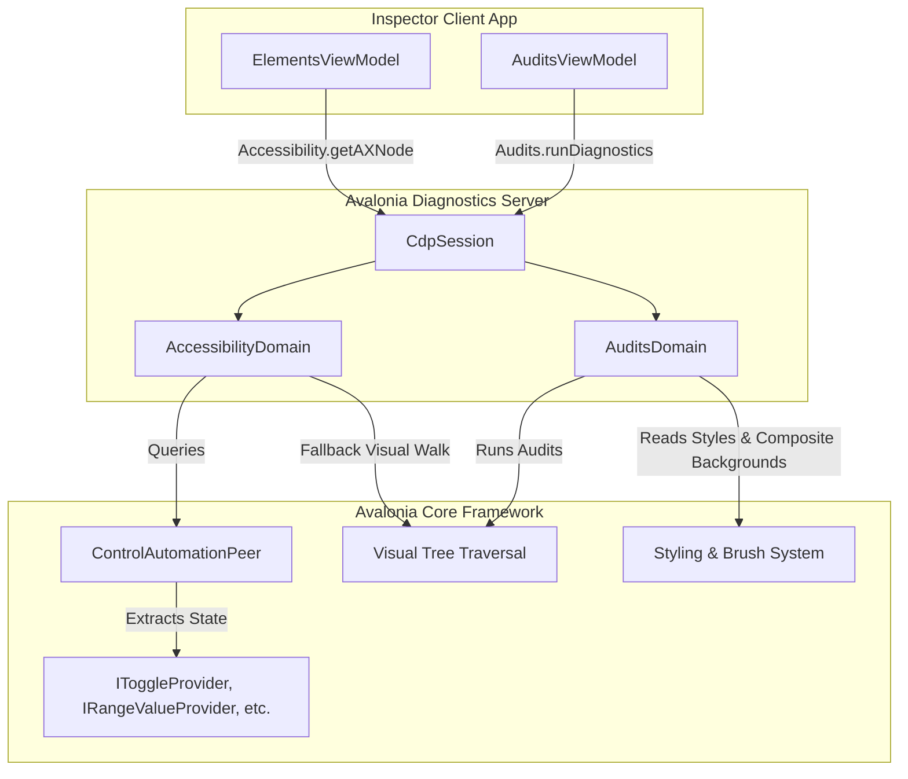
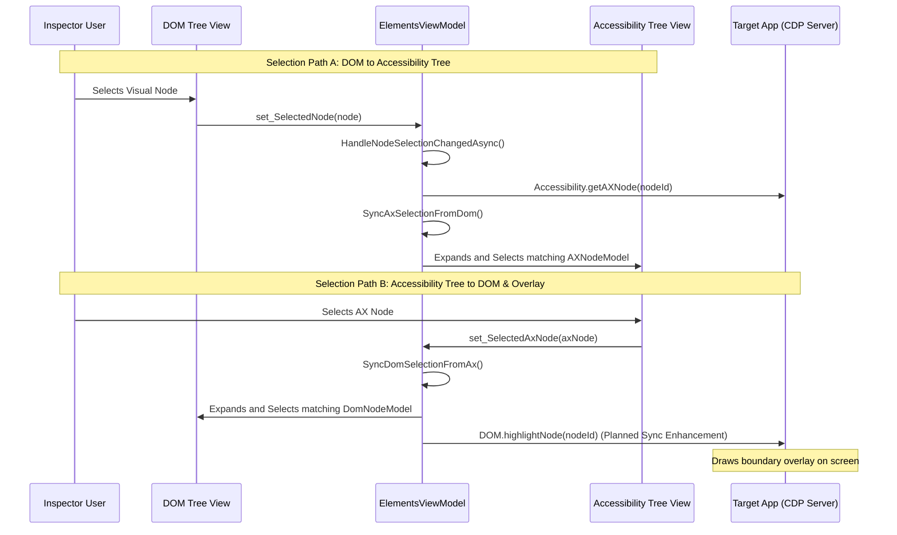

# Implementation Plan: Accessibility (a11y) Auditing & Compliance

This implementation plan details the integration of accessibility (a11y) tree inspection, automated compliance auditing, and bidirectional tree selection synchronization within the Avalonia Chrome DevTools Protocol (CDP) server (`Avalonia.Diagnostics.Cdp`) and the client inspector application (`CdpInspectorApp`). It outlines what features are already in place and provides a detailed architectural blueprint for missing enhancements.

---

## 1. Objectives & Use Cases

Ensuring that applications comply with accessibility guidelines (such as WCAG 2.1 AA) is critical for assistive technologies (screen readers, keyboard-only navigation). Exposing accessibility information through the Chrome DevTools Protocol allows QA engineers, developers, and AI coding agents to inspect and verify the accessibility posture of Avalonia applications programmatically.

### Key Use Cases:
1. **Assistive Tree Inspection**: Verify that the visual control hierarchy matches the accessibility hierarchy exposed to screen readers.
2. **Automated Compliance Verification**: Programmatically scan the application to flag violations such as missing accessible names, low text-to-background contrast ratios, incorrect keyboard focus paths, and redundant visual layout elements.
3. **Selection Synchronization**: Ensure seamless, bidirectional synchronization between the visual DOM tree and the accessibility tree for interactive debugging.
4. **Headless Audits in CI/CD**: Run automated accessibility auditing scripts headlessly during pull request pipelines to prevent accessibility regressions.

---

## 2. Current Implementation Status & Gap Analysis

The accessibility and auditing features are partially implemented across both the CDP Server and the Inspector Client. The table below highlights what is already completed and what remains missing or needs enhancement.

| Feature Area | Already Implemented (Completed) | Missing / Needs Enhancement (Planned) |
| :--- | :--- | :--- |
| **Accessibility Domain Methods** | - `enable` / `disable`<br>- `getFullAXTree` (traverses active window peer tree)<br>- `getAXNode` / `getAXNodeAndAncestors`<br>- `getRootAXNode`<br>- `getChildAXNodes`<br>- `getPartialAXTree` (including siblings/ancestors)<br>- `queryAXTree` (filters by role/name) | - Event-driven accessibility updates (e.g., notifying the client when a peer state changes dynamically on the target). |
| **Peer & Fallback Traversal** | - Traversing using `ControlAutomationPeer`.  <br>- `BuildAXNodeFromVisualFallback` walking the visual tree when peers are missing. | - Fine-grained filtering to reduce noise from layout-only visual controls. |
| **Accessibility Mappings** | - Mapping of `AutomationControlType` to standard roles.  <br>- Extraction of standard properties (`focusable`, `focused`, `disabled`, `checked`, `value`, `valuemin`, `valuemax`, `expanded`, `selected`, `multiselectable`, `keyshortcuts`, `posinset`, `setsize`, `live`, `required`, `roledescription`). | - Mapping of advanced tables/grid control types and their respective structural properties. |
| **Diagnostics Audits** | - `runDiagnostics` executing a recursive tree scan.<br>- Checking interactive controls for missing accessible names.<br>- Rule checking for deep nesting (depth > 12), empty panels, redundant borders, and negative margins. | - **Keyboard Focus Flow Validation**: Checking logical tab orders, focusable elements hidden offscreen, and circular tab loops.<br>- **Advanced WCAG Color Contrast Calculator**: Analyzing foreground vs. background relative luminance and overlay composite blending. |
| **Client Search & Filters** | - Elements DOM Search (via `DOM.performSearch`).<br>- Client-side Accessibility Search (`PerformAxSearchAsync`) filtering local nodes by role or name. | - Server-driven AX Tree search querying via the `Accessibility.queryAXTree` endpoint directly. |
| **Selection Synchronization** | - Bidirectional sync between DOM Tree selection and AX Tree selection via `ElementsViewModel` using `_isSyncingSelection` guards. | - **Highlight Synchronization**: Automatically highlighting the node's visual boundaries (via `DOM.highlightNode`) on AX node selection.<br>- **Keyboard Navigation Sync**: Aligning arrow key traversals between the DOM and AX trees. |

---

## 3. Protocol Mapping (CDP to Avalonia)

### A. Accessibility Domain Mapping
The `Accessibility` domain represents accessibility tree nodes (`AXNode`) and their corresponding properties (`AXProperty` and `AXValue`).

| Standard CDP Method | Parameters | Return Values | Server Implementation Hook |
| :--- | :--- | :--- | :--- |
| `Accessibility.enable` | None | None | Enable Accessibility domain (returns empty success). |
| `Accessibility.disable` | None | None | Disable Accessibility domain (returns empty success). |
| `Accessibility.getFullAXTree` | None | `nodes: AXNode[]` | Walks the entire control automation peer tree from `session.Window`. |
| `Accessibility.getAXNodeAndAncestors` | `nodeId`, `backendNodeId`, `objectId` | `nodes: AXNode[]` | Resolves visual element, climbs up parents, and serializes each step. |
| `Accessibility.getChildAXNodes` | `id: string` (Parent AX ID) | `nodes: AXNode[]` | Retrieves the peer children list for a cached parent node. |
| `Accessibility.getRootAXNode` | None | `node: AXNode` | Returns the root window AX node. |
| `Accessibility.getPartialAXTree` | `nodeId`, `backendNodeId`, `objectId`, `fetchRelatives: bool` | `nodes: AXNode[]` | Returns target visual, and optionally its children, ancestors, and siblings. |
| `Accessibility.queryAXTree` | `nodeId`, `accessibleName`, `role` | `nodes: AXNode[]` | Traverses and filters peers by string query matches. |

### B. Mappings of Avalonia Automation Control Types to AXTree Roles
`Avalonia.Automation.Peers.AutomationControlType` is mapped to standard accessibility roles:
- `Button` &rarr; `button`
- `CheckBox` &rarr; `checkbox`
- `ComboBox` &rarr; `combobox`
- `Edit` &rarr; `textbox`
- `List` &rarr; `list`
- `ListItem` &rarr; `listitem`
- `Slider` &rarr; `slider`
- `Text` &rarr; `StaticText`
- `Header` &rarr; `heading`
- `Menu` / `MenuItem` &rarr; `menu` / `menuitem`
- `ProgressBar` &rarr; `progressbar`
- `RadioButton` &rarr; `radio`
- `ScrollBar` &rarr; `scrollbar`
- `Tab` / `TabItem` &rarr; `tab`
- `ToolTip` &rarr; `tooltip`
- `Tree` / `TreeItem` &rarr; `tree` / `treeitem`
- `Window` &rarr; `window` / `dialog`

### C. Mappings of UI Providers to AXNode Properties
- **Toggle State (`IToggleProvider`)** &rarr; `"checked"` (`AXValue` token `"true"`, `"false"`, or `"mixed"`)
- **Range Values (`IRangeValueProvider`)** &rarr; `"valuemin"`, `"valuemax"`, `"value"` (`AXValue` type `"number"`)
- **Text Value (`IValueProvider`)** &rarr; `"value"` (`AXValue` type `"string"`)
- **Expand/Collapse (`IExpandCollapseProvider`)** &rarr; `"expanded"` (`AXValue` type `"boolean"`)
- **Selection State (`ISelectionItemProvider`)** &rarr; `"selected"` (`AXValue` type `"boolean"`)
- **Selection Mode (`ISelectionProvider`)** &rarr; `"multiselectable"` (`AXValue` type `"boolean"`)

---

## 4. Server-Side Architectural Design



### A. Peer Tree Traversal & Fallback Visual Tree
When `AccessibilityDomain` resolves the tree, it attempts to use `ControlAutomationPeer.CreatePeerForElement(control)`. 
- **Peer Mode**: Gathers accessibility properties, names, descriptions, and keyboard shortcuts.
- **Fallback Visual Mode**: Controls lacking peers are traversed using `GetVisualChildren()`. Fallback nodes are serialized via `BuildAXNodeFromVisualFallback` and marked as `ignored: true` unless they have control type overrides or accessibility names defined.

### B. Diagnostics Audits (`AuditsDomain.cs`)
The audits domain runs a static analysis pass across the window's visual tree recursively.

#### Existing Audits:
1. **Interactive Labeled Elements**: Flags controls (Button, TextBox, CheckBox, ComboBox, ListBox, etc.) missing an accessible name.
2. **Deep Visual Tree Nesting**: Warns if the nesting depth exceeds 12 layers.
3. **Empty Layout Panels**: Flags panels containing 0 children.
4. **Redundant Borders**: Flags borders with no background or thickness that wrap single controls.
5. **Negative Margins**: Flags controls with negative margins that might cause overlapping.

#### Planned Audits & Enhancements:

##### 1. WCAG Color Contrast Calculator
Evaluates readability by comparing relative luminance between text and background:
- **Foreground Resolution**: Fetch the `Foreground` brush of `TextBlock` and button contents (must resolve to `SolidColorBrush`).
- **Composite Background Solver**: Traverse upwards through parent visual tree nodes until a solid background color is found (simulating screen compositing).
- **Luminance Formula**:
  $$L = 0.2126 \times R + 0.7152 \times G + 0.0722 \times B$$
  where color channels are converted using:
  $$C = \begin{cases} \frac{C_{sRGB}}{12.92} & C_{sRGB} \le 0.03928 \\ \left(\frac{C_{sRGB} + 0.055}{1.055}\right)^{2.4} & C_{sRGB} > 0.03928 \end{cases}$$
- **Contrast Ratio Formula**:
  $$\text{Contrast Ratio} = \frac{L_1 + 0.05}{L_2 + 0.05} \quad (\text{where } L_1 > L_2)$$
- **Assertions**: WCAG AA standards require a minimum contrast ratio of **4.5:1** for regular text, and **3:1** for large text ($\ge 18\text{pt}$ or $\ge 14\text{pt}$ and bold). Violations will flag a warning issue and decrement the `accessibilityScore`.

##### 2. Keyboard Focus Flow Validation
Ensures controls are keyboard-navigable and ordered logically:
- **Focus Order Analysis**: Checks that all interactive elements have `Focusable = true` (or are properly excluded if intentionally inert).
- **Offscreen Focusable Check**: Flags elements that are focusable (`Focusable = true`) but are completely hidden (width/height = 0, or `IsVisible = false`). Focusable hidden elements disrupt screen readers.
- **Circular Loops & Disconnected Paths**: Detects scenarios where tab navigation is trapped in sub-containers or bypasses critical interactive panels.

---

## 5. Client-Side UI/UX Design

The client-side inspector application (`CdpInspectorApp`) displays the tree structure and diagnostics in an intuitive, accessible layout using the MVVM pattern.

### A. Elements View Layout (`ElementsView.axaml`)
The visual tree is integrated into a multi-tab view alongside the DOM Tree on the left pane:

```
+-----------------------------------------------------------------------------------+
| Elements Panel                                                                    |
+--------------------------------------------------+--------------------------------+
| [ DOM Tree ]  (•) [ Accessibility Tree ]         | Tabs: [Styles] [Attributes]    |
|                                                  |       [Properties] (•)[A11y]    |
| Search: [ Search by role or name           ] [S] +--------------------------------+
+--------------------------------------------------+  Accessibility Properties:     |
| ▼ Window (window)                                |  - Role: button                |
|   ▼ Grid (layout)                                |  - Name: Click Me              |
|       Button "Click Me" (button)                 |  - Description: Submit form    |
|       TextBox (textbox) [Ignored]                |  - Ignored: False              |
|       ▼ Slider "Volume" (slider)                 |  - Parent AX ID: 12            |
|                                                  |  - Child AX IDs: None          |
+--------------------------------------------------+--------------------------------+
| Node Map ID: Node #1024                          | [ Focus Node ] [ Highlight AX ]|
+--------------------------------------------------+--------------------------------+
```

1. **TreeView Data-Binding**: Binds to `ElementsViewModel.AxRootNodes` (populated with `AxNodeModel`). Ignored nodes are rendered at 50% opacity to highlight accessibility structure.
2. **Accessibility Details Sidebar Tab**: Displays role, name, description, ignored status, parent AX ID, and child AX IDs.
3. **Accessibility Search**: The local search service traverses the tree and cycles through matching nodes via local string query matching.

### B. Bidirectional Tree Selection Sync Details
Selection must sync instantly between the two trees to keep the inspection context clear:



- **Guard Variable Sync**: Updates are guarded using `_isSyncingSelection` to prevent circular event cascades.
- **Visual Highlight Sync (Planned)**: When an AX node is selected, in addition to selecting the DOM node, the client triggers `DOM.highlightNode` on the target application to render visual boundary overlays.
- **Keyboard Sync (Planned)**: Align keyboard focus so that arrow key navigation in the AX Tree automatically updates the active visual/DOM element focus and synchronization.

---

## 6. Phase-by-Phase Roadmap

### Phase 1: Completed Core Infrastructure
- Refactored `Domains/AccessibilityDomain.cs` to fully map basic `AutomationControlType` values.
- Mapped control providers (`IToggleProvider`, `IRangeValueProvider`, `IValueProvider`, `IExpandCollapseProvider`, `ISelectionItemProvider`, `ISelectionProvider`) to `AXNode` properties.
- Implemented static checks for missing accessible names, deep layout nesting, empty panels, and negative margins in `AuditsDomain.cs`.
- Programmed basic elements tab, details panel, and selection synchronization inside the client inspector `ElementsViewModel.cs`.

### Phase 2: Planned Server Extensions
1. **WCAG Color Contrast Auditor**:
   - Write a parent-traversing background color solver in `AuditsDomain.cs`.
   - Implement luminance calculation and contrast ratio assessment against WCAG AA thresholds.
2. **Keyboard Focus Flow Validator**:
   - Add focus order validation, checking tab indexes and offscreen focusable items.
   - Detect circular navigation loops and disconnected focus traps.

### Phase 3: Planned Client UI/UX Enhancements
1. **AX Selection Visual Overlay**:
   - Connect `DOM.highlightNode` triggers to AX Tree selection changes.
2. **Synchronized Keyboard Navigation**:
   - Implement synchronized arrow-key traversal handler that expands and syncs elements across both tabs simultaneously.
3. **Audit Issues Navigation**:
   - Support double-clicking diagnostics issues inside the Audits tab to navigate directly to the offending node in the DOM/AX trees.

---

## 7. Verification & E2E Testing Strategy

We write custom verification tests inside `ControlApp/Program.cs` that run headless E2E verification of these accessibility features.

### A. E2E Verification Scenario Setup (`ControlApp/Program.cs`)
The target application is initialized with the following controls:
```csharp
// Setup interactive control with valid automation properties
var slider = new Slider {
    Minimum = 0, Maximum = 100, Value = 45,
    Name = "volumeSlider"
};
slider.SetValue(AutomationProperties.NameProperty, "System Volume");

// Setup interactive control with a content label fallback
var checkBox = new CheckBox {
    IsChecked = true,
    Content = "Enable Notifications",
    Name = "notifyCheck"
};

// Setup violation scenario: low contrast text
var lowContrastText = new TextBlock {
    Text = "Low Contrast Warning",
    Foreground = new SolidColorBrush(Color.FromRgb(240, 240, 240)), // Light grey
    Background = new SolidColorBrush(Colors.White),                 // White (ratio ~1.2:1)
    Name = "lblLowContrast"
};

// Setup violation scenario: interactive element missing accessible name
var missingNameButton = new Button {
    Content = "", // Empty content
    Name = "btnMissingName"
};
```

### B. Programmatic E2E Verification Assertions (JSON-RPC)
The E2E automation script connects via WebSocket and asserts the following compliance criteria:

1. **Verify Role & Property Mappings**:
   - Command: `Accessibility.getFullAXTree`
   - Assert: Node representing `notifyCheck` has role `"checkbox"` and its `"checked"` property value is `"true"`.
   - Assert: Node representing `volumeSlider` has role `"slider"`, and its properties contain: `valuemin = 0`, `valuemax = 100`, `value = 45`.

2. **Verify Partial Tree Relatives**:
   - Command: `Accessibility.getPartialAXTree` (params: `nodeId` of `volumeSlider`, `fetchRelatives = true`).
   - Assert: Returned node array contains `volumeSlider`, its visual parent, and its immediate sibling `notifyCheck`.

3. **Verify Compliance Audits**:
   - Command: `Audits.runDiagnostics`
   - Assert: The `accessibilityScore` is less than `100` due to compliance issues.
   - Assert: The `issues` list contains a warning issue for `btnMissingName` indicating that the interactive control is missing an accessible name.
   - Assert: The `issues` list contains a warning issue for `lblLowContrast` indicating that the text has a low contrast ratio (against the resolved White background).

4. **Verify Bidirectional Selection Sync**:
   - Set client ViewModel property `SelectedNode` to `notifyCheck`.
   - Assert: The VM's `SelectedAxNode` is automatically populated with the corresponding `AxNodeModel`.
   - Set client ViewModel property `SelectedAxNode` to `volumeSlider`.
   - Assert: The VM's `SelectedNode` is automatically updated to the corresponding `DomNodeModel` representing the slider.
