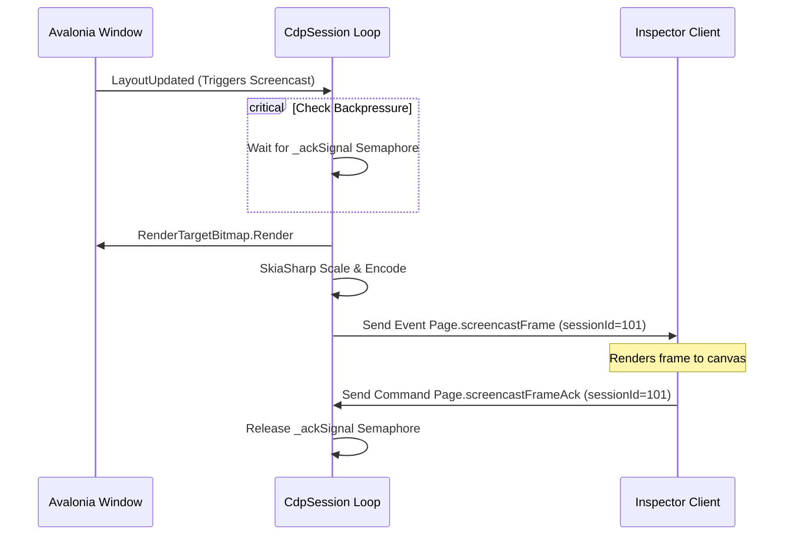

# Visual Regression Testing & Screen/Screencast Streaming Implementation Plan

This document outlines the architecture, protocol specifications, server/client designs, and verification strategies to enable **Visual Regression Testing** and **Real-Time Screencast Streaming with Remote Control** within the Avalonia Chrome DevTools Protocol (CDP) server (`Avalonia.Diagnostics.Cdp`) and the inspector client (`CdpInspectorApp`).

---

## 1. Objective & Use Cases

Visual testing and remote window control are crucial for modern cross-platform GUI development, headless verification, and automated continuous integration (CI) workflows.

### Primary Use Cases:
- **Visual Regression Testing (VRT)**: Capturing pixel-perfect screenshots of either the entire window or specific sub-elements (nodes) to perform automated pixel diffing and layout verification.
- **Remote Desktop Control / Interactive Live View**: Exposing a high-framerate, low-latency live view of the Avalonia target application inside the inspector app, complete with mouse and keyboard input redirection. This allows debugging and controlling headless GUI instances running on Docker containers or build runners.
- **Low-Bandwidth Remote Inspection**: Using delta-compression, frame scaling, quality adjustments, and format compression (JPEG/WebP) to inspect target state changes smoothly over standard WebSockets.

---

## 2. Protocol Mapping (CDP to Avalonia)

To support screenshotting, screencasting, and interactive remote control, we utilize the standard **Page** and **Input** CDP domains.

```
       ┌────────────────────────┐
       │     CdpInspector       │
       │    Client (9223)       │
       └────┬──────────────▲────┘
            │              │
   Page.screencastFrameAck  │ Page.screencastFrame (Event)
   Input.dispatchMouseEvent │ Page.captureScreenshot
   Page.startScreencast     │
             ▼              │
        ┌───────────────────┴────┐
        │     CdpSampleApp       │
        │    Target (9222)       │
        └────────────────────────┘
```

### 2.1 Page Domain Commands & Events
- **`Page.captureScreenshot` (Command)**:
  - **Parameters**:
    - `format` (`string`, optional): `"png"` (default) or `"jpeg"`.
    - `quality` (`integer`, optional): Compression quality (0-100, for jpeg).
    - `clip` (`object`, optional): Viewport clipping rectangle:
      - `x` (`double`), `y` (`double`), `width` (`double`), `height` (`double`), `scale` (`double`).
    - `fromSurface` (`boolean`, optional): Set to `true` to capture from compositor surface.
  - **Returns**: `data` (`string`): Base64-encoded screenshot image data.
  
- **`Page.startScreencast` (Command)**:
  - **Parameters**:
    - `format` (`string`, optional): `"png"`, `"jpeg"`, or `"webp"`.
    - `quality` (`integer`, optional): Compression quality (0-100).
    - `maxWidth` (`integer`, optional): Target scale width.
    - `maxHeight` (`integer`, optional): Target scale height.
    - `everyNthFrame` (`integer`, optional): Frame decimation count (e.g. 2 means deliver every 2nd frame).
  
- **`Page.stopScreencast` (Command)**:
  - **Parameters**: None.

- **`Page.screencastFrame` (Event)**:
  - **Parameters**:
    - `data` (`string`): Base64-encoded frame image data.
    - `metadata` (`object`): Frame layout properties:
      - `deviceWidth` (`double`), `deviceHeight` (`double`), `offsetTop` (`double`), `pageScaleFactor` (`double`), `scrollX` (`double`), `scrollY` (`double`), `timestamp` (`double`).
    - `sessionId` (`integer`): Monotonically increasing frame sequence ID.

- **`Page.screencastFrameAck` (Command)**:
  - **Parameters**:
    - `sessionId` (`integer`): Frame ID being acknowledged.

### 2.2 Input Domain Commands
- **`Input.dispatchMouseEvent` (Command)**:
  - **Parameters**:
    - `type` (`string`): `"mousePressed"`, `"mouseReleased"`, `"mouseMoved"`, or `"mouseWheel"`.
    - `x` (`double`), `y` (`double`): Logical device coordinates.
    - `button` (`string`): `"none"`, `"left"`, `"middle"`, `"right"`, `"back"`, `"forward"`.
    - `buttons` (`integer`, optional): Bitmask of active buttons.
    - `clickCount` (`integer`, optional): Number of clicks.
    - `deltaX` (`double`, optional), `deltaY` (`double`, optional): Scroll offsets.
    - `modifiers` (`integer`, optional): Active modifier keys (Alt=1, Ctrl=2, Meta=4, Shift=8).

- **`Input.dispatchKeyEvent` (Command)**:
  - **Parameters**:
    - `type` (`string`): `"keyDown"`, `"keyUp"`, `"rawKeyDown"`, or `"char"`.
    - `key` (`string`): Identifier string (e.g. `"ArrowLeft"`, `"Enter"`).
    - `modifiers` (`integer`, optional): Active modifiers mask.

- **`Input.insertText` (Command)**:
  - **Parameters**:
    - `text` (`string`): Raw text to input.

---

## 3. Avalonia-Side Architectural Design

The server-side implementation leverages Avalonia's rendering pipeline and lower-level window input managers.

### 3.1 Screenshotting via `RenderTargetBitmap`

#### A. Full Window Screenshot
To snap the full window, we instantiate an Avalonia `RenderTargetBitmap` on the UI thread and render the active window instance:
```csharp
var scale = window.RenderScaling;
var width = Math.Max(1, (int)(window.Bounds.Width * scale));
var height = Math.Max(1, (int)(window.Bounds.Height * scale));

using var bitmap = new RenderTargetBitmap(
    new PixelSize(width, height),
    new Vector(96 * scale, 96 * scale));

bitmap.Render(window);

using var ms = new MemoryStream();
bitmap.Save(ms);
var base64Png = Convert.ToBase64String(ms.ToArray());
```

#### B. Node-Specific Screenshot
To support VRT of target components:
1. Resolve the `nodeId` parameter using the active `CdpSession.NodeMap` to find the target `Control` instance.
2. If the control is nested, we render the parent window and crop it using SkiaSharp to match the control's bounds:
```csharp
// Retrieve target bounds relative to top-level window
var relativeBounds = control.Bounds;
var visual = control as Visual;
while (visual != null && visual != window)
{
    var parent = visual.VisualParent;
    if (parent != null)
    {
        // Accumulate offsets
        relativeBounds = new Rect(
            relativeBounds.Position + visual.Bounds.Position,
            relativeBounds.Size);
    }
    visual = parent;
}
// Render full window and crop the target area using SkiaSharp SKBitmap
```
3. Alternatively, if the control is self-contained and supports isolated rendering, render the `Visual` directly into `RenderTargetBitmap` matching the control's bounding dimensions.

### 3.2 WebSocket Screencasting & Backpressure Control

To avoid saturating the WebSocket channel, the screencast implementation employs an event-driven loop with **explicit frame acknowledgment (ACK) backpressure**.



#### Backpressure Control Details:
- **`SemaphoreSlim _ackSignal`**: Initialized with a permit count of 1.
- **Screencast Frame Pipeline**:
  1. The screencast worker thread waits for a visual tree change (`_screencastSignal.WaitAsync()`).
  2. The thread checks backpressure: `bool acked = await _ackSignal.WaitAsync(500, token);`. If the client hasn't acknowledged the previous frame within 500ms, the watchdog timeout forces a release to keep the inspector live.
  3. The server renders the frame and encodes it.
  4. **Delta Compression / Change Detection**: To avoid transmitting redundant frames, the server compares the raw output bytes (`rawPngBytes`) with `_lastSentFrameBytes` via `ReadOnlySpan<byte>.SequenceEqual`. If they match exactly, the frame is skipped, the `_ackSignal` permit is released, and the loop proceeds.
  5. The frame is scaled down using SkiaSharp according to `_screencastMaxWidth` and `_screencastMaxHeight`.
  6. The base64 frame is sent as a `Page.screencastFrame` event with a unique `sessionId`.
  7. When the client receives the frame, it dispatches `Page.screencastFrameAck` containing `sessionId`, which calls `_ackSignal.Release()` on the server to permit the next frame capture.

### 3.3 Input Redirection Integration

- **Mouse Events**:
  Mouse events received from the client are mapped to raw platform input events. Coordinates are mapped to raw platform input coordinates:
  ```csharp
  var position = new Point(x, y);
  
  // Create and dispatch RawPointerEventArgs using reflection on platform input managers
  var device = GetMouseDevice();
  var inputHandler = GetInputHandler(Window);
  var rawEvent = new RawPointerEventArgs(
      device, 
      (ulong)DateTimeOffset.UtcNow.ToUnixTimeMilliseconds(), 
      Window, 
      mappedType, 
      position, 
      (RawInputModifiers)modifiers);
      
  inputHandler?.Invoke(rawEvent);
  ```

- **Keyboard Events**:
  String key identifiers (e.g. `"ArrowLeft"`) are converted into Avalonia `Key` enumerations:
  ```csharp
  if (Enum.TryParse<Key>(keyStr, out var key))
  {
      var device = GetKeyboardDevice();
      var inputHandler = GetInputHandler(Window);
      var rawEvent = new RawKeyEventArgs(
          device, 
          (ulong)DateTimeOffset.UtcNow.ToUnixTimeMilliseconds(), 
          Window, 
          mappedType, 
          key, 
          (RawInputModifiers)modifiers);
          
      inputHandler?.Invoke(rawEvent);
  }
  ```

- **Keyboard Text Input**:
  Supports standard text insertion by calling the platform text inputs handler (`RawTextInputEventArgs`), falling back to a direct control modification if keyboard focus infrastructure is unavailable (e.g., by scanning the visual tree for the focused `TextBox` and directly mutating its `Text` property).

---

## 4. Inspector-Side UI/UX Design

The inspector client `CdpInspectorApp` implements a dedicated **Live View / Simulation** panel inside `SimulationView.axaml` and `SimulationViewModel.cs`.

### 4.1 UI Layout & Interaction Canvas

The viewport contains a main renderer image control wrapped inside a scroll container:

```
+-------------------------------------------------------------------------+
| [◀] [▶] [↻] Address: [ http://localhost:9222/about              ] [ Go ]|
+-------------------------------------------------------------------------+
| Preset: [ iPad Air (820x1180)  ▼] Scale: [ 1.0  ] [Mobile] [Screenshot] |
+-------------------------------------------------------------------------+
|                                                                         |
|  +-------------------------------------------------------------------+  |
|  | Pillarbox Padding                                                 |  |
|  |  +-------------------------------------------------------------+  |  |
|  |  |                                                             |  |  |
|  |  |                    Live View Canvas (Image)                 |  |  |
|  |  |                                                             |  |  |
|  |  +-------------------------------------------------------------+  |  |
|  |                                                                   |  |
|  +-------------------------------------------------------------------+  |
|                                                                         |
+-------------------------------------------------------------------------+
```

### 4.2 Aspect-Ratio Scaling & Coordinate Transformation

When the screencast image is rendered with a stretch mode (`Stretch="Uniform"`), the physical control dimensions of the `Image` in `SimulationView` typically deviate from the aspect ratio of the stream's frames. Direct raw mouse event coordinates (`pos.X`, `pos.Y`) on the local Image control will map incorrectly unless they are scaled back to target resolution.

The correct aspect ratio coordinate conversion logic is as follows:

```csharp
private void SendMouseEvent(string type, PointerEventArgs e)
{
    var img = this.Find<Image>("imgScreenshot");
    if (img == null || img.Source is not Bitmap bitmap) return;

    var pointerPoint = e.GetCurrentPoint(img);
    var pos = pointerPoint.Position;

    double localWidth = img.Bounds.Width;
    double localHeight = img.Bounds.Height;
    
    // Target device dimensions obtained from screencast frame metadata
    double targetWidth = mainVm.Simulation.DeviceWidth;
    double targetHeight = mainVm.Simulation.DeviceHeight;

    if (localWidth <= 0 || localHeight <= 0 || targetWidth <= 0 || targetHeight <= 0) return;

    // Calculate aspect ratios
    double targetAspect = targetWidth / targetHeight;
    double localAspect = localWidth / localHeight;

    double displayWidth, displayHeight;
    double offsetX = 0;
    double offsetY = 0;

    // Determine actual rendered image bounds inside the Uniform Image control
    if (localAspect > targetAspect)
    {
        // Pillarboxed (vertical bars on left/right)
        displayHeight = localHeight;
        displayWidth = localHeight * targetAspect;
        offsetX = (localWidth - displayWidth) / 2.0;
    }
    else
    {
        // Letterboxed (horizontal bars on top/bottom)
        displayWidth = localWidth;
        displayHeight = localWidth / targetAspect;
        offsetY = (localHeight - displayHeight) / 2.0;
    }

    // Map local pointer coordinates to actual visual image surface
    double imageX = pos.X - offsetX;
    double imageY = pos.Y - offsetY;

    // Clamp coordinates
    if (imageX < 0 || imageX > displayWidth || imageY < 0 || imageY > displayHeight) return;

    // Scale to target coordinates
    double scaledX = (imageX / displayWidth) * targetWidth;
    double scaledY = (imageY / displayHeight) * targetHeight;

    _ = mainVm.Simulation.SendMouseEventAsync(type, scaledX, scaledY, button, modifiers, buttons);
}
```

---

## 5. Current Implementation Status

Below is a detailed breakdown of features currently implemented in the codebase and existing gaps that require further enhancements.

### 5.1 Already Implemented Features

1. **Screenshotting & Printing**:
   - **Full Window Screenshot**: Implemented in `PageDomain.CaptureScreenshotAsync`. Takes a bitmap snapshot of the target window via `RenderTargetBitmap` and converts it to a Base64-encoded PNG string.
   - **High-DPI Scale Calculation**: Dynamically queries the window's `RenderScaling` to determine the physical pixel size for rendering.
   - **Image Format Encoding**: Fallback code is in place to generate placeholder mock images using SkiaSharp if rendering fails.
   - **PDF Printing**: Implemented in `PageDomain.PrintToPdfAsync`. Captures a window rendering, decodes it into a SkiaSharp `SKBitmap`, and writes it into a PDF stream via `SKDocument.CreatePdf` before returning Base64 data.

2. **WebSocket Screencasting Loop**:
   - **Active Streaming & Decimation**: Handled in `CdpSession.cs` via a background worker thread. Allows setting format (`jpeg`, `png`, `webp`), scaling boundaries (`maxWidth`, `maxHeight`), and decimation filters (`everyNthFrame`).
   - **Layout Triggers**: Subscribes to the target window's `LayoutUpdated` event to queue up frames immediately upon visual layout modifications.
   - **Minimum Rate Gating**: Limits capture rate to a minimum threshold of 33ms (~30 FPS) using a timing loop to avoid thread starvation.
   - **Flow Control (Backpressure)**: Uses `SemaphoreSlim _ackSignal` requiring the client to issue `Page.screencastFrameAck` before delivering subsequent frames. Protects network bandwidth from saturating. Includes a 500ms watchdog fallback to prevent the stream from freezing if an ACK is lost.
   - **Delta Frame Compression**: Compares encoded output bytes (`SequenceEqual`) against the previous frame. Redundant frames are skipped, preventing needless WebSocket data transfer.

3. **Client-Side Simulation UI**:
   - **Simulation Canvas**: Built into `SimulationView.axaml` and `SimulationViewModel.cs`. Renders screencast frames on an image control, updates `DeviceWidth` and `DeviceHeight` parameters dynamically, and returns matching frame acknowledgements.
   - **Interactive Control Redirection**: Hooks into UI controls to capture keystrokes, input text, and mouse drags, dispatching corresponding JSON-RPC payloads (`Input.dispatchMouseEvent`, `Input.dispatchKeyEvent`, and `Input.insertText`).
   - **Touch & Gesture Emulation**: Exposes touch-oriented redirection (`Input.emulateTouchFromMouseEvent`) and handles complex gesture synthesis including Tap, Scroll, and Pinch.

---

### 5.2 Missing Features & Needed Enhancements

While core mechanics are functional, several critical gaps must be resolved for a production-ready Visual Regression Testing and Remote Control experience:

1. **High-DPI Coordinate Mapping & DPI Scaling Inconsistencies**:
   - **Server-Side DPI Mismatch**: In `InputDomain.cs`, coordinates (`x`, `y`) received from the CDP client are mapped directly to `Point(x, y)` when dispatching `RawPointerEventArgs`. However, Avalonia's platform window backend expects physical coordinates on high-DPI displays. If `RenderScaling` is not applied, clicks on high-DPI monitors will target the wrong locations.
   - **Client-Side Scaling Translation**: `SimulationView.axaml.cs` currently reads bounds from `imgScreenshot.Bounds` and maps local mouse coordinates 1:1, failing to apply the coordinate conversion formula to map values to the target `DeviceWidth` and `DeviceHeight` from the screencast metadata. If the inspector window is resized or scaling is set, pointer coordinates are completely offset.

2. **Unified Aspect Ratio Coordinate Mapping**:
   - **Uniform Stretch Support**: The client UI does not support uniform aspect-ratio translation. When the live view uses letterboxing/pillarboxing, mouse clicks in the padding areas are not ignored, and clicks inside the visual image are misaligned. The aspect ratio translation code described in Section 4.2 must be integrated into `SimulationView.axaml.cs`.

3. **Cropping & Clipping Bounds in Screenshots**:
   - **`clip` Parameter Support**: `Page.captureScreenshot` ignores the `clip` parameters (`x`, `y`, `width`, `height`, `scale`). Visual testing frameworks need to capture sub-regions of windows.
   - **Node-Specific Screenshotting**: The current `captureScreenshot` method has no mechanism to resolve a `nodeId` from the CDP DOM session and isolate visual rendering/cropping to that control. SkiaSharp cropping based on visual bounds accumulation must be implemented.

4. **Bandwidth & Video Compression Optimizations**:
   - **Lack of Modern Streaming Protocols**: The screencast loop relies entirely on static, frame-by-frame image rendering (JPEG/PNG/WebP). Streaming over a protocol like WebRTC (H.264/VP9) or utilizing partial frame-update tiles (sending only dirty sub-regions) is missing.
   - **SequenceEqual Overhead**: The delta comparison currently checks for absolute equality of the final encoded bytes. This means minor alterations (such as a cursor blink) force the encoding and transmission of the entire frame.

5. **Interactive Screenshot Cropping UI**:
   - The inspector application lacks a built-in selection overlay / cropping tool to let users visually outline areas of the screen to produce Visual Regression Test templates.

---

## 6. Phase-by-Phase Roadmap

### Phase 1: Server Domain & Protocol Completeness
- **DPI Coordinate Resolution**: Implement scaling inside `InputDomain.cs` to multiply coordinates by `window.RenderScaling` where expected by the platform backend.
- **Visual Node Cropping**: Add a node-specific screenshot resolver in `PageDomain.cs` that:
  1. Finds the control matching `nodeId` in the DOM tree.
  2. Resolves its bounds relative to the window.
  3. Renders the window and crops SkiaSharp `SKBitmap` to match the control coordinates.
- **Screenshot Clipping**: Process the `clip` parameter inside `captureScreenshot` requests to crop the output image accordingly.

### Phase 2: Client View Coordinate & Aspect Scaling
- **Coordinate Mapping Integration**: Integrate the Aspect-Ratio Scaling translation algorithm into `SimulationView.axaml.cs`'s `SendMouseEvent` and `Image_PointerWheelChanged` handlers.
- **Fitted Boundary Clipping**: Ensure mouse events occurring outside the letterboxed/pillarboxed boundaries are rejected.

### Phase 3: Live Streaming Optimizations
- **Partial Frame Updates**: Transition screencast updates to a dirty-rect structure, transmitting only coordinates and data for modified tiles.
- **Frame Drop Handling**: Refine backpressure to drop frames gracefully when client processing lag is detected (e.g. queue saturation).

### Phase 4: Automated Testing & VRT Tooling (Harnessing `ControlApp` verification)
- Extend the `ControlApp` verification script to assert coordinate mapping correctness, high-DPI scaling offsets, and cropping metrics.

---

## 7. Verification & E2E Testing Strategy

To verify this feature programmatically without relying on manual browser inspection, we use the dual-CDP automation framework inside `scratch/ControlApp`.

```
  [ControlApp]
       │
       ├─► (Port 9222) Start Screencast & Capture Screenshot
       │               Verify: Base64 data is returned and matches image header.
       │
       ├─► (Port 9222) Emulate Mouse Input on Targets
       │               Verify: Visual tree coordinates process pointer positions.
       │
       └─► (Port 9233) Self-Inspect Client UI Canvas Renderers
                       Verify: UI bindings display screenshot updates.
```

### Dedicated Custom E2E Verifier Code (`scratch/ControlApp/Program.cs`):
```csharp
using System;
using System.IO;
using System.Text.Json.Nodes;
using System.Threading;
using System.Threading.Tasks;
using System.Net.WebSockets;
using System.Text;

namespace ControlApp;

public static class Program
{
    public static async Task Main(string[] args)
    {
        Console.WriteLine("[TEST RUNNER] Starting Visual Regression & Screencast Verification...");
        
        string targetWsUrl = "ws://127.0.0.1:9222/devtools/page/main-session";
        string inspectorWsUrl = "ws://127.0.0.1:9233/devtools/page/inspector-session";

        using var cts = new CancellationTokenSource(TimeSpan.FromSeconds(15));

        try
        {
            // 1. Connect to Target App (Port 9222)
            using var targetSocket = new ClientWebSocket();
            await targetSocket.ConnectAsync(new Uri(targetWsUrl), cts.Token);
            Console.WriteLine("[TEST PASS] Connected to target application.");

            // 2. Request Page.captureScreenshot
            var screenshotCmd = new JsonObject
            {
                ["id"] = 1,
                ["method"] = "Page.captureScreenshot",
                ["params"] = new JsonObject { ["format"] = "png" }
            };
            await SendMessageAsync(targetSocket, screenshotCmd);
            var screenshotResponse = await ReadMessageAsync(targetSocket, cts.Token);
            
            var base64Data = screenshotResponse["result"]?["data"]?.GetValue<string>();
            if (string.IsNullOrEmpty(base64Data))
            {
                throw new Exception("[TEST FAIL] Screenshot capture failed or returned empty data.");
            }
            byte[] imgBytes = Convert.FromBase64String(base64Data);
            Console.WriteLine($"[TEST PASS] Screenshot captured successfully ({imgBytes.Length} bytes).");

            // 3. Start Screencast Loop and verify Frame Event + Ack
            var startScreencastCmd = new JsonObject
            {
                ["id"] = 2,
                ["method"] = "Page.startScreencast",
                ["params"] = new JsonObject
                {
                    ["format"] = "jpeg",
                    ["quality"] = 80,
                    ["maxWidth"] = 800,
                    ["maxHeight"] = 600,
                    ["everyNthFrame"] = 1
                }
            };
            await SendMessageAsync(targetSocket, startScreencastCmd);
            Console.WriteLine("[TEST INFO] Page.startScreencast command sent.");

            // Read the next event (should be Page.screencastFrame)
            bool frameReceived = false;
            for (int i = 0; i < 5; i++)
            {
                var eventMsg = await ReadMessageAsync(targetSocket, cts.Token);
                string method = eventMsg["method"]?.GetValue<string>() ?? "";
                if (method == "Page.screencastFrame")
                {
                    int sessionId = eventMsg["params"]?["sessionId"]?.GetValue<int>() ?? 0;
                    Console.WriteLine($"[TEST PASS] Received screencast frame. Session ID: {sessionId}");
                    
                    // Send Ack immediately
                    var ackCmd = new JsonObject
                    {
                        ["id"] = 3 + i,
                        ["method"] = "Page.screencastFrameAck",
                        ["params"] = new JsonObject { ["sessionId"] = sessionId }
                    };
                    await SendMessageAsync(targetSocket, ackCmd);
                    Console.WriteLine($"[TEST PASS] Acknowledged screencast frame: {sessionId}");
                    frameReceived = true;
                    break;
                }
            }

            if (!frameReceived)
            {
                throw new Exception("[TEST FAIL] Failed to receive screencastFrame event within timeout.");
            }

            // 4. Clean up and stop screencast
            var stopScreencastCmd = new JsonObject
            {
                ["id"] = 10,
                ["method"] = "Page.stopScreencast"
            };
            await SendMessageAsync(targetSocket, stopScreencastCmd);
            Console.WriteLine("[TEST PASS] Screencast stopped successfully.");
        }
        catch (Exception ex)
        {
            Console.Error.WriteLine($"[TEST ERROR] E2E verification failed: {ex.Message}");
            Environment.Exit(1);
        }
    }

    private static async Task SendMessageAsync(ClientWebSocket ws, JsonObject node)
    {
        var bytes = Encoding.UTF8.GetBytes(node.ToJsonString());
        await ws.SendAsync(new ArraySegment<byte>(bytes), WebSocketMessageType.Text, true, CancellationToken.None);
    }

    private static async Task<JsonObject> ReadMessageAsync(ClientWebSocket ws, CancellationToken token)
    {
        var buffer = new byte[16384];
        using var ms = new MemoryStream();
        WebSocketReceiveResult result;
        do
        {
            result = await ws.ReceiveAsync(new ArraySegment<byte>(buffer), token);
            ms.Write(buffer, 0, result.Count);
        } while (!result.EndOfMessage);

        var jsonStr = Encoding.UTF8.GetString(ms.ToArray());
        return JsonNode.Parse(jsonStr) as JsonObject ?? new JsonObject();
    }
}
```
