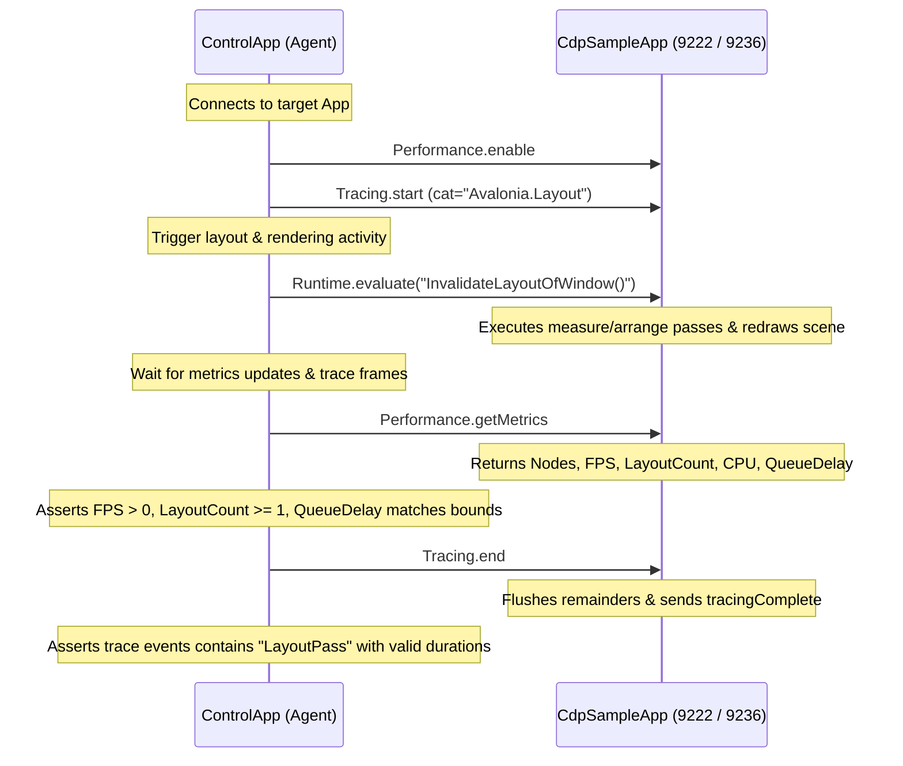

# Technical Implementation Plan: Performance Profiling & Layout/Render Diagnostics

This implementation plan outlines the architectural integration and user interface design required to add performance profiling, rendering diagnostics, dispatcher monitoring, and trace event logging to the Avalonia Chrome DevTools Protocol (CDP) server (`Avalonia.Diagnostics.Cdp`) and its inspector client (`CdpInspectorApp`).

---

## 1. Objective & Use Cases

Modern desktop applications require precise tools to diagnose performance bottlenecks. Interrupted frames (jank), layout thrashing (excessive measure/arrange cycles), and UI thread blockage degrade the user experience. By implementing the CDP `Performance` and `Tracing` domains, developers and automation agents can inspect Avalonia applications with standard-aligned profiling tools.

### Key Use Cases
1. **Frame Rate (FPS) and Rendering Optimization**: Programmatically measure frame-render times to detect frames that exceed the 16.6ms budget (for 60 FPS targets).
2. **Layout Cycle Auditing**: Detect layout loops and trace hot paths in measure/arrange execution.
3. **UI Thread Responsiveness**: Track how long the `Dispatcher` is blocked by synchronous tasks, and measure queue latency (scheduling-to-execution delays).
4. **End-to-End Performance Benchmarking**: Capture tracing data during automated test runs (e.g. via `ControlApp` verification scripts) to establish regression boundaries for CPU and memory usage.

---

## 2. Protocol Mapping (CDP to Avalonia)

To achieve parity with Google Chrome's developer tools, we map standard CDP commands to Avalonia-specific diagnostics engines.

### Performance Domain (`Performance`)

| CDP Method / Event | Direction | Parity Mapping in Avalonia |
| :--- | :--- | :--- |
| `Performance.enable` | Client → Server | Activates performance telemetry loops (timers, hooks). |
| `Performance.disable` | Client → Server | Deactivates metrics collection and tears down hooks. |
| `Performance.getMetrics` | Client → Server | Returns a snapshot of current system metrics. |
| `Performance.metrics` | Server → Client | Pushes periodic metrics (if enabled) at configured intervals. |

#### Extended Metrics Schema
The `getMetrics` response and `metrics` events will include the following standard and custom metrics:
- `Timestamp`: Epoch timestamp in seconds.
- `Nodes`: Visual node count in target window.
- `JSHeapUsedSize`: Process Private Working Set (bytes).
- `JSHeapTotalSize`: Managed GC Heap total memory (bytes).
- `CPUUsage`: Normalized CPU consumption percentage (0–100%).
- `LayoutCount`: Cumulative number of measure/arrange passes.
- `LayoutDuration`: Total time spent performing layout passes (seconds).
- `FPS`: Current frame rate (frames per second).
- `FrameDuration`: Time taken to render the last frame (seconds).
- `DispatcherQueueDelay`: Average latency of the UI Dispatcher queue (seconds).
- `UIThreadBlockingTime`: Current time the UI thread was blocked/janked (seconds).

### Tracing Domain (`Tracing`)

| CDP Method / Event | Direction | Parity Mapping in Avalonia |
| :--- | :--- | :--- |
| `Tracing.start` | Client → Server | Attaches an `ActivityListener` or `DiagnosticListener` to capture traces. |
| `Tracing.end` | Client → Server | Disposes the listener and flushes remaining buffered traces. |
| `Tracing.dataCollected` | Server → Client | Event containing a chunk of trace events (Chrome Trace Format). |
| `Tracing.tracingComplete` | Server → Client | Event signaling that tracing has fully stopped and all data is flushed. |

#### Chrome Trace Event format (JSON)
```json
{
  "cat": "Avalonia.Layout",
  "pid": 58310,
  "tid": 1,
  "ts": 1624294025123456,
  "ph": "X",
  "name": "LayoutPass",
  "dur": 4500,
  "args": {
    "visualRoot": "MainWindow",
    "cycleCount": 2
  }
}
```

---

## 3. Current Implementation Status & Gap Analysis

Based on an audit of the codebase, there is a substantial gap between the existing performance metrics and the targeted profiling capabilities.

### 3.1 Already Implemented

1. **Performance Domain**:
   - `PerformanceDomain.cs` exposes the standard `Performance.getMetrics` method.
   - It returns a subset of metrics: `Timestamp` (epoch seconds), `Nodes` (recursive count of visual children in the active session window), `JSHeapUsedSize` (using `Process.GetCurrentProcess().WorkingSet64`), and `JSHeapTotalSize` (using `GC.GetTotalMemory(false)`).
   - Stubs for `enable`, `disable`, and `setTimeDomain` are defined but execute as no-ops.
2. **Memory Domain**:
   - `MemoryDomain.cs` implements `Memory.getDOMCounters` (returning the count of active targets as `documents`, visual nodes count as `nodes`, and `jsEventListeners` as a stub).
   - `Memory.getLiveControls` recursively crawls all active windows to count instantiated control types (returned as a dictionary).
   - `Memory.collectGarbage` and `Memory.forciblyPurgeJavaScriptMemory` trigger full Garbage Collection cycles (`GC.Collect()` followed by finalizer waiting).
3. **SystemInfo Domain**:
   - `SystemInfoDomain.cs` implements `SystemInfo.getProcessInfo` (returning process ID, thread count, private Working Set size, and total cumulative CPU seconds).
4. **Client UI & ViewModels**:
   - `PerformanceViewModel.cs` connects to the server and retrieves these metrics via periodic polling (`RefreshMetricsAsync`).
   - The values are bound to text elements in `PerformanceView.axaml`.
   - A sliding list of the last 30 memory measurements (`MemoryHistory`) is plotted on the screen using a custom-drawn `TimelineChart.cs` control.

### 3.2 Missing or Needs Enhancement

1. **Active Core Metrics Tracking**:
   - **CPU Usage Percentage**: Currently, only cumulative processor seconds are exposed in `SystemInfo`. The real-time normalized CPU utilization (0-100%) metric is missing from the `Performance` domain.
   - **Frame Rate (FPS) and Rendering Timings**: There are no active hooks measuring scene rendering loops or frame draw durations.
   - **Layout Pass Tracking**: Cumulative layout passes (`LayoutCount`) and time spent executing layouts (`LayoutDuration`) are entirely unmeasured.
   - **Dispatcher Queue Watchdog**: There is no monitoring of the UI thread to calculate queue scheduling delays (`DispatcherQueueDelay`) or UI thread blocking/jank duration (`UIThreadBlockingTime`).
2. **CDP Tracing Domain**:
   - The `Tracing` domain is completely absent on the server. No handler exists, and no mapping of .NET trace activities (`System.Diagnostics.Activity`) to Chrome Trace JSON formats has been written.
3. **Client-Side Views & Timelines**:
   - The client has no timelines for FPS, CPU utilization, or Dispatcher latency.
   - There is no UI to toggle/record system trace activities, view flame charts, or export Trace JSON logs for Chrome DevTools compatibility.

---

## 4. Avalonia-Side Architectural Design

To support the missing metrics and tracing events, we will introduce specialized diagnostic monitors.

```mermaid
flowchart TD
    subgraph Target Application (CDP Server)
        subgraph Diagnostics Instrumentation
            RT[IRenderer / SceneInvalidated] -->|FPS / Frame Time| PM[Metrics Manager]
            LM[LayoutManager / LayoutUpdated] -->|Layout Duration & Cycles| PM
            DB[Dispatcher Heartbeat Watcher] -->|Queue Delay & Block Time| PM
            SYS[System Processes / GC] -->|CPU & Memory Metrics| PM
        end
        
        subgraph .NET Trace Sources
            ACT[System.Diagnostics.ActivitySource]
        end

        PM -->|getMetrics / Periodic Push| PD[PerformanceDomain Handler]
        ACT -->|ActivityListener| TD[TracingDomain Handler]
        
        PD -->|Performance.metrics| WS[WebSocket Session]
        TD -->|Tracing.dataCollected| WS
    end
    
    WS <-->|JSON-RPC| Client[CdpInspectorApp / Automation Agent]
```

### 4.1 Rendering Diagnostics Hook (FPS & Frame Durations)
To measure frame rate and render duration without dragging down application performance:
- We hook into the target window's rendering compositor pipeline.
- In the active `CdpSession`, we subscribe to the `Window.Renderer.SceneInvalidated` event.
- Because `SceneInvalidated` triggers when elements require redraw, we measure the rendering pipeline latency by enqueueing a callback or capturing timestamps:
```csharp
private long _lastFrameTimestamp;
private double _fps;
private double _lastFrameDurationMs;

private void OnSceneInvalidated(object? sender, SceneInvalidatedEventArgs e)
{
    long currentTimestamp = Stopwatch.GetTimestamp();
    if (_lastFrameTimestamp != 0)
    {
        double elapsedMs = (currentTimestamp - _lastFrameTimestamp) * 1000.0 / Stopwatch.Frequency;
        _fps = 1000.0 / elapsedMs;
    }
    _lastFrameTimestamp = currentTimestamp;
    
    // Track render time of the frame
    var stopwatch = Stopwatch.StartNew();
    // We register a callback that completes when the draw is flushed
    Dispatcher.UIThread.Post(() =>
    {
        stopwatch.Stop();
        _lastFrameDurationMs = stopwatch.Elapsed.TotalMilliseconds;
    }, DispatcherPriority.Render);
}
```

### 4.2 Layout Diagnostics Hook (Measure/Arrange Cycles)
To track layout pass count and layout duration:
- In Avalonia, the visual layout pass executes synchronously under `LayoutManager`.
- Since `LayoutManager` is public on `TopLevel.LayoutManager`, we will hook layout cycles.
- Since we want non-intrusive measurements, we can subscribe to `TopLevel.LayoutUpdated`. To capture the layout pass duration, we listen to the start of layout by detecting layout invalidations (`InvalidateMeasure`/`InvalidateArrange` requests) or by wrapping the `LayoutManager` via reflection/subclassing.
- Alternatively, we post a tracking wrapper job directly onto the `Dispatcher` at `DispatcherPriority.Layout` to measure the execution bounds:
```csharp
private int _layoutCycles;
private double _layoutDurationMs;

public void TrackLayoutStart()
{
    var sw = Stopwatch.StartNew();
    Dispatcher.UIThread.Post(() =>
    {
        sw.Stop();
        _layoutDurationMs = sw.Elapsed.TotalMilliseconds;
        _layoutCycles++;
    }, DispatcherPriority.Layout);
}
```

### 4.3 Dispatcher Queue Delay & UI Thread Blocking Watchdog
To measure responsiveness on the UI Thread, we run a background thread "heartbeat watcher":
- **Dispatcher Latency**: Every 100ms, the background thread schedules a lightweight job on the UI thread at `DispatcherPriority.Normal` containing a scheduled timestamp. When the job runs on the UI thread, it calculates the delay `Time.Now - ScheduledTime`.
- **UI Thread Blocking**: The background thread posts a ping to the UI thread using a high priority every 16ms and waits on an event. If the UI thread fails to signal back within 16ms, the watchdog increments the UI thread blocking duration counter by the excess time.

```csharp
public class DispatcherWatchdog : IDisposable
{
    private readonly Thread _watchdogThread;
    private readonly CancellationTokenSource _cts = new();
    private double _queueDelayMs;
    private double _blockingTimeMs;

    public double QueueDelaySeconds => _queueDelayMs / 1000.0;
    public double BlockingTimeSeconds => _blockingTimeMs / 1000.0;

    public DispatcherWatchdog()
    {
        _watchdogThread = new Thread(WatchdogLoop) { IsBackground = true, Name = "CdpDispatcherWatchdog" };
        _watchdogThread.Start();
    }

    private async void WatchdogLoop()
    {
        var stopwatch = new Stopwatch();
        while (!_cts.IsCancellationRequested)
        {
            long scheduleTime = Stopwatch.GetTimestamp();
            var uiSignal = new SemaphoreSlim(0, 1);

            Dispatcher.UIThread.Post(() =>
            {
                long executeTime = Stopwatch.GetTimestamp();
                _queueDelayMs = (executeTime - scheduleTime) * 1000.0 / Stopwatch.Frequency;
                uiSignal.Release();
            }, DispatcherPriority.Normal);

            stopwatch.Restart();
            bool completed = await uiSignal.WaitAsync(100, _cts.Token);
            stopwatch.Stop();

            if (!completed)
            {
                _blockingTimeMs = stopwatch.ElapsedMilliseconds - 100;
            }
            else
            {
                _blockingTimeMs = 0;
            }

            await Task.Delay(100);
        }
    }

    public void Dispose() => _cts.Cancel();
}
```

### 4.4 Tracing Domain Engine (.NET Activity Listener Integration)
The standard `.NET` engine leverages `System.Diagnostics.ActivitySource` and `Activity` for application tracing.
We integrate this directly with the CDP `Tracing` domain:
- In `TracingDomain.HandleAsync("start", params)`:
  - We instantiate an `ActivityListener`.
  - We register interest in the targets requested (e.g. `Avalonia.*`, application assemblies).
  - In `ActivityStarted(Activity activity)` and `ActivityStopped(Activity activity)`:
    - We capture thread ID (`Environment.CurrentManagedThreadId`), high-precision timestamps (microseconds), name, category (Source), and tags.
    - We convert the activity to a Chrome Trace Event.
    - We enqueue the event in a concurrent queue.
  - A background flush loop periodically (e.g. every 100ms) extracts events, bundles them into a `Tracing.dataCollected` event payload, and dispatches them via WebSocket.
- In `TracingDomain.HandleAsync("end", params)`:
  - We detach the `ActivityListener`.
  - We flush all remaining events via a final `Tracing.dataCollected` push.
  - We return a response and send `Tracing.tracingComplete`.

---

## 5. Inspector-Side UI/UX Design

In `CdpInspectorApp` (residing in `CDP.Inspector.Shared`), we will enhance the **Performance Tab** to render these metrics.

```
+---------------------------------------------------------------------------------------------------+
| Elements  Console  Network  [Performance]  Test Studio                                            |
+------------------------------------+--------------------------------------------------------------+
| Actions & Stats                    | Real-Time Diagnostics Timelines                              |
| [Refresh] [Collect GC] [Record Tr] | FPS Timeline (Target: 60 FPS)                                |
|                                    | [============================== 59 FPS ===================]  |
| System Stats:                      |                                                              |
| - CPU: 4.2%                        | UI Thread Latency (Queue Delay)                              |
| - Memory (Private WS): 120.4 MB    | [______/\______________________ 4ms ______________________]  |
| - Visual Nodes: 432                |                                                              |
| - Target Windows: 1                | Layout Cycles & Timings                                      |
| - Accum. Layout Runs: 124          | [____|__|____________|_________ 12ms _____________________]  |
+------------------------------------+--------------------------------------------------------------+
| Trace Timeline Flame Chart (Active during Record Trace)                                           |
| Zoom: [ - ] [ + ]   Pan: [ < ] [ > ]                                                              |
| Thread 1 (UI Thread)                                                                              |
| [---------------------------- ExecuteLayoutPass ---------------------------]                      |
|   [------ MeasurePass ------]               [------ ArrangePass ------]                           |
| Thread 12 (Compositor Thread)                                                                     |
|   [-- RenderFrame --]                             [-- RenderFrame --]                             |
+---------------------------------------------------------------------------------------------------+
```

### 5.1 UI Components to Add

1. **`TimelineChart` Control (`Controls/TimelineChart.cs`)**:
   - A highly optimized, custom-drawn control extending `Control` that renders double array data series.
   - Supports drawing background gridlines and gradient area fill under the line.
   - Utilizes custom `DrawingContext` lines, fills, and text drawing for performance.
2. **`TraceTimelineControl` Control (`Controls/TraceTimelineControl.cs`)**:
   - Renders a multi-track timeline displaying collected trace events.
   - Automatically computes lane assignments based on Thread ID.
   - Maps parent-child relations to visual nesting stack heights (flame chart view).
   - Integrates standard horizontal scroll and mouse wheel zoom.
   - Shows hover tooltips detailing: Event Name, Category, Duration (ms), Thread, and Arguments.

### 5.2 ViewModel Architecture (`ViewModels/PerformanceViewModel.cs`)
We will upgrade `PerformanceViewModel.cs` to manage the lifecycle of metrics streams and tracing buffers:

```csharp
public class PerformanceViewModel : ViewModelBase
{
    private readonly ICdpService _cdpService;
    private bool _isRecordingTrace;
    
    public ObservableCollection<double> FpsHistory { get; } = new();
    public ObservableCollection<double> CpuHistory { get; } = new();
    public ObservableCollection<double> DelayHistory { get; } = new();
    public ObservableCollection<TraceTimelineEntry> TraceEntries { get; } = new();

    public bool IsRecordingTrace
    {
        get => _isRecordingTrace;
        set => RaiseAndSetIfChanged(ref _isRecordingTrace, value);
    }

    public ICommand ToggleTraceCommand { get; }

    public PerformanceViewModel(ICdpService cdpService)
    {
        _cdpService = cdpService;
        ToggleTraceCommand = new RelayCommand(async () => await ToggleTraceAsync());
        
        // Listen to performance events pushed from target
        _cdpService.RegisterEventHandler("Performance.metrics", OnMetricsReceived);
        _cdpService.RegisterEventHandler("Tracing.dataCollected", OnTraceDataReceived);
        _cdpService.RegisterEventHandler("Tracing.tracingComplete", OnTracingComplete);
    }

    private void OnMetricsReceived(JsonObject payload)
    {
        // Extract standard and custom metrics, push to histories, and enforce sliding capacity window (e.g. max 50 points)
    }

    private void OnTraceDataReceived(JsonObject payload)
    {
        // Parse Chrome Trace events and push into TraceEntries collection
    }

    private async Task ToggleTraceAsync()
    {
        if (!IsRecordingTrace)
        {
            TraceEntries.Clear();
            await _cdpService.SendCommandAsync("Tracing.start", new JsonObject
            {
                ["categories"] = "Avalonia.Layout,Avalonia.Rendering,App"
            });
            IsRecordingTrace = true;
        }
        else
        {
            await _cdpService.SendCommandAsync("Tracing.end");
            IsRecordingTrace = false;
        }
    }
}
```

---

## 6. Phase-by-Phase Roadmap

### Phase 1: Server Domain Infrastructure & Profiling Hooks
- Implement `DispatcherWatchdog` in `Avalonia.Diagnostics.Cdp`.
- Hook into `TopLevel.Renderer.SceneInvalidated` to compute FPS and frame durations.
- Add tracking events for Layout passes inside `TopLevel.LayoutManager` cycles.
- Integrate process CPU measuring logic in `PerformanceDomain.cs` by computing processor time deltas.

### Phase 2: Tracing Domain & Activity Engine Implementation
- Write `Domains/TracingDomain.cs` to manage tracing lifecycles.
- Map the .NET `ActivityListener` inside `TracingDomain.cs` to output JSON conforming to the Chrome Trace Event format.
- Set up the asynchronous buffering and WebSocket chunking pipeline for trace streams.
- Register `Tracing` in `CdpDispatcher.cs`.

### Phase 3: Client Services & ViewModels Updates
- Extend `ICdpService` / `CdpService` to process the incoming `Performance.metrics` and `Tracing.dataCollected` push events.
- Upgrade `PerformanceViewModel` to register CDP handlers and bind timelines (FPS, CPU, and Latency collections).
- Implement commands for Starting/Stopping Tracing.

### Phase 4: UI controls & Visualization Panel
- Build the custom `TimelineChart` control in `CDP.Inspector.Shared/Controls/TimelineChart.cs`.
- Build the flame-chart visualizer `TraceTimelineControl` to display recorded traces with nesting and tooltip metadata.
- Integrate the new graphs and controls in `CDP.Inspector.Shared/Views/PerformanceView.axaml` using grid layouts.

---

## 7. Verification & E2E Testing Strategy

To verify this implementation end-to-end, we will implement dedicated test logic inside the headless verifier `scratch/ControlApp/Program.cs`:

### Step-by-Step E2E Test Verification Scenario



### Programmatic Assertions in `Program.cs`
Inside the test script:
1. **Metrics Parity**: Check that the `Performance.getMetrics` call returns the custom metrics: `CPUUsage`, `FPS`, `FrameDuration`, `DispatcherQueueDelay`, and `LayoutCount`.
2. **Trace Frame Verification**: Validate that when trace activities occur (like invalidating a window layout), trace event payloads are delivered containing `"ph": "X"` or `"ph": "B"` / `"ph": "E"` representing valid layout/rendering passes.
3. **Queue Health Validation**: Confirm that dispatcher queue delay and thread blocking numbers remain non-negative and are correctly computed by the heartbeat watcher.
