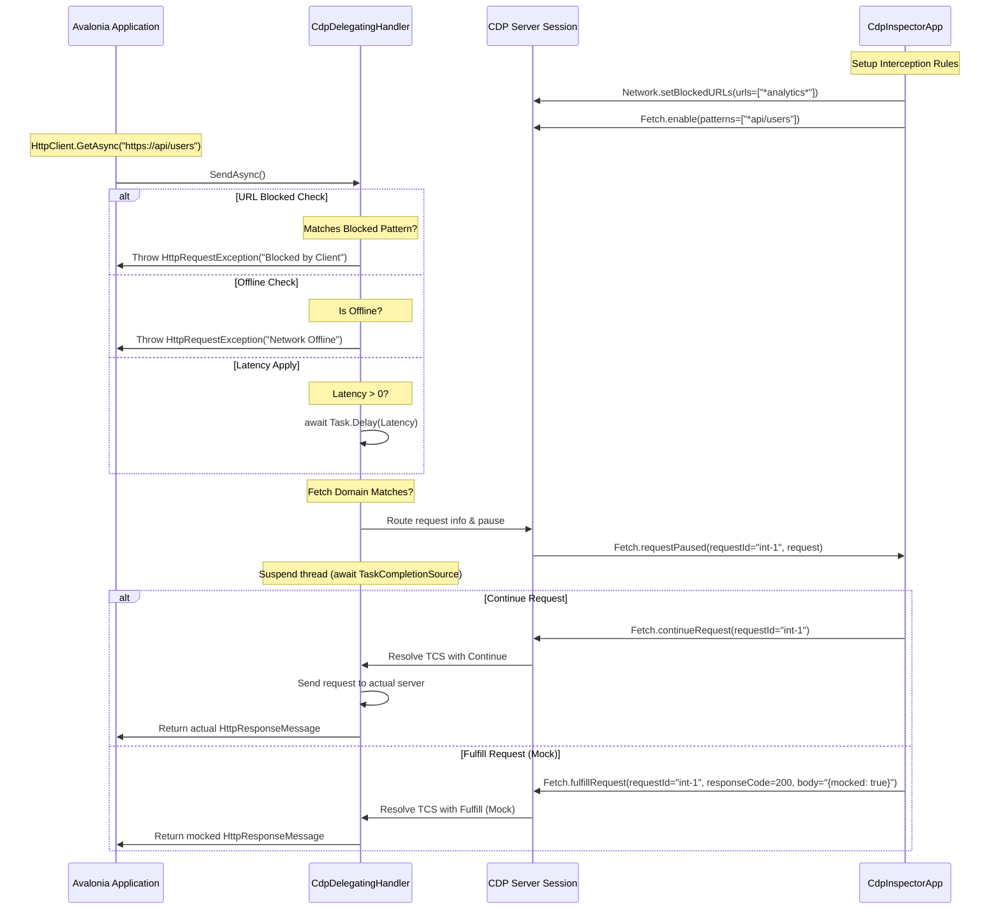

# Technical Implementation Plan: Network Mocking & HTTP Traffic Inspection

This document outlines the revised design, architectural updates, and implementation roadmap for enabling comprehensive HTTP/HTTPS monitoring, URL blocking, request mocking, and network throttling within the Chrome DevTools Protocol (CDP) server (`Avalonia.Diagnostics.Cdp`) and the inspector client application (`CdpInspectorApp`).

---

## 1. Objective & Use Cases

Modern desktop applications heavily rely on web services. Testing how an Avalonia application behaves under different network environments—or with faulty APIs—historically required external proxy configuration (e.g., Fiddler, Charles Proxy) or mock servers. By implementing the CDP `Network` and `Fetch` domains, we provide native, programmatically controllable traffic inspection and manipulation directly inside the CDP developer tools.

### Key Use Cases
- **Passive HTTP Monitoring**: Live-inspect outbound HTTP request and response headers, methods, status codes, payload sizes, and raw text bodies.
- **API Response Mocking**: Inject customized mock responses (JSON bodies, HTTP headers, status codes) to test app behavior against unreleased API endpoints or simulated server failures (e.g., 500 Internal Server Error).
- **Domain/URL Blocking**: Enforce block lists (e.g., ad servers, tracking endpoints, third-party CDNs) and verify that the application handles resource loading errors gracefully.
- **Resilience & Throttling Simulation**: Emulate offline mode or throttle connection speed (e.g., simulating a Slow 3G network) to test the responsiveness of the Avalonia UI, progress indicators, and timeout thresholds.

---

## 2. Current State (Already Implemented)

A partial implementation of network diagnostics exists in the repository. The following components are already implemented:

### Server-Side (`Avalonia.Diagnostics.Cdp`):
1. **Passive HTTP Monitoring**:
   - A `DiagnosticListener` subscription is registered under the `"HttpHandlerDiagnosticListener"` source.
   - It intercepts events `"System.Net.Http.HttpRequestOut.Start"` and `"System.Net.Http.HttpRequestOut.Stop"` via `HttpKeyValueObserver` in [NetworkDomain.cs](file:///Users/wieslawsoltes/GitHub/CDP/src/Avalonia.Diagnostics.Cdp/Domains/NetworkDomain.cs#L586).
   - Sequentially assigns request IDs (`req-1`, `req-2`, etc.) and maps HTTP request/response headers to JSON objects.
   - Intercepts and buffers text-based response bodies up to 5 MB using a custom `InterceptingHttpContent` and `TrackingStream`. Stream-based content types (like `text/event-stream` or `application/octet-stream`) are automatically excluded from buffering.
   - Caches response bodies in memory (`_responseBodies`) to serve `Network.getResponseBody` requests.
   - Fires standard CDP events: `Network.requestWillBeSent`, `Network.responseReceived`, and `Network.loadingFinished`.
2. **Network Throttling Emulator**:
   - `Network.emulateNetworkConditions` captures `offline`, `latency`, `downloadThroughput`, and `uploadThroughput` settings.
   - Throws a `HttpRequestException` inside the DiagnosticObserver's `OnRequestStart` hook if `offline` is true.
   - Induces request start delays using `Thread.Sleep((int)_latency)` inside the DiagnosticObserver if `latency > 0`.
   - Simulates download throttling by calling `ApplyDownloadThrottling`/`ApplyDownloadThrottlingAsync` during reads from the custom `TrackingStream`.
3. **Capability Overrides**:
   - Standard capability checks `canClearBrowserCache`, `canClearBrowserCookies`, and `canEmulateNetworkConditions` return `true`.
   - Stub handlers exist for cookie/cache cleaning, blocked URL configurations (`setBlockedURLs`), and request interceptions, returning empty successful JSON results.

### Client-Side (`CdpInspectorApp`):
1. **Network Grids & Detail Panel**:
   - [NetworkViewModel.cs](file:///Users/wieslawsoltes/GitHub/CDP/src/CDP.Inspector.Shared/ViewModels/NetworkViewModel.cs) enables the `Network` domain and listens to incoming `Network.requestWillBeSent`, `Network.responseReceived`, and `Network.loadingFinished` events to populate a request grid.
   - A two-pane layout in [NetworkView.axaml](file:///Users/wieslawsoltes/GitHub/CDP/src/CDP.Inspector.Shared/Views/NetworkView.axaml) shows a list of requests (URL, Method, Status, Type, Time) alongside a details panel containing raw textboxes for Request Headers, Response Headers, and Response Body.
2. **Throttling Selection**:
   - A dropdown menu lists predefined throttling profiles: No Throttling, Fast 3G, Slow 3G, and Offline.
   - Selecting a profile dispatches the `Network.emulateNetworkConditions` command.

---

## 3. Gaps & Enhancements Needed

The current implementation has critical architectural gaps that prevent active interception, API mocking, and reliable network conditioning:

```
┌────────────────────────────────────────────────────────────────────────────────────────┐
│ Current Flow (DiagnosticListener - Read-Only/Passive)                                  │
│                                                                                        │
│  [HttpClient] ────► [DiagnosticListener.OnNext] ────► Emulate Offline (Throws exception)│
│       │                                         ────► Latency (Blocks thread pool)     │
│       └───────────► Send Request to Web ───────────────────────────────────────────────┘
│                                                                                        │
│ Gaps:                                                                                  │
│   1. Throwing in observer is unsafe and doesn't abort requests cleanly in all cases.    │
│   2. Thread.Sleep blocks calling thread pool/UI thread.                                │
│   3. Fetch (interception/mocking) and Blocked URLs are completely unhandled.            │
└────────────────────────────────────────────────────────────────────────────────────────┘
```

### 1. The Need for Active Interception: `CdpDelegatingHandler`
Passive monitoring via `DiagnosticListener` fires *after* a request has already been scheduled and initiated by the runtime. This makes modifying the request headers/body, routing it to a mock responder, or blocking it entirely impossible or highly unstable.
- **Offline / Latency Simulation**: Running `Thread.Sleep` inside the `DiagnosticObserver` is synchronous and blocks thread pool or UI threads. It must be replaced by asynchronous delays (`await Task.Delay`) in an active delegating handler.
- **Request Blocking**: The command `Network.setBlockedURLs` is currently a stub. The server does not block URLs because it lacks a mechanism to intercept and cancel HTTP requests before network dispatch.

### 2. Missing Fetch Domain on the Server
Active response mocking requires the CDP `Fetch` domain, which is completely missing in `Avalonia.Diagnostics.Cdp`:
- **Interception Mechanism**: We must define a new domain endpoint `FetchDomain.cs` to handle `Fetch.enable`, `Fetch.disable`, `Fetch.continueRequest`, `Fetch.fulfillRequest`, and `Fetch.failRequest`.
- **Request Suspending**: When a request matches a configured interception pattern:
  1. The server must pause the request.
  2. The server must fire `Fetch.requestPaused` containing the interception ID and request details.
  3. The server must suspend the active HTTP handler thread (using a `TaskCompletionSource` or equivalent async semaphore) waiting for the inspector to respond.
  4. Upon receiving `Fetch.continueRequest`, `Fetch.fulfillRequest`, or `Fetch.failRequest`, the thread is resumed with the appropriate action.

### 3. Missing Client-Side UI/UX for Blocking & Mocking
- **Mock Rules Editor**: There is no interface in `CdpInspectorApp` to define matching URL patterns, mock status codes, custom mock headers, or simulated JSON payloads.
- **Blocking Rules Editor**: There is no interface to add or manage URL wildcard block rules.
- **Auto-Fulfillment Engine**: The client-side `NetworkViewModel` needs a rules processor. When a `Fetch.requestPaused` event is received via WebSocket, the client must automatically look up the defined mock and block rules and respond with `Fetch.fulfillRequest` or `Fetch.failRequest` programmatically.

---

## 4. Avalonia-Side Architectural Design

We will transition from a read-only diagnostics model to an active delegation pipeline using a custom `DelegatingHandler`.



### The `CdpDelegatingHandler` Class
A custom class `CdpDelegatingHandler : DelegatingHandler` must be created in the `Avalonia.Diagnostics.Cdp` namespace. Developers can register it when creating their `HttpClient` instances:
```csharp
var handler = new CdpDelegatingHandler(new HttpClientHandler());
var client = new HttpClient(handler);
```

#### SendAsync Lifecycle:
1. **Offline Check**: If `NetworkDomain.Offline` is true, immediately throw a `HttpRequestException("Network is offline (emulated by CDP).")`.
2. **Latency delay**: If `NetworkDomain.Latency > 0`, perform `await Task.Delay((int)NetworkDomain.Latency, cancellationToken)`.
3. **URL Blocking Check**: Compare request URI against the array of wildcards configured via `Network.setBlockedURLs`. If matched, throw a `HttpRequestException` stating the request was blocked by the client.
4. **Fetch Interception**:
   - Check if `FetchDomain` is enabled and has matching patterns.
   - If a match is found:
     - Generate a unique `interceptionId` (e.g. `intercept-1234`).
     - Create a `TaskCompletionSource<InterceptResult>` and store it in a thread-safe static directory: `FetchDomain.PendingInterceptions[interceptionId]`.
     - Fire the `Fetch.requestPaused` event to all connected sessions.
     - Await the `TaskCompletionSource.Task` with an asynchronous timeout (default 30s) to prevent blocking the app indefinitely in case of network disconnects.
     - Process the `InterceptResult`:
       - **Fulfill**: Build an `HttpResponseMessage` containing the specified status code, mock headers, and body. Return it immediately.
       - **Fail**: Throw an exception matching the requested `ErrorReason`.
       - **Continue**: Modify request headers, URL, or method if requested, and call `await base.SendAsync()`.
5. **Standard Request Execution**:
   - If not intercepted or mocked, execute `await base.SendAsync(request, cancellationToken)`.
   - Wrap the request and response content streams in a `ThrottledStream` to simulate `uploadThroughput` and `downloadThroughput` respectively if values are greater than zero.

---

## 5. Inspector-Side UI/UX Design

The Network tab inside the `CdpInspectorApp` will be upgraded to support rule configuration and auto-mocking.

### Redesigned Network Toolbar & Views
We will expand `NetworkView.axaml` with a tabbed management area:

```
┌─────────────────────────────────────────────────────────────────────────────┐
│ Network Traffic Inspector                                                    │
├─────────────────────────────────────────────────────────────────────────────┤
│ [Clear Log] [Throttling: No Throttling ▼] [Blocked URLs...] [Mock Rules...]  │
├──────────────────────────────────────┬──────────────────────────────────────┤
│ Name                 Method  Status  │ Request URL: https://api/users       │
├──────────────────────────────────────┼──────────────────────────────────────┤
│ users                GET     200 OK  │ ┌──────────────────────────────────┐ │
│ analytics            POST    Blocked │ │ Headers │ Payload │ Response     │ │
│ details?id=5         GET     Mocked  │ ├─────────┴─────────┴──────────────┤ │
│ config.json          GET     200 OK  │ │ Status Code: 200 OK              │ │
│                                      │ │                                  │ │
│                                      │ │ Response Headers:                │ │
│                                      │ │ Content-Type: application/json   │ │
│                                      │ └──────────────────────────────────┘ │
└──────────────────────────────────────┴──────────────────────────────────────┘
```

1. **Blocked URLs Manager Dialog**:
   - A list of wildcard patterns (e.g., `*google-analytics.com*`, `*adserver*`).
   - Add/Remove buttons. Dispatches `Network.setBlockedURLs` command on modification.
2. **Mock Rules Manager Drawer**:
   - A grid of mock rules. Each rule includes:
     - **URL Pattern**: String match (e.g., `*api/v1/users*`).
     - **Is Active**: Boolean checkbox.
     - **Status Code**: HTTP response code (e.g., `201`).
     - **Mock Body**: Multi-line textbox for JSON/HTML payloads.
     - **Response Headers**: List of custom header strings (e.g., `Content-Type: application/json`).
3. **Auto-Mocker Integration**:
   - The `CdpService` will dispatch events to the `NetworkViewModel`.
   - When `Fetch.requestPaused` fires, `NetworkViewModel` checks the rules:
     - If a match is found, it automatically calls `Fetch.fulfillRequest` or `Fetch.failRequest` back to the server.
     - If no rules match, it automatically calls `Fetch.continueRequest` to keep the application flowing.
   - The user gets visual feedback in the Traffic list: blocked requests are highlighted in Red (`Status: Blocked`), mocked requests in Gold (`Status: Mocked`).

---

## 6. Phase-by-Phase Roadmap

### Phase 1: Server Domain & Active Interception Handler
- **Core Library (`Avalonia.Diagnostics.Cdp`)**:
  - Implement `CdpDelegatingHandler` in the pipeline.
  - Implement `FetchDomain.cs` to process incoming JSON-RPC calls: `enable`, `disable`, `continueRequest`, `fulfillRequest`, and `failRequest`.
  - Add thread-safe static registries for managing active blocking URLs and pending Fetch interceptions.
  - Upgrade `NetworkDomain.cs` to integrate with `CdpDelegatingHandler`, refactoring latency delays to use async delays and routing network conditions through the handler.
  - Register `Fetch` domain in the server's `CdpDispatcher.cs` list of active domains.

### Phase 2: Client Service & ViewModel Integration
- **Client Infrastructure (`CDP.Inspector.Shared`)**:
  - Add `Fetch` domain API methods to `ICdpService` / `CdpService`.
  - Introduce `BlockedUrlModel` and `MockRuleModel` in the shared models.
  - Update `NetworkViewModel.cs` to maintain collections of blocking wildcards and mock responses.
  - Hook into `Fetch.requestPaused` WebSocket events to implement the Client Auto-Fulfillment engine.

### Phase 3: GUI Redesign
- **Inspector Application UI**:
  - Update `NetworkView.axaml` to replace the simple details border with a functional `TabControl` separating Headers, Post Payload, and Response Content.
  - Create the UI layout and binds for the Blocked URLs dialog.
  - Create the layout, text area, and bindings for the Mock Rules list and editor fields.

### Phase 4: Edge Cases & Reliability
- **Resource Management**:
  - Ensure pending `TaskCompletionSource` objects are automatically resolved/completed with a "Continue" action if the WebSocket session unexpectedly drops, preventing the target application from hangs.
  - Add thread safety to rule collections and active interception caches.

---

## 7. Verification & E2E Testing Strategy

We will write a dedicated E2E test suite inside `ControlApp/Program.cs` to programmatically assert the functionality of the new network mocking and throttling capabilities.

### E2E Test Cases & Assertions

1. **Passive Traffic Monitoring Verification**:
   - Trigger a GET request via the target app's HTTP Client to a known test endpoint (e.g. `https://jsonplaceholder.typicode.com/posts/1`).
   - Listen to `Network.requestWillBeSent` and `Network.responseReceived` events.
   - Assert request headers and response details match.
   - Call `Network.getResponseBody` and verify the body is a valid JSON post content.

2. **Wildcard Blocking Verification**:
   - Set blocked URLs via `Network.setBlockedURLs` with pattern `["*mock-blocked-target*"]`.
   - Attempt to call `https://mock-blocked-target.com/data` from the application.
   - Assert that a `HttpRequestException` is thrown inside the target application, and the request never hits the internet.

3. **Active API Mocking Verification**:
   - Enable Fetch interception: `Fetch.enable` with pattern `["*api/v1/users*"]`.
   - Launch a request to `https://my-service.com/api/v1/users`.
   - Capture `Fetch.requestPaused` event in `ControlApp`.
   - Call `Fetch.fulfillRequest` returning Status Code `201 Created`, custom header `X-Mock: CDP`, and body `{"id": 99, "name": "CDP Mock User"}`.
   - Assert that the target app receives status code `201`, the custom header is present, and the response content exactly matches the mock JSON body.

4. **Latency and Throttling Verification**:
   - Configure latency of `300ms` via `Network.emulateNetworkConditions`.
   - Measure the exact duration of an outbound HTTP call.
   - Assert the elapsed time is greater than or equal to `300ms`.
   - Set `offline` to `true` and verify that all outgoing requests fail immediately.
