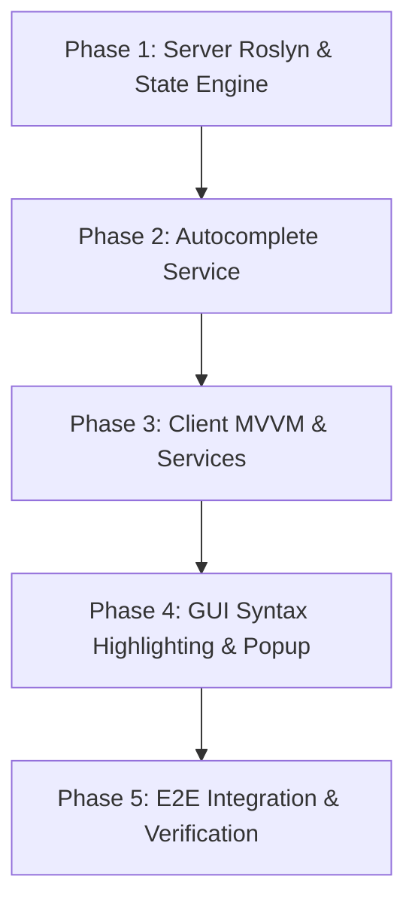

# Plan: Interactive C# Console & Scripting REPL

This implementation plan details the architecture, protocol additions, server-side design, client-side UI, and E2E verification strategy for the **Interactive C# Console & Scripting REPL** in our Chrome DevTools Protocol (CDP) server and inspector application.

---

## 1. Objective & Use Cases

### Business Value
In traditional web development, the browser console allows developers to query DOM nodes, run JavaScript snippets, inspect memory, and dynamically modify state. Desktop frameworks have historically lacked this degree of lightweight, real-time interactivity. This feature brings Web-Dev-like console execution to Avalonia UI applications using a native C# Roslyn evaluator.

### Developer Benefits
- **Live Scripting**: Execute C# snippets directly in the context of the running application, eliminating compile-restart cycles.
- **Contextual Debugging**: Run diagnostic expressions targeting specific UI elements, view models, or styles in real time.
- **Dynamic Inspections**: Query layout values, trigger control behaviors, or modify binding contexts live.

### QA / Testing Scenarios
- **Live State Manipulation**: Inject test mock data into view models while running tests.
- **Manual Automation**: Simulate user actions or sequence events directly from the C# prompt.
- **Verification Hooking**: Inspect internal application state and bindings during manual E2E test runs.

---

## 2. Current State & Gap Analysis

To successfully implement the Interactive C# Console & Scripting REPL, we must first analyze what is already implemented in the codebase and identify what remains missing.

### 2.1 What is Already Implemented

1. **CDP Protocol & Domain Infrastructure**:
   - **Log Domain** ([LogDomain.cs](file:///Users/wieslawsoltes/GitHub/CDP/src/Avalonia.Diagnostics.Cdp/Domains/LogDomain.cs)): Handlers for `Log.enable` and `Log.disable` are implemented to manage the registration of active CDP sessions. The server broadcasts application traces to all active sessions via the `Log.entryAdded` event. An Avalonia diagnostics log sink `CdpLogSink` translates `ILogSink` messages into `Log.entryAdded` events.
   - **Console Domain** ([ConsoleDomain.cs](file:///Users/wieslawsoltes/GitHub/CDP/src/Avalonia.Diagnostics.Cdp/Domains/ConsoleDomain.cs)): Stub handlers exist for `Console.enable`, `Console.disable`, and `Console.clearMessages`.
   - **Runtime Domain** ([RuntimeDomain.cs](file:///Users/wieslawsoltes/GitHub/CDP/src/Avalonia.Diagnostics.Cdp/Domains/RuntimeDomain.cs)):
     - Standard methods: `Runtime.enable`, `Runtime.disable`, `Runtime.getIsolateId`, `Runtime.releaseObject`, and `Runtime.releaseObjectGroup` are operational.
     - `Runtime.getHeapUsage` returns memory statistics by querying the garbage collector (`GC.GetTotalMemory`) and process diagnostics (`Process.GetCurrentProcess().WorkingSet64`).
     - `Runtime.getProperties` inspects properties of a registered `RemoteObject` via standard reflection, returning their names, writeability, and remote object descriptors.
     - `Runtime.callFunctionOn` invokes a method on a registered target object using reflection.
   - **Console Redirection** ([CdpServer.cs](file:///Users/wieslawsoltes/GitHub/CDP/src/Avalonia.Diagnostics.Cdp/CdpServer.cs)): A thread-safe, reentrancy-guarded `ConsoleRedirector` intercepts `Console.Out` and `Console.Error` streams and routes them to `LogDomain.BroadcastLog`.

2. **Reflection-Based Expression Evaluator** ([RuntimeDomain.cs:EvaluateExpression](file:///Users/wieslawsoltes/GitHub/CDP/src/Avalonia.Diagnostics.Cdp/Domains/RuntimeDomain.cs#L227-L485)):
   - A manual reflection-based parser parses and evaluates expressions in the context of the current session window (or inspected node).
   - Supports basic literals (booleans, strings, integers, doubles) and basic logical OR (`||`) chains.
   - Evaluates equality/inequality comparison expressions (`==`, `!=`, `===`, `!==`).
   - Supports reading and writing nested properties (e.g., `Width = 500` or `Bounds.Width`).
   - Invokes methods with basic comma-separated arguments (e.g., `Close()`).
   - Resolves the selected node shortcut `$0` by fetching the target visual from `session.NodeMap.GetVisual(session.InspectedNodeId)`.

3. **Client-Side Views & ViewModels**:
   - **ConsoleViewModel** ([ConsoleViewModel.cs](file:///Users/wieslawsoltes/GitHub/CDP/src/CDP.Inspector.Shared/ViewModels/ConsoleViewModel.cs)): Manages logs filtering (All, Error, Warning, Info, Verbose), filters logs by query strings, and handles `Log.entryAdded` events. Maintains a list of previously executed evaluations (`ConsoleHistory`). The `EvaluateAsync` method calls `Runtime.evaluate` over WebSocket.
   - **ConsoleView** ([ConsoleView.axaml](file:///Users/wieslawsoltes/GitHub/CDP/src/CDP.Inspector.Shared/Views/ConsoleView.axaml)): Renders logs in a filterable list, lists evaluation history entries (expressions and return values), and contains a simple `TextBox` for inputting commands.

---

### 2.2 What is Missing or Needs Enhancement

1. **Stateful Roslyn Scripting Engine**:
   - The current expression evaluator is a basic reflection-based parser. It cannot parse complex C# scripts, multiline blocks, local variable declarations (`int x = 5;`), imports, loops, or conditionals.
   - We must integrate `Microsoft.CodeAnalysis.CSharp.Scripting` to compile and execute actual C# code.
   - The server must maintain a stateful `CdpScriptSession` per session so that variables, classes, and imports declared in previous lines persist across subsequent evaluations.

2. **Inspected Node & View Model Shortcuts (`$0`, `$vm`, `$dc`)**:
   - The current expression evaluator maps `$0` through custom string checks.
   - With Roslyn, we need an input preprocessor to map shorthand identifiers (`$0` for the inspected visual control, `$vm` / `$dc` for its `DataContext`) to properties on a globals object (e.g., `ReplGlobals`) that is passed to the Roslyn script runner.

3. **Autocomplete & Intellisense Support**:
   - Autocomplete is completely missing. Standard CDP does not define a standard C# completion protocol.
   - We need to implement a custom CDP method `Runtime.getCompletions` on the server.
   - The server must run a Roslyn `CompletionService` inside an `AdhocWorkspace` representing the cumulative script text up to the cursor.
   - The client `ICdpService` and `ConsoleViewModel` must handle querying completions upon character keystrokes (like `.`, `(`, or `Ctrl+Space`).

4. **Syntax Highlighting & TextMate Integration**:
   - The command input in `ConsoleView.axaml` is a basic `<TextBox>`.
   - We must replace this input control with an `<AvaloniaEdit:TextEditor>` and integrate `AvaloniaEdit.TextMate` and `TextMateSharp.Grammars` (already present in the centralized packages configuration) to provide full, real-time C# syntax highlighting.

5. **Client-Side Autocomplete UI Dropdown**:
   - The client lacks a dropdown menu to list autocomplete options.
   - We must add a floating popup layout to `ConsoleView.axaml` overlaying the editor at the current cursor position, displaying symbols, keywords, methods, and properties.

6. **Interactive Editor Navigation**:
   - Keyboard command history navigation (using Up/Down arrow keys to walk through previous evaluations) is not supported in the editor.
   - Multiline entry support (e.g., executing on `Ctrl+Enter` and inserting newlines on `Enter`) is missing.

---

## 3. Protocol Mapping (CDP to Avalonia)

To support Roslyn-based evaluation and autocomplete, we extend the standard CDP protocol mapping:

```
┌─────────────────────────────────┐                 ┌────────────────────────────────┐
│      CdpInspectorApp (Client)   │                 │     Avalonia Application       │
└────────────────┬────────────────┘                 └───────────────┬────────────────┘
                 │                                                  │
                 │      1. Runtime.evaluate (C# Script Expression)  │
                 ├─────────────────────────────────────────────────>│ (Evaluated via Roslyn)
                 │                                                  │
                 │      2. Response (RemoteObject representation)   │
                 │<─────────────────────────────────────────────────┤
                 │                                                  │
                 │      3. Runtime.getCompletions (Custom Method)   │
                 ├─────────────────────────────────────────────────>│ (Analyzed via CompletionService)
                 │                                                  │
                 │      4. Response (completions: CompletionItem[]) │
                 │<─────────────────────────────────────────────────┤
                 │                                                  │
                 │      5. Log.entryAdded (Console redirection)     │
                 │<─────────────────────────────────────────────────┤
```

### Standard CDP Domains Involved
1. **Runtime Domain**:
   - `Runtime.enable`: Initializes the execution context.
   - `Runtime.evaluate`: Evaluates C# code in the context of the current session using Roslyn.
   - `Runtime.callFunctionOn`: Invokes a method on a registered `RemoteObject`.
   - `Runtime.getProperties`: Inspects the public properties of a registered object.
2. **Log Domain**:
   - `Log.enable` / `Log.disable`: Starts/stops log telemetry.
   - `Log.entryAdded`: Broadcasts standard log messages and redirected `stdout` / `stderr` streams.

### Custom Protocol Extensions
We introduce custom method extensions on the `Runtime` domain to power C# code autocompletion:

#### Method: `Runtime.getCompletions`
- **Request Parameters**:
  - `expression` (`string`): The C# script code input up to the cursor position.
  - `cursorPosition` (`integer`): The 0-indexed character cursor position within the expression.
- **Response Result**:
  - `completions` (`array` of objects):
    - `displayText` (`string`): The text to display in the autocomplete popup.
    - `insertionText` (`string`): The actual text to insert.
    - `kind` (`string`): The type of symbol (e.g. `Property`, `Method`, `Field`, `Keyword`).
    - `documentation` (`string`, optional): Intellisense tooltips.

---

## 4. Server-Side Architectural Design (Avalonia)

### 4.1 Roslyn Scripting Engine Configuration
To execute C# code dynamically, we utilize the Microsoft compiler platform (`Microsoft.CodeAnalysis.CSharp.Scripting`). 

#### 1. Script State Lifecycle Management
Instead of instantiating a fresh scripting context for each execution, we preserve a continuous state across commands in the `CdpSession` to maintain declared local variables and imports.

```csharp
namespace Avalonia.Diagnostics.Cdp;

using Microsoft.CodeAnalysis.Scripting;

public class CdpScriptSession
{
    private ScriptState<object>? _currentState;
    private readonly ScriptOptions _options;
    private readonly ReplGlobals _globals;

    public CdpScriptSession(CdpSession session)
    {
        _globals = new ReplGlobals(session);
        
        // Accumulate active assemblies for reference
        var assemblies = AppDomain.CurrentDomain.GetAssemblies()
            .Where(a => !a.IsDynamic && !string.IsNullOrEmpty(a.Location));

        _options = ScriptOptions.Default
            .WithReferences(assemblies)
            .WithImports(
                "System",
                "System.Collections.Generic",
                "System.Linq",
                "System.Threading.Tasks",
                "Avalonia",
                "Avalonia.Controls",
                "Avalonia.VisualTree",
                "Avalonia.LogicalTree"
            );
    }

    public async Task<object?> EvaluateAsync(string code)
    {
        if (_currentState == null)
        {
            _currentState = await Microsoft.CodeAnalysis.CSharp.Scripting.CSharpScript.RunAsync(
                code, _options, _globals, typeof(ReplGlobals));
        }
        else
        {
            _currentState = await _currentState.ContinueWithAsync(code, _options);
        }

        return _currentState.ReturnValue;
    }

    public void Reset()
    {
        _currentState = null;
    }
}
```

#### 2. Globals Context (`ReplGlobals`)
Expose variables and helpers to developers:
- `SelectedNode` (`Visual?`): The active control selected in the Elements panel (`$0`).
- `Control` (`Control?`): The selected node cast as `Control`.
- `DataContext` (`object?`): Data context of the inspected control (`$dc` or `$vm`).
- `Window` (`Window?`): The parent window.
- `Print(object? obj)`: Utility method targeting stdout.
- `Query(string selector)` / `QueryAll(string selector)`: Elements querying utility functions.

```csharp
public class ReplGlobals
{
    private readonly CdpSession _session;

    public ReplGlobals(CdpSession session)
    {
        _session = session;
    }

    public Visual? SelectedNode => _session.NodeMap.GetVisual(_session.InspectedNodeId);
    public Control? Control => SelectedNode as Control;
    public object? DataContext => Control?.DataContext;
    public object? ViewModel => DataContext;
    public Window? Window => SelectedNode as Window ?? _session.Window as Window;

    public void Print(object? obj) => Console.WriteLine(obj);
    
    public Visual? Query(string selector) =>
        SelectedNode != null ? SelectorEngine.QuerySelector(SelectedNode, selector, _session.UseLogicalTree) : null;
}
```

#### 3. Command Preprocessor
Before passing code to Roslyn, replace shorthand symbols to avoid syntax compilation issues:
- Replace `$0` with `SelectedNode`
- Replace `$vm` or `$dc` with `DataContext`

```csharp
public static class ScriptPreprocessor
{
    public static string Preprocess(string expression)
    {
        if (string.IsNullOrWhiteSpace(expression)) return expression;
        
        // Use regex bounds to safely swap targets
        var processed = System.Text.RegularExpressions.Regex.Replace(expression, @"\b\$0\b", "SelectedNode");
        processed = System.Text.RegularExpressions.Regex.Replace(processed, @"\b\$vm\b", "DataContext");
        processed = System.Text.RegularExpressions.Regex.Replace(processed, @"\b\$dc\b", "DataContext");
        
        return processed;
    }
}
```

### 4.2 Autocomplete via Roslyn CompletionService
To retrieve autocompletions dynamically from the target:
1. Create a transient `AdhocWorkspace`.
2. Add a virtual Project and Document containing the imports and cumulative code executed in `CdpScriptSession`.
3. Invoke `CompletionService` to compute options at the current character cursor position.

```csharp
using Microsoft.CodeAnalysis;
using Microsoft.CodeAnalysis.Completion;
using Microsoft.CodeAnalysis.CSharp;

public static class AutocompleteEngine
{
    public static async Task<List<CompletionItem>> GetCompletionsAsync(string scriptText, int cursorPosition)
    {
        var workspace = new AdhocWorkspace();
        var projectId = ProjectId.CreateNewId();
        var documentId = DocumentId.CreateNewId(projectId);

        var solution = workspace.CurrentSolution
            .AddProject(projectId, "ReplProject", "ReplProject", LanguageNames.CSharp)
            .AddMetadataReferences(projectId, AppDomain.CurrentDomain.GetAssemblies()
                .Where(a => !a.IsDynamic && !string.IsNullOrEmpty(a.Location))
                .Select(a => MetadataReference.CreateFromFile(a.Location)))
            .AddDocument(documentId, "ReplScript.cs", scriptText);

        var document = solution.GetDocument(documentId);
        var completionService = CompletionService.GetService(document);
        
        if (completionService == null) return new List<CompletionItem>();

        var results = await completionService.GetCompletionsAsync(document, cursorPosition);
        return results?.ItemsList ?? new List<CompletionItem>();
    }
}
```

### 4.3 Console Stream Redirection (`Console.Out` and `Console.Error`)
We leverage the existing `ConsoleRedirector` from `CdpServer.cs` to capture `Console.Out` and `Console.Error` streams and route them to `LogDomain.BroadcastLog`.

#### Thread Safety and Recursion Prevention
To prevent stack overflows if the logger triggers a console log recursively, a `[ThreadStatic]` reentrancy boolean guards calls:

```csharp
public class ConsoleRedirector : System.IO.TextWriter
{
    private readonly System.IO.TextWriter _original;
    private readonly string _level;
    private readonly System.Text.StringBuilder _buffer = new();
    
    [ThreadStatic]
    private static bool _isRedirecting;

    public ConsoleRedirector(System.IO.TextWriter original, string level)
    {
        _original = original;
        _level = level;
    }

    public override System.Text.Encoding Encoding => _original.Encoding;

    public override void Write(char value)
    {
        _original.Write(value);
        if (_isRedirecting) return;
        
        _isRedirecting = true;
        try
        {
            lock (_buffer)
            {
                if (value == '\n')
                {
                    var line = _buffer.ToString().TrimEnd('\r');
                    _buffer.Clear();
                    Broadcast(line);
                }
                else
                {
                    _buffer.Append(value);
                }
            }
        }
        finally
        {
            _isRedirecting = false;
        }
    }
    
    private void Broadcast(string line)
    {
        LogDomain.BroadcastLog("Console", _level, line);
    }
}
```

---

## 5. Client-Side UI/UX Design (CdpInspectorApp)

We upgrade the bottom area of `ConsoleView.axaml` to feature a robust scripting editor panel.

```
+-----------------------------------------------------------------------------+
| Filter: [All] [Error] [Warning] [Info]                           [ Clear ]  |
+-----------------------------------------------------------------------------+
| [11:15:02] [Info] App initialized.                                          |
| [11:15:10] [Info] Button clicked.                                           |
| [11:15:15] [Error] NullReferenceException in SampleViewModel.cs:line 45     |
+-----------------------------------------------------------------------------+
| History                                                                     |
| ❯ $0.Width = 500;                                             value: 500    |
| ❯ $vm.Items.Count                                             value: 12     |
+-----------------------------------------------------------------------------+
| C# Script Input (Ctrl+Enter to evaluate)                                    |
| +-------------------------------------------------------------------------+ |
| | $0.Height = 350;                                                        | |
| |                                                                         | |
| +-------------------------------------------------------------------------+ |
| [x] Live Bindings   [x] Context Autocomplete              [ Evaluate (Run) ]|
+-----------------------------------------------------------------------------+
```

### 5.1 Integration of AvaloniaEdit & Syntax Highlighting
We replace the standard `<TextBox Name="txtConsoleInput">` with an `<AvaloniaEdit:TextEditor>` instance:
1. Reference the text editor namespace: `xmlns:ae="avares://Avalonia.AvaloniaEdit/TextEditor"`.
2. Attach a TextMate grammar registry inside the control code-behind to format C# syntax dynamically.

```csharp
using AvaloniaEdit;
using AvaloniaEdit.TextMate;
using TextMateSharp.Grammars;

public partial class ConsoleView : UserControl
{
    private TextMate.Installation _textMateInstallation;

    public ConsoleView()
    {
        InitializeComponent();
        
        var editor = this.FindControl<TextEditor>("CsharpEditor");
        if (editor != null)
        {
            _textMateInstallation = editor.InstallTextMate(RegistryOptions.DefaultTheme);
            _textMateInstallation.SetGrammarByExtension(".cs");
        }
    }
}
```

### 5.2 Autocomplete Dropdown Popup
Bind cursor position updates or character triggers (like `.`) to invoke `CdpService.SendCommandAsync("Runtime.getCompletions", ...)`:
1. Show an Avalonia `Popup` overlaid at the cursor position.
2. Render completions in a small floating list.
3. Handle keyboard events (`Up`, `Down`, `Enter`, `Tab`) to navigate options and complete inputs.

### 5.3 Execution History Navigation
Maintain a client-side execution history queue (`List<string>`):
- Intercept key inputs: `KeyUp` and `KeyDown` when editor is focused.
- **Key Up**: Fetch preceding history entry, updating input text.
- **Key Down**: Fetch subsequent history entry or clear input text if returning to active line.

---

## 6. Phase-by-Phase Roadmap



### Phase 1: Server Domain Implementation (Core Server Library)
- [ ] Add `Microsoft.CodeAnalysis.CSharp.Scripting` package dependency to `Directory.Packages.props` and `Avalonia.Diagnostics.Cdp.csproj`.
- [ ] Create `CdpScriptSession` and the preprocessor logic in `Avalonia.Diagnostics.Cdp.Domains`.
- [ ] Wire the compiler script execution inside `RuntimeDomain.cs` under the `"evaluate"` action (replacing the manual expression parser).
- [ ] Implement target node resolution (`$0` visual lookup via NodeMap, and DataContext extraction) and pass it as the globals host container context.

### Phase 2: Autocomplete Service & Custom CDP Protocol
- [ ] Add custom `Runtime.getCompletions` method handler linking into Roslyn `CompletionService` using `AdhocWorkspace`.
- [ ] Set up the autocomplete token parser to compute active suggestion lists at cursor indexes.

### Phase 3: Client ViewModels & Services (Inspector Client)
- [ ] Implement `getCompletions` calling method inside `CdpService.cs`.
- [ ] Extend `ConsoleViewModel` to handle autocomplete callbacks and parse autocomplete details.
- [ ] Write evaluation history tracking structures and clear operations inside `ConsoleViewModel`.
- [ ] Bind commands for Up/Down arrow history traversal.

### Phase 4: GUI & Interaction (Inspector UI)
- [ ] Replace standard input box inside `ConsoleView.axaml` with `Avalonia.AvaloniaEdit`.
- [ ] Register TextMate C# syntax styling in `ConsoleView.axaml.cs`.
- [ ] Add completion popup Overlay list (`Popup`) for inline suggestions.
- [ ] Attach Up/Down keyboard handlers for command history retrieval.

### Phase 5: E2E Verification & Stabilization
- [ ] Write E2E verification scenarios inside `scratch/ControlApp/Program.cs` to test expression evaluations, autocomplete services, and console stream capture.
- [ ] Verify execution in headless mode.

---

## 7. Verification & E2E Testing Strategy

The C# Scripting and REPL implementation will be verified programmatically in headless runs using `scratch/ControlApp/Program.cs`.

### E2E Test Scenarios to implement in `Program.cs`

1. **Interactive Stateful C# Evaluation Assertion**:
   - Connect to the target application.
   - Run a stateful evaluation declaring a variable: `"int myVar = 150;"` using `Runtime.evaluate`.
   - In a subsequent call, evaluate: `"myVar * 2"` and assert the return value is exactly `300`.
   
2. **Shorthand Variable Preprocessing ($0 and $vm/$dc)**:
   - Programmatically select the TextBox control (`#txtTarget`).
   - Call `Runtime.evaluate` with: `"$0.Width = 250;"`.
   - Retrieve the width property via `Runtime.evaluate` using `"$0.Width"` and assert the result is exactly `250`.
   - Retrieve `$vm.SomeValue` and verify it correctly resolves properties on the inspected control's DataContext.

3. **Autocomplete Integration**:
   - Call the custom method `Runtime.getCompletions` with target expression `"$0.He"` and cursor position 5.
   - Assert the return payload lists `Height` as an insertion suggestion.

4. **Console Stream Capture**:
   - Send `Runtime.evaluate` expression: `"System.Console.WriteLine(\"REPL_VERIFY_SUCCESS\");"`.
   - Listen for WebSocket callback events on `Log.entryAdded`.
   - Assert that a log entry with `text` containing `"REPL_VERIFY_SUCCESS"` and `level` as `"info"` is dispatched.
