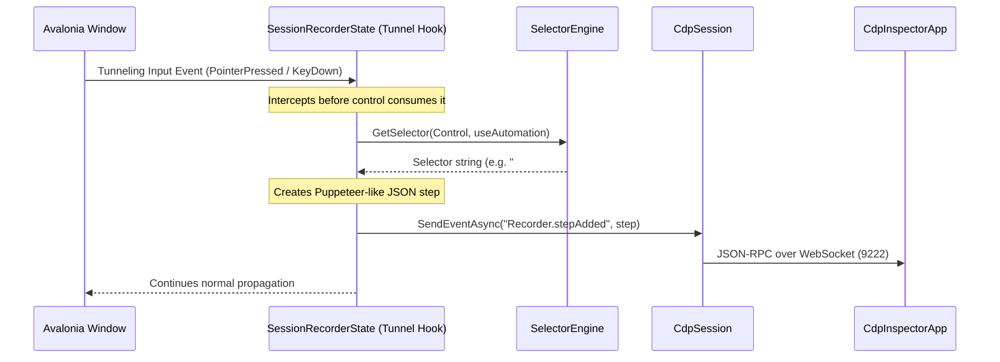

# Technical Implementation Plan: UI Test Recording & Playback

This document describes the revised design, protocol mappings, class architecture, status of implementation, and verification strategy for the **UI Test Recording & Playback** engine within the Avalonia CDP Server (`Avalonia.Diagnostics.Cdp`) and Inspector Client (`CdpInspectorApp`).

---

## 1. Title: UI Test Recording & Playback

An integrated UI automation framework enabling real-time user action recording on Avalonia target windows, translating interactions into standard testing scripts, and executing step-by-step simulated input playback via the Chrome DevTools Protocol (CDP).

---

## 2. Objective & Use Cases

### Business Value
Automated E2E testing in desktop applications historically requires specialized desktop automation drivers (e.g., Appium Windows Driver, WinAppDriver, FlaUI) that are OS-dependent, complex to set up, and fragile to visual UI updates. Dual-CDP orchestration simplifies the testing landscape by exposing standard Web-like test automation primitives natively inside the desktop app.

### Developer Benefits
- **Zero-Setup Recording**: Developers can launch a target app with CDP enabled and record scripts directly by clicking and typing on the GUI.
- **Cross-Platform Playback**: Visual scripts execute identically on macOS, Windows, and Linux (headless under Xvfb).
- **Fast Troubleshooting**: Failed test scenarios can be recorded, exported as JSON, and loaded locally in the inspector to step through the playback and locate layout bugs.

### Use Cases & QA Scenarios
1. **Regression Testing**: Capture complex navigation paths, text insertion, key events, and scroll/drag states, then replay them programmatically in CI/CD.
2. **Multi-Format Export**: Export recorded interactions directly into standard testing formats (Puppeteer, Playwright Test, Selenium C#, Appium C#, and Avalonia Headless xUnit).
3. **E2E Automation Verification**: Programmatic agents read visual trees, simulate mouse clicks on controls, insert texts, and assert states to verify app logic without physical devices.

---

## 3. Protocol Mapping (CDP to Avalonia)

### Custom CDP Domain: `Recorder`
Since standard CDP does not include a native recording command capture domain (standard DevTools uses client-side listener hooks in the browser), we expose a custom server-side `Recorder` domain to register handlers.

| CDP Command / Event | JSON-RPC Direction | Parameters / Payload | Description |
|---|---|---|---|
| `Recorder.start` | Client → Server | `{"selectorMode": "dom" \| "automation"}` | Attaches input tunneling hooks to the active target window. |
| `Recorder.stop` | Client → Server | `{}` | Detaches all input tunneling hooks and cleans up states. |
| `Recorder.stepAdded` | Server → Client (Event) | `{"step": { ... }}` | Emits a structured step representation when an interaction is intercepted. |

### Standard CDP Domains Used during Playback
To replay steps, the inspector client invokes standard CDP methods on the server session:

1. **`DOM` Domain**:
   - `DOM.getDocument`: Retrieves the DOM tree to obtain the root `nodeId`.
   - `DOM.querySelector`: Resolves CSS selectors (e.g., `#btnClickMe` or `Button.primary`) to specific `nodeId` values.
   - `DOM.getBoxModel`: Resolves an element's client coordinates using its `nodeId` to calculate the visual center point:
     $$\text{centerX} = x_1 + \frac{x_2 - x_1}{2.0}, \quad \text{centerY} = y_1 + \frac{y_2 - y_1}{2.0}$$
   - `DOM.focus`: Directs keyboard focus to the target control before typing.

2. **`Input` Domain**:
   - `Input.dispatchMouseEvent`: Dispatches mouse operations (`mousePressed`, `mouseReleased`, `mouseMoved`).
   - `Input.dispatchKeyEvent`: Dispatches physical keyboard actions (`rawKeyDown`, `keyUp`).
   - `Input.insertText`: Directly inserts character strings to simulate text typing.

3. **`Page` Domain**:
   - `Page.navigate`: Replays initial navigation actions by visiting the target URL.

4. **`Emulation` Domain**:
   - `Emulation.setDeviceMetricsOverride`: Sets window dimensions to replicate recorded viewport metrics.

---

## 4. Avalonia-Side Architectural Design

The server-side recording mechanism intercepts pointer and keyboard interactions inside the target application window without interfering with normal event dispatching.



### Event Interception Hooks
To record events before they are consumed by individual controls, the `SessionRecorderState` inside [RecorderDomain.cs](file:///Users/wieslawsoltes/GitHub/CDP/src/Avalonia.Diagnostics.Cdp/Domains/RecorderDomain.cs) attaches listeners using the **Tunneling** strategy (`RoutingStrategies.Tunnel`) with `handledEventsToo: true`:
- `InputElement.PointerPressedEvent`
- `InputElement.PointerMovedEvent`
- `InputElement.PointerReleasedEvent`
- `InputElement.GotFocusEvent` (to store starting textbox content)
- `InputElement.LostFocusEvent` (to detect final text changes and emit a `change` event)
- `InputElement.KeyDownEvent` (to log special control/navigation key events)

```csharp
public void Attach()
{
    _session.Window.AddHandler(InputElement.PointerPressedEvent, _pointerPressedHandler, RoutingStrategies.Tunnel, handledEventsToo: true);
    _session.Window.AddHandler(InputElement.PointerMovedEvent, _pointerMovedHandler, RoutingStrategies.Tunnel, handledEventsToo: true);
    _session.Window.AddHandler(InputElement.PointerReleasedEvent, _pointerReleasedHandler, RoutingStrategies.Tunnel, handledEventsToo: true);
    _session.Window.AddHandler(InputElement.GotFocusEvent, _gotFocusHandler, RoutingStrategies.Bubble | RoutingStrategies.Tunnel, handledEventsToo: true);
    _session.Window.AddHandler(InputElement.LostFocusEvent, _lostFocusHandler, RoutingStrategies.Bubble | RoutingStrategies.Tunnel, handledEventsToo: true);
    _session.Window.AddHandler(InputElement.KeyDownEvent, _keyDownHandler, RoutingStrategies.Tunnel, handledEventsToo: true);
}
```

### Selector Generators
When a tunneling handler intercepts an input target, it passes the control to `SelectorEngine.GetSelector(control, useAutomation)` defined in [SelectorEngine.cs](file:///Users/wieslawsoltes/GitHub/CDP/src/Avalonia.Diagnostics.Cdp/SelectorEngine.cs):
1. **DOM Selector Generator** ([DomSelectorGenerator.cs](file:///Users/wieslawsoltes/GitHub/CDP/src/Avalonia.Diagnostics.Cdp/DomSelectorGenerator.cs)):
   - Walks up the visual or logical tree looking for a unique control name (e.g., `#btnSave` where `Name` is set and does not start with `PART_`).
   - If no unique name is discovered, it walks up to the root to build a structural CSS path (e.g., `Window > Grid > StackPanel > Button.primary`).
2. **Automation Selector Generator** ([AutomationSelectorGenerator.cs](file:///Users/wieslawsoltes/GitHub/CDP/src/Avalonia.Diagnostics.Cdp/AutomationSelectorGenerator.cs)):
   - Checks if the control has `AutomationProperties.AutomationIdProperty` configured.
   - If configured, it inserts `[AccessibilityId="idValue"]`.
   - If not, it falls back to structural visual tree names, eventually using `DomSelectorGenerator` as a fallback.

---

## 5. Inspector-Side UI/UX Design

The recorder client in `CdpInspectorApp` implements a dual-panel MVVM-based layout defined in [RecorderView.axaml](file:///Users/wieslawsoltes/GitHub/CDP/src/CDP.Inspector.Shared/Views/RecorderView.axaml) and [TestStudioView.axaml](file:///Users/wieslawsoltes/GitHub/CDP/src/CDP.Inspector.Shared/Views/TestStudioView.axaml).

### Core Components & ViewModels
- **Recorder ViewModel** ([RecorderViewModel.cs](file:///Users/wieslawsoltes/GitHub/CDP/src/CDP.Inspector.Shared/ViewModels/RecorderViewModel.cs)):
  - Implements the main state management (`IsRecording`, `IsReplayEnabled`).
  - Stores captured steps in an `ObservableCollection<RecordedStepModel>`.
  - Exposes `ToggleRecordCommand` (dispatches `Recorder.start`/`stop` commands).
  - Exposes `ReplayCommand` (executes the async replayer loop).
  - Exposes `ClearCommand` (clears steps).
  - Handles the `Recorder.stepAdded` event from the CdpService, adding a new model and updating the generated code.
- **Test Studio ViewModel** ([TestStudioViewModel.cs](file:///Users/wieslawsoltes/GitHub/CDP/src/CDP.Inspector.Shared/ViewModels/TestStudioViewModel.cs)):
  - Manages Maestro-style test flows.
  - Supports detailed step status tracking (`Pending`, `Running`, `Passed`, `Failed`).
  - Features pause/resume via cancellation tokens and line-by-line stepping (`StepOver`).
  - Offers custom test actions (like copy-text-to-clipboard, back button, scroll viewport, assert element visibility, etc.).
- **Code Generator Service Suite**:
  - Generates code templates on change:
    - [PuppeteerGenerator.cs](file:///Users/wieslawsoltes/GitHub/CDP/src/CDP.Inspector.Shared/Services/PuppeteerGenerator.cs)
    - [PlaywrightGenerator.cs](file:///Users/wieslawsoltes/GitHub/CDP/src/CDP.Inspector.Shared/Services/PlaywrightGenerator.cs)
    - [SeleniumCSharpGenerator.cs](file:///Users/wieslawsoltes/GitHub/CDP/src/CDP.Inspector.Shared/Services/SeleniumCSharpGenerator.cs)
    - [AppiumCSharpGenerator.cs](file:///Users/wieslawsoltes/GitHub/CDP/src/CDP.Inspector.Shared/Services/AppiumCSharpGenerator.cs)
    - [AvaloniaHeadlessXUnitGenerator.cs](file:///Users/wieslawsoltes/GitHub/CDP/src/CDP.Inspector.Shared/Services/AvaloniaHeadlessXUnitGenerator.cs)

---

## 6. Implementation Status & Gap Analysis

### Already Implemented

The following features are fully implemented, verified by unit/E2E tests, and integrated within the codebase:

1. **Custom `Recorder` Domain & Protocol Mapping**:
   - `Recorder.start` and `Recorder.stop` are handled in [RecorderDomain.cs](file:///Users/wieslawsoltes/GitHub/CDP/src/Avalonia.Diagnostics.Cdp/Domains/RecorderDomain.cs) and dispatched via [CdpDispatcher.cs](file:///Users/wieslawsoltes/GitHub/CDP/src/Avalonia.Diagnostics.Cdp/CdpDispatcher.cs).
   - WebSocket events (`Recorder.stepAdded`) broadcast recorded actions from the server to the client.
2. **Event Tunneling & Interception Hooks**:
   - The tunneling strategy (`RoutingStrategies.Tunnel`) captures pointer presses, pointer releases, text alterations, GotFocus/LostFocus, and special navigation keys before target controls consume them.
   - Pointer dragging calculations detect drag-and-drop actions when pointer movement exceeds a $10.0$ px distance threshold.
3. **Selector Generators**:
   - [SelectorEngine.cs](file:///Users/wieslawsoltes/GitHub/CDP/src/Avalonia.Diagnostics.Cdp/SelectorEngine.cs) parses and matches standard CSS classes, element names, custom identifiers, and `:contains("...")` pseudo-selectors.
   - [DomSelectorGenerator.cs](file:///Users/wieslawsoltes/GitHub/CDP/src/Avalonia.Diagnostics.Cdp/DomSelectorGenerator.cs) automatically resolves unique elements or structures visual tree names.
   - [AutomationSelectorGenerator.cs](file:///Users/wieslawsoltes/GitHub/CDP/src/Avalonia.Diagnostics.Cdp/AutomationSelectorGenerator.cs) targets C# `AutomationProperties.AutomationIdProperty` to output `[AccessibilityId="..."]`.
   - Client-side mirrors are defined in `ClientSelectorRegistry.cs` to resolve selectors immediately from the local DOM node trees.
4. **Code Exporters**:
   - Full code export generation templates exist for Puppeteer, Playwright Test, Selenium C#, Appium C#, and Avalonia Headless xUnit tests, handling escaping and modifier parsing.
5. **Playback Engines**:
   - **Main Recorder Replay**: Resolves bounds via `DOM.getBoxModel`, focuses nodes via `DOM.focus`, and triggers keyboard, clicking, and typing actions.
   - **Test Studio Execution Loop**: Features play, pause, stop, step over, delay, back-navigation history, copy-text-to-clipboard (using remote objects and JS evaluation `Runtime.callFunctionOn`), and element assertions.

---

### Missing or Needs Enhancement

The following areas are missing or require enhancement to improve recording fidelity, user debugging feedback, and export options:

1. **Fidelity of Interaction Interception & Gestures**:
   - **Text Flushing on Stop/Exit**: The `LostFocusEvent` emits a text `change` step only after the input control loses focus. If the recording is stopped or the application closes while the user is still typing in an active TextBox, the last typed characters are lost.
     > [!TIP]
     > *Proposed Fix:* Force a manual focus flush on all currently focused text fields immediately when `Recorder.stop` is requested.
   - **Hover and Hover State Recording**: Normal mouse movements (`mouseMoved`) without pointer depression are discarded. Replaying interactions that rely on hover styling or menus (e.g. `:pointerover` classes or popup menus) will fail because the hover step is never recorded.
   - **Scroll Interaction Capture**: User scrolling on scroll views is not currently intercepted by `RecorderDomain`. While TestStudio supports scroll execution, the steps must be constructed manually instead of recorded.
   - **Typing Modifier Key Propagation**: Character inputs (e.g. holding `Shift` or `Alt` while typing regular text characters) are simulated via basic `Input.insertText` actions which lack physical modifier parameters, resulting in failed modifier checks in strictly-written event handlers.

2. **Visual Playback Indicators & Debugging overlays**:
   - **Target Node Highlighting**: During playback, actions occur on target controls rapidly without highlighting them. Implementing visual highlights (e.g. highlighting target node boxes with green/blue translucent overlays) using the standard CDP `Overlay` domain (`Overlay.highlightNode`) is missing.
   - **Recorder Status Indicators**: Unlike the TestStudio steps list, the main `RecorderViewModel` does not update step items in real-time with visual status highlights (`Pending`, `Executing`, `Passed`, `Failed`) during a replay sequence.
   - **Replay Throttling (Speed Controls)**: Main replay runs with hardcoded delays (`Task.Delay(100)`, `Task.Delay(300)`). A speed control slider (e.g., "Playback Speed" from 0.1x to 2x) is needed to allow visual walkthroughs of test runs.

3. **Export and Translation Refinements**:
   - **Maestro YAML Generation**: While TestStudio parses Maestro-inspired YAML, there is no direct option to export the main recorded steps list to this YAML format.
   - **UI Assertion Recording**: Developers cannot record assertion steps (e.g., asserting that a label has text "Success") directly from the target app. We need an "Assertion Picker Mode" in the inspector to click an element and record a visibility/text assertion step.

---

## 7. Phase-by-Phase Roadmap

### Phase 1: Robust Interception & State Flushing (Server Refinements)
- Implement focus-flushing in `RecorderDomain` to force-save active TextBox text inputs before completing `Recorder.stop`.
- Hook mouse wheel scroll events and translate them into structured scroll steps inside `SessionRecorderState`.
- Incorporate hover event recording (`mouseMoved` without buttons pressed) with a short debouncing timer to prevent flooding the event log.

### Phase 2: Visual Playback & Debugging Overlays (Client/Server Enhancements)
- Call `Overlay.highlightNode` on the target application during step execution to visually highlight the element being clicked, typed on, or verified.
- Implement step-status mapping in `RecorderViewModel` to style recorded steps (`StepStatus`) with spinners, checkmarks, or warning badges during playback.
- Add a speed slider to control step-execution delay bounds (throttling).

### Phase 3: GUI Assertion Tool & Maestro Exporter (Client Enhancements)
- Add an "Add Assertion" button in the inspector that enables node selection mode, allowing the user to click any element in the DOM tree and add a `assertVisible`, `assertNotVisible`, or `assertText` step.
- Implement `MaestroYamlGenerator` to support exporting captured lists directly into Maestro-inspired YAML.

---

## 8. Verification & E2E Testing Strategy

The correctness of the entire Recorder/Playback stack is verified programmatically via a task-specific headless test suite inside [Program.cs](file:///Users/wieslawsoltes/GitHub/CDP/scratch/ControlApp/Program.cs).

### Headless Orchestration Flow
```
                  ┌──────────────────────┐
                  │ ControlApp (Test)    │
                  └──────────┬───────────┘
                             │
       Launch headless target│ & CDP server (9236)
                             ▼
                  ┌──────────────────────┐
                  │ Target Window        │
                  │ [txtTarget] [button] │
                  └──────────┬───────────┘
                             │
      CDP commands:           │ Connect client CdpService
      Input.dispatchMouse...  │ Intercept events
                             ▼
                  ┌──────────────────────┐
                  │ RecorderDomain       │
                  │ generates selectors  │
                  └──────────┬───────────┘
                             │
             Assert steps/code│ & Replay execution
                             ▼
                  ┌──────────────────────┐
                  │ Control Verification │
                  │ Assert click/changes │
                  └──────────────────────┘
```

### Verification Scenarios in the Test Suite
The E2E program executes the following verification scenarios sequentially:
1. **Scenario 1: Step Construction & Auto-YAML Sync**: Generates steps manually via the TestStudio interface and asserts that the parsed YAML contains all actions.
2. **Scenario 2: YAML Parsing & Load**: Loads complex YAML flows and verifies step actions, selectors, and parameters.
3. **Scenario 3: Play Execution Loop**: Replays the steps on a headless window, simulating clicks/inputs and verifying that the click handler fires and text is modified.
4. **Scenario 4: StepOver Flow**: Executes step-by-step debug loops, asserting that execution pauses between commands.
5. **Scenario 5: Selection Sync**: Verifies that selecting a DOM element immediately updates the TestStudio selector.
6. **Scenario 6: Event Interception & Recording**: Attaches the recorder, dispatches clicks/keypresses, and asserts that the steps are broadcast over the socket and translated.
7. **Scenario 7: View Bindings Validation**: Reflection-checks views to verify buttons bind to appropriate VM commands.
8. **Scenario 8: New Command Execution**: Tests `doubleTapOn`, `longPressOn`, screen capture, clipboard copying, and assertion execution.
9. **Scenario 9: Playwright Export & Parse**: Verifies Playwright TS script generation and regex-based parser round-tripping.
10. **Scenario 10: Selenium C# Generation**: Validates the generation of compliant C# Selenium WebDriver script blocks.
11. **Scenario 11: Appium C# Generation**: Asserts compliance with WindowsDriver and Accessibility IDs.
12. **Scenario 12: Avalonia Headless Fact Generation**: Asserts generation of custom Fact xUnit tests.
13. **Scenario 13: Selector Mode Selection**: Confirms selection updates adapt cleanly based on `UseAutomationSelectors` config.
