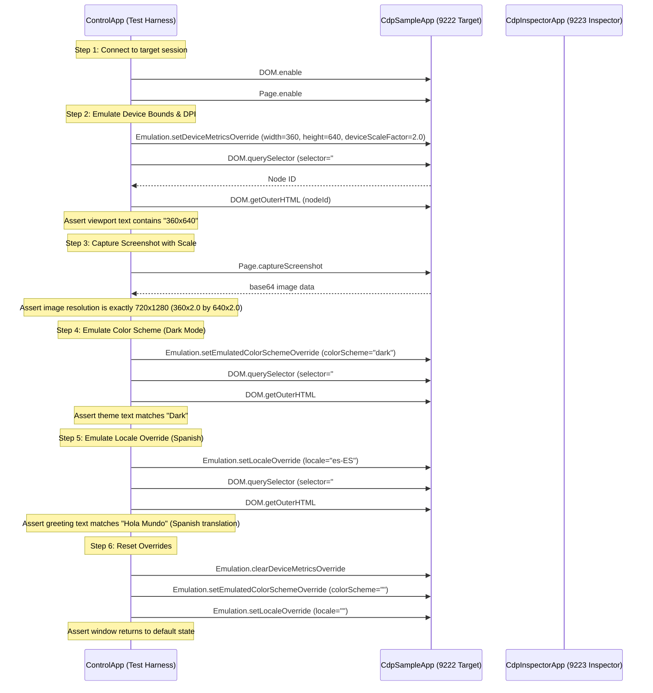

# Responsive Layout & Environment Emulation Plan

This technical plan details the implementation design to support responsive layout and environment emulation in our Chrome DevTools Protocol (CDP) server (`Avalonia.Diagnostics.Cdp`) and inspector client (`CdpInspectorApp`). This allows developers and automated agents to simulate different viewports, high-DPI scaling, UI theme variants, and locales/cultures in a running Avalonia application.

---

## 1. Objective & Status Overview

Testing and verifying desktop applications across different screen configurations, cultures, and user preferences is a complex process. This feature addresses several critical requirements:
- **Responsive Sizing Verification**: Emulate how views respond to tablet, mobile, and ultra-wide monitor dimensions to ensure layouts flow, wrap, and collapse correctly.
- **High-DPI Scaling Verification**: Simulate scaling factors (e.g., `125%`, `150%`, `200%`, `300%`) to test coordinate translation, asset sharpness, and layout sizing on high-density displays.
- **Theme Testing**: Verify styling and resource lookup when toggling between Light, Dark, and High Contrast mode.
- **Localization and Globalization Testing**: Verify string translations, layout constraints, and text wrapping when dynamically switching the target application's thread locale (e.g., `es-ES`, `ja-JP`, `ar-SA` for right-to-left alignment).
- **Headless Test Automation**: Allow E2E automation engines to programmatically trigger these environment states and assert visual layouts using assertions or screenshot validation.

### Feature Status Overview

The table below outlines what is currently implemented in the codebase and what remains missing or needs enhancement:

| Feature Area | Status | Implementation Details / Gaps |
| :--- | :--- | :--- |
| **Emulation Domain Actions** | `[Partially Implemented]` | `setDeviceMetricsOverride`, `clearDeviceMetricsOverride`, `setEmulatedColorSchemeOverride`, `setEmulatedMedia`, `setLocaleOverride`, `setTouchEmulationEnabled`, and `setGeolocationOverride` are supported by the server. `setFocusEmulationEnabled` is stubbed out. |
| **Window-Level Resizing** | `[Implemented]` | Direct resizing of the host window using session window bounds is supported. |
| **Viewport Virtualization** | `[Missing]` | No `EmulationViewportContainer` or decorator-based sizing to emulate dimensions larger than the physical screen. |
| **High-DPI Scaling Override** | `[Missing]` | `deviceScaleFactor` parameter is ignored. `CdpSession` lacks a thread-safe `DeviceScaleFactorOverride` property, and screencast/screenshot pipelines only use OS default `RenderScaling`. |
| **Theme / Color Scheme Overrides** | `[Implemented]` | Server supports changing `RequestedThemeVariant` of the application dynamically. |
| **Locale / Culture Overrides** | `[Partially Implemented]` | Server updates thread culture. However, child visual components and dynamic resource bindings are not forced to recycle or reload. |
| **Client UI Controls** | `[Partially Implemented]` | Preset device selection is implemented. However, UI controls for Color Scheme (Theme) and Locale (Culture) selectors are completely missing. |

---

## 2. Protocol Mapping (CDP to Avalonia)

We map standard Chrome DevTools Protocol methods and properties to the Avalonia target application's internals:

| CDP Domain | CDP Method / Event | Parameter | Implementation Status & Mapping |
| :--- | :--- | :--- | :--- |
| **`Emulation`** | `setDeviceMetricsOverride` | `width` (int)<br>`height` (int)<br>`deviceScaleFactor` (double)<br>`mobile` (bool) | **Partial**. Window bounds are resized directly. Scales and mobile flag touch emulation are parsed but `deviceScaleFactor` is not applied. Virtual viewport is missing. |
| **`Emulation`** | `clearDeviceMetricsOverride` | *None* | **Implemented**. Restores original window dimensions stored in session. |
| **`Emulation`** | `setEmulatedColorSchemeOverride` | `colorScheme` (string) | **Implemented**. Sets `Application.Current.RequestedThemeVariant` to Dark, Light, or Default. |
| **`Emulation`** | `setEmulatedMedia` | `media` (string)<br>`features` (array) | **Implemented**. Intercepts `prefers-color-scheme` to set theme. |
| **`Emulation`** | `setLocaleOverride` | `locale` (string) | **Partial**. Sets thread culture properties and invalidates visual tree. Real-time binding refresh is missing. |
| **`Emulation`** | `setTouchEmulationEnabled` | `enabled` (bool) | **Implemented**. Toggles `TouchEmulationEnabled` flag in `CdpSession`. |
| **`Emulation`** | `setFocusEmulationEnabled` | `enabled` (bool) | **Stubbed**. Returns success response without side effects. |
| **`Page`** | `captureScreenshot` | *None* | **Implemented**. Captures window using default scaling. Needs high-DPI scaling override enhancement. |
| **`Page`** | `screencastFrame` (Event) | `metadata` (object) | **Implemented**. Transmits frames at default scaling. Needs high-DPI scaling override enhancement. |

---

## 3. Detailed Architectural Design

### 3.1 Already Implemented Mechanisms

1. **Window-Level Resizing (`EmulationDomain.cs`)**
   - Directly mutates `session.Window.Width` and `session.Window.Height` on the UI thread.
   - Saves original width and height state in a conditional weak table `_sessionStates` keyed by `CdpSession`:
     ```csharp
     private sealed class WindowSizeState
     {
         public double OriginalWidth { get; set; }
         public double OriginalHeight { get; set; }
     }
     ```
2. **Color Scheme Override (`EmulationDomain.cs`)**
   - Modifies the global `Application.Current.RequestedThemeVariant` dynamically between `ThemeVariant.Dark`, `ThemeVariant.Light`, and `ThemeVariant.Default`.
3. **Locale Setting (`EmulationDomain.cs`)**
   - Configures the standard .NET culture settings globally on the UI thread:
     ```csharp
     System.Globalization.CultureInfo.CurrentCulture = culture;
     System.Globalization.CultureInfo.CurrentUICulture = culture;
     System.Globalization.CultureInfo.DefaultThreadCurrentCulture = culture;
     System.Globalization.CultureInfo.DefaultThreadCurrentUICulture = culture;
     ```
   - Invalidation of open windows:
     ```csharp
     foreach (var win in CdpServer.GetWindows())
     {
         win.Window.InvalidateVisual();
     }
     ```

---

### 3.2 Missing Mechanisms & Enhancement Designs

#### A. Viewport Virtualization (`EmulationViewportContainer` Decorator)
To support viewports larger or smaller than the physical screen boundaries without forcing OS-level window resizes, we will implement a virtual viewport decorator.

1. **Decorator Implementation**:
   ```csharp
   namespace Avalonia.Diagnostics.Cdp.Controls;

   public class EmulationViewportContainer : global::Avalonia.Controls.Decorator
   {
       public static readonly StyledProperty<Size> TargetSizeProperty =
           AvaloniaProperty.Register<EmulationViewportContainer, Size>(nameof(TargetSize));

       public static readonly StyledProperty<double> VirtualScaleProperty =
           AvaloniaProperty.Register<EmulationViewportContainer, double>(nameof(VirtualScale), 1.0);

       public Size TargetSize
       {
           get => GetValue(TargetSizeProperty);
           set => SetValue(TargetSizeProperty, value);
       }

       public double VirtualScale
       {
           get => GetValue(VirtualScaleProperty);
           set => SetValue(VirtualScaleProperty, value);
       }

       protected override Size MeasureOverride(Size availableSize)
       {
           if (Child == null) return new Size(0, 0);

           // Constrain the layout to the emulated device dimensions
           var emulatedSize = TargetSize;
           Child.Measure(emulatedSize);
           return emulatedSize;
       }

       protected override Size ArrangeOverride(Size arrangeSize)
       {
           if (Child == null) return arrangeSize;

           // Center/scale the child layout inside the available size if virtualized bounds exceed window
           var rect = new Rect(new Point(0, 0), TargetSize);
           Child.Arrange(rect);
           return TargetSize;
       }
   }
   ```

2. **Injection Workflow**:
   - When viewport emulation is activated via `setDeviceMetricsOverride`, check if the window's current content is an `EmulationViewportContainer`.
   - If not, detach the existing content from the window, wrap it in the container, and assign the container as the window's content:
     ```csharp
     var oldContent = window.Content;
     window.Content = null;
     var container = new EmulationViewportContainer
     {
         TargetSize = new Size(width, height),
         VirtualScale = deviceScaleFactor,
         Child = oldContent
     };
     window.Content = container;
     ```
   - When calling `clearDeviceMetricsOverride`, reverse the insertion process, restore original content, and remove the container.

3. **Coordinate Remapping**:
   - The interactive mouse event handlers (`Input.dispatchMouseEvent`) must adjust raw coordinates by calculating coordinate ratios and canvas offsets introduced by the viewport container scaling.

#### B. High-DPI Scaling Overrides
Currently, the rendering pipelines only use `Window.RenderScaling` directly. To enable high-DPI scaling overrides:

1. **DPI Session Property**: Add a property to `CdpSession.cs`:
   ```csharp
   public double? DeviceScaleFactorOverride { get; set; }
   ```

2. **Pipeline Integration**:
   - Update `setDeviceMetricsOverride` to store the `deviceScaleFactor` parameter into `session.DeviceScaleFactorOverride`.
   - Update `clearDeviceMetricsOverride` to reset it to `null`.
   - Intercept screencast and screenshot rendering loops in `CdpSession.cs` and `PageDomain.cs` to resolve scale using this override:
     ```csharp
     var scale = session.DeviceScaleFactorOverride ?? Window.RenderScaling;
     var pixelWidth = Math.Max(1, (int)(width * scale));
     var pixelHeight = Math.Max(1, (int)(height * scale));
     ```
   - Pass the overridden scale to `RenderTargetBitmap` configuration.

#### C. Locale Override & Thread Culture Invalidation
Setting thread cultures is not always sufficient to update static or one-time bound labels in Avalonia. We will add layout and binding refreshes:

1. **Recursive Refresh Engine**:
   Traverse the visual tree to force controls to refresh localization bindings:
   ```csharp
   public static void RefreshResourcesRecursively(Visual visual)
   {
       if (visual is StyledElement styled)
       {
           // Cycle styles or clear resource cache to force lookup of localized strings
           var resources = styled.Resources;
           styled.Resources = new ResourceDictionary();
           styled.Resources = resources;
       }

       foreach (var child in visual.GetVisualChildren())
       {
           RefreshResourcesRecursively(child);
       }
   }
   ```
2. **Layout Cycles**:
   Explicitly schedule measure passes for all windows after culture updates:
   ```csharp
   foreach (var win in CdpServer.GetWindows())
   {
       win.Window.InvalidateVisual();
       win.Window.InvalidateMeasure();
       RefreshResourcesRecursively(win.Window);
   }
   ```

#### D. Focus Emulation
Support `setFocusEmulationEnabled` by mocking the target window's active state or directly managing Avalonia's focus manager:
- Set simulated focus on target control trees:
  ```csharp
  var focusManager = global::Avalonia.Input.FocusManager.Instance;
  if (enabled)
  {
      // Emulate application focus state on target TopLevel
      session.Window.Focus();
  }
  ```

---

## 4. Client-Side Inspector UI/UX Design

We will extend `SimulationView.axaml` and `SimulationViewModel.cs` to include controls for Environment Emulation (Themes & Locales).

### 4.1 Mockup Layout Extensions

We will modify the toolbars in `SimulationView.axaml` to group the device presets and append the new environment overrides:

```
+---------------------------------------------------------------------------------------------------------------+
| Device: [ iPhone 12 Pro    v ]  Width: [ 390 ] x Height: [ 844 ]  [⇅] Scale: [ 3.0 ]  [x] Mobile  [ Apply ]   |
+---------------------------------------------------------------------------------------------------------------+
| Theme:  [ Dark             v ]  Locale: [ es-ES (Spanish)     v ]                     [ Reset All ]   |
+---------------------------------------------------------------------------------------------------------------+
```

### 4.2 ViewModel Additions (`SimulationViewModel.cs`)

We will add the following properties, commands, and fields to support the view elements:

```csharp
// Color schemes
private readonly string[] _colorSchemes = { "default", "light", "dark", "high-contrast" };
private string _selectedColorScheme = "default";

public string[] ColorSchemes => _colorSchemes;
public string SelectedColorScheme
{
    get => _selectedColorScheme;
    set
    {
        if (RaiseAndSetIfChanged(ref _selectedColorScheme, value))
        {
            _ = ApplyColorSchemeAsync(value);
        }
    }
}

// Locales
private readonly string[] _locales = { "", "en-US", "es-ES", "de-DE", "fr-FR", "ja-JP", "zh-CN" };
private string _selectedLocale = "";

public string[] Locales => _locales;
public string SelectedLocale
{
    get => _selectedLocale;
    set
    {
        if (RaiseAndSetIfChanged(ref _selectedLocale, value))
        {
            _ = ApplyLocaleAsync(value);
        }
    }
}

// Emulation Commands
public ICommand ResetAllEmulationsCommand { get; }

private async Task ApplyColorSchemeAsync(string scheme)
{
    if (!_cdpService.IsConnected) return;
    await _cdpService.SendCommandAsync("Emulation.setEmulatedColorSchemeOverride", new JsonObject
    {
        ["colorScheme"] = scheme
    });
}

private async Task ApplyLocaleAsync(string locale)
{
    if (!_cdpService.IsConnected) return;
    await _cdpService.SendCommandAsync("Emulation.setLocaleOverride", new JsonObject
    {
        ["locale"] = locale
    });
}

private async Task ResetAllEmulationsAsync()
{
    SelectedColorScheme = "default";
    SelectedLocale = "";
    WidthText = "800";
    HeightText = "600";
    ScaleFactorText = "1.0";
    IsMobileActive = false;
    await _cdpService.SendCommandAsync("Emulation.clearDeviceMetricsOverride", new JsonObject());
}
```

---

## 5. Phase-by-Phase Roadmap

### Phase 1: Server Viewport Virtualization & DPI Overrides
1. Add `DeviceScaleFactorOverride` property to `CdpSession.cs`.
2. Modify screencast frame loops to scale and crop based on `DeviceScaleFactorOverride`.
3. Implement `EmulationViewportContainer` and logic to dynamically inject and remove it on `setDeviceMetricsOverride` and `clearDeviceMetricsOverride`.
4. Modify `PageDomain.CaptureScreenshotAsync` to scale screenshots with overridden DPI.

### Phase 2: Server Localization & Focus Enhancements
1. Implement recursive resource invalidation helper in `EmulationDomain.cs`.
2. Connect `setLocaleOverride` to layout measure passes and style refreshes.
3. Update `setFocusEmulationEnabled` to simulate window focus states.

### Phase 3: Client ViewModel Integration
1. Extend `SimulationViewModel.cs` to add bindable properties (`ColorSchemes`, `Locales`, `SelectedColorScheme`, `SelectedLocale`).
2. Add `ResetAllEmulationsCommand`.
3. Register connection changed listeners to clear local selections when disconnected.

### Phase 4: Client View Updates
1. Edit `SimulationView.axaml` to add a second toolbar line below the device presets.
2. Render Theme and Locale selection dropdowns.
3. Style layout options using matching VS Code / Chrome DevTools dark palette colors.

---

## 6. Verification & E2E Testing Strategy

The E2E verification test harness in `scratch/ControlApp` will automate the testing sequence.

### Target App Layout for Testing
A dedicated testing panel inside `CdpSampleApp` will display:
- `<TextBlock Name="lblGreeting" Text="{DynamicResource GreetingString}"/>`
- `<TextBlock Name="lblThemeName" Text="{Binding CurrentThemeName}"/>`
- `<TextBlock Name="lblViewportSize" Text="{Binding ViewportSizeText}"/>`

### Automated Test Scenario (`ControlApp/Program.cs`)

The test suite will execute the following automation sequences:



By programmatically driving this test sequence, the system will verify both the server's protocol compatibility and visual correctness under simulated layouts.
