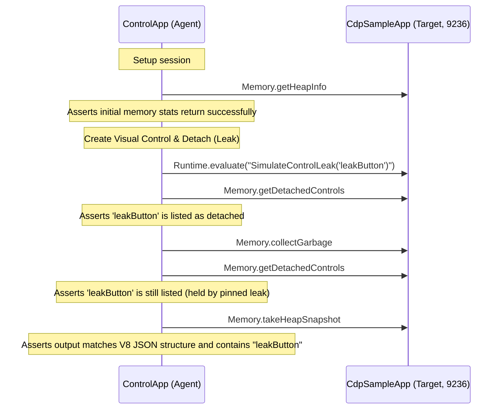

# Technical Implementation Plan: Memory Leak Profiling & Allocation Analysis

This document details the architectural design and implementation plan for adding memory profiling, garbage collection (GC) diagnostics, and memory leak analysis to the Chrome DevTools Protocol (CDP) server (`Avalonia.Diagnostics.Cdp`) and the client inspector application (`CdpInspectorApp`).

---

## 1. Executive Summary & Objectives

In desktop environments, long-running processes are highly susceptible to memory leaks. In Avalonia applications, the most common sources of memory leaks are:
1. **Detached Controls**: Visual components that have been removed from the active window tree but are still held in the managed heap by static events, long-lived subscriptions, or strong references.
2. **ViewModel Leaks**: ViewModels that remain alive due to background services, keeping bound views alive via two-way bindings.
3. **Reference Cycles**: Unreleased event handler subscriptions from controls to long-lived objects.

### Developer & QA Use Cases
- **Detached Controls Auditing**: Locate every control instance that is detached from the visual tree but cannot be garbage-collected, displaying its type, name, and lifecycle duration.
- **Visual-Centric Retention Paths**: Generate standard V8-compliant `.heapsnapshot` graphs tracing parent-child links, logical roots, and `DataContext` relationships, allowing inspection in Chromium's standard DevTools memory panel.
- **Real-Time Memory Telemetry**: Track live heap allocation trends and GC generation collections using high-performance dotnet diagnostics APIs.
- **Programmatic Leak Assertions**: Enable automated E2E tests in the verification script (`ControlApp`) to assert that views are fully cleaned up post-navigation.

---

## 2. Current Implementation Status

Through research of the codebase inside `src/Avalonia.Diagnostics.Cdp/Domains/MemoryDomain.cs` and `MemoryViewModel.cs`, we have established the following status:

### A. What is Already Implemented

1. **CDP Server-Side (`MemoryDomain.cs`)**:
   - **`Memory.getDOMCounters`**: Returns count stats for `documents` (calculated using `CdpServer.GetActiveTargets().Count`) and `nodes` (recursively counts visuals of the session window via the UI thread).
   - **`Memory.getLiveControls`**: Traverses all windows registered under `CdpServer.GetWindows()`, recursively traverses their visual trees using `CountControlTypes`, aggregates instance counts grouped by their runtime type name, and returns the collection as a JSON array under `"controls"`.
   - **`Memory.collectGarbage` & `Memory.forciblyPurgeJavaScriptMemory`**: Forces a synchronous garbage collection run:
     ```csharp
     GC.Collect();
     GC.WaitForPendingFinalizers();
     GC.Collect();
     ```
   - **Stubs**: Stubs out standard CDP methods (`setPressureNotificationsSuppressed`, `simulatePressureNotification`, `prepareForLeakDetection`) to return empty responses, preventing protocol crashes when Chromium clients invoke them.

2. **CDP Client-Side ViewModel & Views (`MemoryViewModel.cs` / `MemoryView.axaml`)**:
   - **Snapshot Management**: A local historical log (`Snapshots` list) that keeps track of captured live control snapshots with timestamps.
   - **GC Triggering**: The "Collect Garbage" button (`btnGcCollect`) which executes `Memory.collectGarbage` on the target.
   - **Live Counts Grid**: Displays all visual control types and their counts, sorted in descending order of instance count.
   - **Snapshot Comparison Mode**: Supports comparing a selected snapshot against any older baseline snapshot, displaying the control type, baseline count, snapshot count, and calculated delta difference.

### B. What is Missing or Needs Enhancement

1. **Detached Control Tracking (Core Leak Root Cause)**:
   - **The Problem**: Currently, `getLiveControls` only crawls the *attached* visual trees starting from open windows. If a control was detached (e.g. removed from a panel) but not collected, it will NOT be reached by the window visual tree traversal. As a result, it is omitted from the snapshot and appears to have been successfully garbage collected when it is actually leaking.
   - **The Solution**: Build a global `ControlTracker` using Avalonia's global event class handlers to capture weak references to all visual components at initialization, identifying instances where `IsAttachedToVisualTree` is `false` but the target is still alive in memory.

2. **V8 Heap Snapshot Exporting (`.heapsnapshot` Format)**:
   - **The Problem**: There is no way to export the control graph as a standard V8 `.heapsnapshot` file. Developers cannot trace exact retention pathways or look for reference cycles using the Chromium DevTools Memory panel.
   - **The Solution**: Implement a serializing exporter that maps the visual/logical tree, parent-child links, and `DataContext` relationships into a V8-compliant heap snapshot file structure.

3. **Telemetry & Real-Time Performance Graphs**:
   - **The Problem**: The inspector only updates when manual snapshots are taken. There is no real-time telemetry representing system memory load or GC generation activities.
   - **The Solution**: Implement `Memory.getHeapInfo` (using `GC.GetGCMemoryInfo()`) and set up a background thread notifying the inspector via a custom event (`Memory.heapStatsChanged`) to feed a real-time memory trend chart.

4. **Expanded Client UI**:
   - **The Problem**: The client has no tab to view detached controls, no visual memory performance graphs, and no export button to save V8 snapshots.
   - **The Solution**: Expand `MemoryView.axaml` with a sub-tabbed view separating "Live Counts", "Detached Controls", and "Heap Trend Graph", alongside a snapshot export action trigger.

---

## 3. Protocol Mapping (CDP to Avalonia)

We will expand the standard and custom capabilities of the `Memory` domain to support full leak diagnostics.

| Domain | Method / Event | Direction | Description |
| :--- | :--- | :--- | :--- |
| **Memory** | `getDOMCounters` | Client -> Server | Returns number of documents and active visual nodes (Implemented). |
| **Memory** | `collectGarbage` | Client -> Server | Forces full synchronous garbage collection (Implemented). |
| **Memory** | `getLiveControls` | Client -> Server | Custom extension. Returns flat type counts of active visuals (Implemented). |
| **Memory** | `getDetachedControls` | Client -> Server | Custom extension. Returns list of alive visual instances that are detached from the visual tree (Proposed). |
| **Memory** | `getHeapInfo` | Client -> Server | Returns memory metrics (total committed heap, generation collection counts) (Proposed). |
| **Memory** | `takeHeapSnapshot` | Client -> Server | Serializes a visual-centric heap graph in standard V8 format (Proposed). |
| **Memory** | `heapStatsChanged` | Server -> Client (Event) | Event. Periodic broadcast of heap usage and collection numbers (Proposed). |

### JSON Payload Schemas

#### 1. `Memory.getDetachedControls` (Response)
```json
{
  "detachedControls": [
    {
      "id": "0x1F80A90F",
      "type": "Avalonia.Controls.Button",
      "name": "btnSave",
      "hashCode": 4928174,
      "detachedDurationMs": 14200,
      "hasDataContext": true,
      "dataContextType": "MyApp.ViewModels.EditorViewModel"
    }
  ]
}
```

#### 2. `Memory.getHeapInfo` (Response)
```json
{
  "totalAllocatedBytes": 45892104,
  "committedHeapBytes": 67108864,
  "fragmentedBytes": 2048576,
  "gen0Collections": 14,
  "gen1Collections": 4,
  "gen2Collections": 1
}
```

#### 3. `Memory.takeHeapSnapshot` (Response)
Conforms strictly to the V8 Heap Snapshot format, serialized chunk-by-chunk to avoid high-allocation buffers.

---

## 4. Avalonia-Side Architectural Design

### Detached Control Tracking Engine

To monitor the lifecycle of visual elements without modifying user-defined control classes, we register global class handlers inside the CDP Server startup sequence.

```
                  ┌───────────────────────────────┐
                  │          CdpServer            │
                  └──────────────┬────────────────┘
                                 │ Registers Class Handlers
                                 ▼
                  ┌───────────────────────────────┐
                  │        ControlTracker         │
                  └──────────────┬────────────────┘
                                 │ Weakly tracks visual lifecycle
                                 ▼
┌─────────────────────────────────────────────────────────────────┐
│     ConcurrentDictionary<IntPtr, WeakReference<Visual>>         │
│     - Tracks every control created                              │
│     - Filters out finalized targets on lookup                   │
└────────────────────────────────┬────────────────────────────────┘
                                 │
                     ┌───────────┴───────────┐
                     ▼                       ▼
         [IsAttachedToVisualTree == true]    [IsAttachedToVisualTree == false]
         - Rooted in Window/TopLevel         - Detached Control (Leaked)
         - Healthy element                   - Retained in heap
```

1. **Global Class Handlers**:
   During initialization in `MemoryDomain`, register a class handler for the base `Visual` type:
   ```csharp
   Visual.AttachedToVisualTreeEvent.AddClassHandler<Visual>((visual, args) =>
   {
       ControlTracker.Register(visual);
   });
   ```

2. **Thread-Safe Weak Reference Dictionary**:
   We map an identifier (like `GCHandle` address or hashcode combined with an internal index) to a weak reference:
   ```csharp
   public static class ControlTracker
   {
       private static readonly ConcurrentDictionary<IntPtr, WeakReference<Visual>> _trackedVisuals = new();
       private static readonly ConcurrentDictionary<IntPtr, DateTime> _detachTimestamps = new();

       public static void Register(Visual visual)
       {
           IntPtr handle = GetIntPtr(visual);
           _trackedVisuals.TryAdd(handle, new WeakReference<Visual>(visual));
       }

       public static IEnumerable<DetachedControlInfo> GetDetachedControls()
       {
           var list = new List<DetachedControlInfo>();
           foreach (var kvp in _trackedVisuals)
           {
               if (kvp.Value.TryGetTarget(out var visual))
               {
                   if (!visual.IsAttachedToVisualTree)
                   {
                       IntPtr handle = kvp.Key;
                       if (!_detachTimestamps.TryGetValue(handle, out var detachTime))
                       {
                           detachTime = DateTime.UtcNow;
                           _detachTimestamps[handle] = detachTime;
                       }

                       list.Add(new DetachedControlInfo(visual, handle, DateTime.UtcNow - detachTime));
                   }
                   else
                   {
                       _detachTimestamps.TryRemove(kvp.Key, out _);
                   }
               }
               else
               {
                   _trackedVisuals.TryRemove(kvp.Key, out _);
                   _detachTimestamps.TryRemove(kvp.Key, out _);
               }
           }
           return list;
       }
   }
   ```

---

### Visual-Centric Heap Snapshot Generator (`.heapsnapshot`)

Rather than attempting to dump the entire .NET runtime heap (which contains millions of system nodes, garbage collector structs, and string allocations), the server generates a target-oriented snapshot graph. This graph centers on `Visual` elements, `Logical` trees, and their bound objects.

#### Snapshot Serialization Format
The output structure contains a V8 metadata header, flat integer lists representing nodes and edges, and an array of literal strings.

```json
{
  "snapshot": {
    "meta": {
      "node_fields": ["type", "name", "id", "self_size", "edge_count", "trace_node_id"],
      "node_types": [["hidden", "array", "string", "object", "code", "closure", "regexp", "number", "native", "synthetic", "concatenated string", "sliced string"], "string", "number", "number", "number", "number"],
      "edge_fields": ["type", "name_or_index", "to_node"],
      "edge_types": [["context", "element", "property", "internal", "hidden", "shortcut"], "string_or_number", "number"]
    },
    "node_count": 3,
    "edge_count": 2
  },
  "nodes": [
    3, 0, 1, 120, 2, 0,
    3, 1, 2, 80,  0, 0,
    3, 2, 3, 64,  0, 0
  ],
  "edges": [
    1, 3, 6,
    2, 4, 12
  ],
  "strings": [
    "Window",
    "Button",
    "EditorViewModel",
    "ChildControl",
    "DataContext"
  ]
}
```

#### Node and Edge Construction Logic
- **Nodes**: Represent `Visual` control instances, `Window` windows, styles, templates, and `DataContext` (ViewModels). Each is mapped to a unique incremental node ID.
- **Edges**:
  - `element`: Visual parent-to-child relationships (traversing `visual.GetVisualChildren()`).
  - `property`: Logical associations (traversing logical child lists).
  - `context`: Reference from a control to its active `DataContext`.
  - `internal`: Internal dependencies such as active event listeners or binding subscriptions.

---

## 5. Inspector-Side UI/UX Design

We will upgrade [MemoryView.axaml](file:///Users/wieslawsoltes/GitHub/CDP/src/CDP.Inspector.Shared/Views/MemoryView.axaml) to provide a workspace split into tabbed views.

### UI Layout Structure
```
┌──────────────────┬────────────────────────────────────────────────────────┐
│ HEAP CONTROLS    │ [Live Counts]  [Detached Controls (Leaked)]  [Heap Info]│
├──────────────────┼────────────────────────────────────────────────────────┤
│ [Take Snapshot]  │ Type           Name      Detached Time  DataContext    │
│ [Force GC]       ├────────────────────────────────────────────────────────┤
│ [Export V8 JSON] │ Button         btnSave   00:12.4        EditorViewModel│
│                  │ StackPanel     -         00:12.4        -              │
│                  │ TextBox        txtInput  00:10.1        EditorViewModel│
│                  │                                                        │
└──────────────────┴────────────────────────────────────────────────────────┘
```

1. **Sub-Tab Navigation**:
   - **Live Counts (Default)**: Flat lists of controls with delta comparisons (current feature expanded).
   - **Detached Controls Grid**: Lists control instances that are detached from the visual tree. Columns include: Control Type, Name, Detached Duration, and DataContext View Model.
   - **Heap Info Line Chart**: A live-updating chart showcasing heap committed memory size and collection counts over time.

2. **Actions & Commands**:
   - **Export Snapshot**: Asks the user for a path using the platform file picker, requests `Memory.takeHeapSnapshot` from the CDP server, and writes it directly as a `.heapsnapshot` file.
   - **Monitoring Toggle**: Triggers a periodic timer that sends `Memory.getHeapInfo` calls to keep the performance charts current.

---

## 6. Phase-by-Phase Roadmap

### Phase 1: Detached Control Infrastructure (Core Server Library)
- Write the `ControlTracker` utility class inside `Avalonia.Diagnostics.Cdp`.
- Hook global class handlers for visual initialization events.
- Implement `Memory.getDetachedControls` JSON-RPC handler mapping control statuses and computing elapsed detach duration.
- Expose `Memory.getHeapInfo` mapping properties out of `GC.GetGCMemoryInfo()`.

### Phase 2: V8 `.heapsnapshot` Exporter
- Build `HeapSnapshotExporter` mapping C# objects to V8 structure matrices (`nodes`, `edges`, `strings` arrays).
- Traverse live visual roots and include all detached elements as separate entry nodes to illustrate retention.
- Wire `Memory.takeHeapSnapshot` to trigger this exporter.

### Phase 3: Client UI Expansion
- Modify `MemoryViewModel.cs` with reactive collection lists for detached controls.
- Expand `MemoryView.axaml` with a tabbed view layout, displaying the detached control grid.
- Implement file export for `.heapsnapshot` profiles.
- Integrate a line graph displaying allocation performance statistics.

### Phase 4: CI/CD E2E Integration Testing
- Program the `ControlApp` verification script to programmatically construct memory leaks, trigger garbage collection, assert detached nodes, and verify exported snapshot formats.

---

## 7. Verification & E2E Testing Strategy

To verify this implementation end-to-end, we will construct a custom testing scenario inside [Program.cs](file:///Users/wieslawsoltes/GitHub/CDP/scratch/ControlApp/Program.cs).

### Programmatic Verification Walkthrough



### Verification Script Code Structure
The custom test logic will be added to the automation script:

```csharp
public static async Task VerifyMemoryDiagnosticsAsync(CdpService cdpService)
{
    Console.WriteLine("=== VERIFYING MEMORY LEAK DIAGNOSTICS & ALLOCATION ANALYSIS ===");

    // 1. Get initial memory information
    var heapInfoRes = await cdpService.SendCommandAsync("Memory.getHeapInfo");
    if (heapInfoRes == null || !heapInfoRes.ContainsKey("totalAllocatedBytes"))
    {
        throw new Exception("Memory.getHeapInfo failed to return allocation telemetry.");
    }
    Console.WriteLine($"[PASS] Initial Allocated Bytes: {heapInfoRes["totalAllocatedBytes"]}");

    // 2. Trigger target allocation leak simulator
    // Evaluates a script that instantiates a Button, attaches it, detaches it,
    // and keeps a strong reference to it in a static dictionary.
    await cdpService.SendCommandAsync("Runtime.evaluate", new JsonObject
    {
        ["expression"] = @"
            (function() {
                var btn = new Avalonia.Controls.Button { Name = 'leakButton' };
                // Attach and detach to trigger class tracking
                var container = window.Content as Avalonia.Controls.Panel;
                container.Children.Add(btn);
                container.Children.Remove(btn);
                // Hold strong reference globally to simulate memory leak
                GlobalLeakRegistry.Leaks['leakButton'] = btn;
            })()"
    });

    // 3. Inspect detached controls list
    var detachedRes = await cdpService.SendCommandAsync("Memory.getDetachedControls");
    if (detachedRes == null || !detachedRes.ContainsKey("detachedControls"))
    {
        throw new Exception("Memory.getDetachedControls failed to respond.");
    }

    var detachedList = detachedRes["detachedControls"] as JsonArray;
    var leakBtnNode = detachedList?.FirstOrDefault(n => n?["name"]?.GetValue<string>() == "leakButton");
    if (leakBtnNode == null)
    {
        throw new Exception("Detached control list did not contain 'leakButton'.");
    }
    Console.WriteLine("[PASS] 'leakButton' successfully identified in detached list.");

    // 4. Force synchronous Garbage Collection
    Console.WriteLine("Executing GC Collect...");
    await cdpService.SendCommandAsync("Memory.collectGarbage");

    // 5. Verify the control is still detached (not collected because of the strong reference)
    var postGcDetachedRes = await cdpService.SendCommandAsync("Memory.getDetachedControls");
    var postGcList = postGcDetachedRes?["detachedControls"] as JsonArray;
    if (postGcList?.Any(n => n?["name"]?.GetValue<string>() == "leakButton") != true)
    {
        throw new Exception("Leaked button was prematurely collected or lost from detached tracking.");
    }
    Console.WriteLine("[PASS] 'leakButton' correctly remains in detached list after GC.");

    // 6. Test V8 Heap Snapshot Serializer
    Console.WriteLine("Taking V8 Heap Snapshot...");
    var snapshotRes = await cdpService.SendCommandAsync("Memory.takeHeapSnapshot");
    if (snapshotRes == null || !snapshotRes.ContainsKey("snapshot"))
    {
        throw new Exception("Memory.takeHeapSnapshot failed to generate output.");
    }

    string snapshotJson = snapshotRes.ToString();
    if (!snapshotJson.Contains("\"node_fields\"") || !snapshotJson.Contains("leakButton"))
    {
        throw new Exception("Generated heapsnapshot format is invalid or missing the leaked node.");
    }
    Console.WriteLine("[PASS] V8 .heapsnapshot successfully generated and validated.");
}
```
