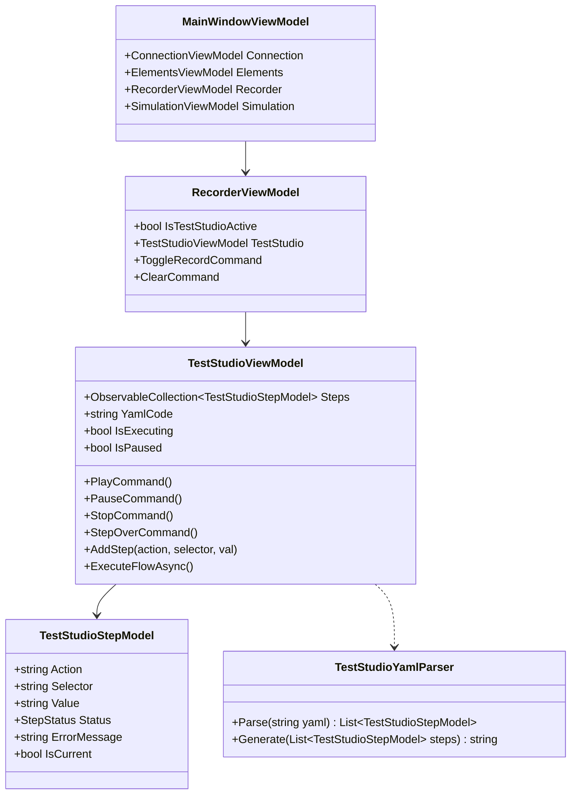

# Test Studio Architecture & UI Design

This document details the MVVM and UI design for the Test Studio, explaining how the visual components, bindings, and services integrate with the existing codebase.

---

## 1. Class Diagram & Architecture

The Test Studio is built using the standard Avalonia MVVM pattern:



---

## 2. Interactive Actions Panel & Selector Extraction

To allow quick authoring:
- We bind `TestStudioViewModel` to elements selected in `ElementsViewModel`.
- When `ElementsViewModel.SelectedNode` changes:
  1. We extract the best unique selector (e.g. `#btnClickMe` or `Button.primary` using the `SelectorEngine.GetSelector` utility).
  2. We update `TestStudioViewModel.SelectedElementSelector` to this string.
  3. The buttons `Tap`, `Input Text`, `Assert Visible` become enabled.

---

## 3. UI Layout & Wireframe (Grid-based)

The Test Studio uses a 2-column layout + log area at the bottom:

```
+-------------------------------------------------------------------------+
| [O] Standard Recorder  (•) Test Studio                                  |
+------------------------------------+------------------------------------+
| Left Panel: Steps & Controls       | Right Panel: YAML Flow Editor      |
| +--------------------------------+ | +--------------------------------+ |
| | [Play] [Pause] [Step] [Stop]   | | | appId: CdpSampleApp            | |
| +--------------------------------+ | | ---                            | |
| | Steps:                         | | | - launchApp                    | |
| | [√] 1. launchApp               | | | - tapOn: "#btnClickMe"         | |
| | [>] 2. tapOn: "#btnClickMe"    | | | - inputText: "hello"           | |
| | [ ] 3. assertVisible: "#lbl"   | | |                                | |
| |                                | | |                                | |
| +--------------------------------+ | |                                | |
| | Selected Element: #btnClickMe  | | |                                | |
| | [Tap] [Input:______] [Assert]  | | |                  [ Apply YAML ]| |
| +--------------------------------+ | +--------------------------------+ |
+------------------------------------+------------------------------------+
| Debug Logs:                                                             |
| [12:04:55] Executing step 2: tapOn: "#btnClickMe"...                    |
+-------------------------------------------------------------------------+
```

---

## 4. MVVM Data Binding Specifications

- **Debugger Controls**:
  - Play button bound to `PlayCommand`, which triggers async execution loop. Visible/enabled when `!IsExecuting || IsPaused`.
  - Pause button bound to `PauseCommand`, which sets a pause flag. Enabled when `IsExecuting && !IsPaused`.
  - Step Over button bound to `StepOverCommand`. Enabled when `IsPaused` or `!IsExecuting`.
  - Stop button bound to `StopCommand`. Enabled when `IsExecuting`.
- **Steps ListBox**:
  - `ItemsSource` bound to `Steps`.
  - Item template has text blocks bound to `Action` and `Selector`/`Value`.
  - Left icon bound to `Status` (converts `StepStatus` to visual icon/color: `Passed` -> Green Check, `Failed` -> Red Cross, `Running` -> Blue Spinner, `Pending` -> Gray Dot).
- **YAML Code View**:
  - Text property of YAML TextBox bound to `YamlCode` (TwoWay, or updated on clicking "Apply").
- **Selected Element Actions**:
  - Label bound to `SelectedElementSelector` (e.g. `Selected Element: Button#btnSubmit`).
  - `AddTapCommand` adds step with action `tapOn` and parameter `SelectedElementSelector`.
